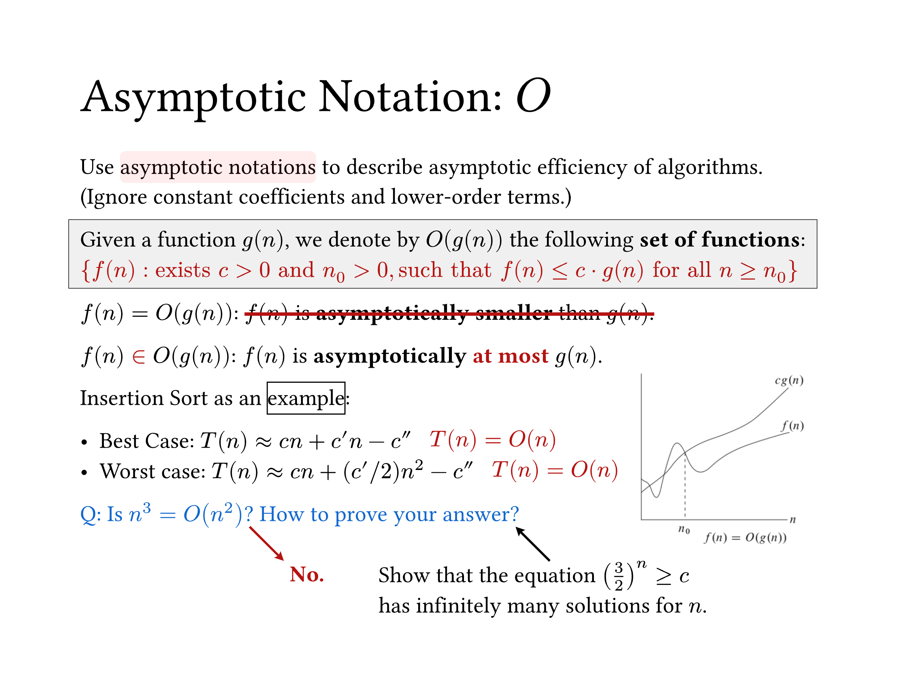
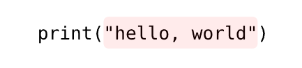

# Pinit

Relative positioning by pins, especially useful for making slides in typst.

## Example

### Pin things as you like

Have a look at the source [here](./examples/example.typ).



### Dynamic Slides

Pinit works with [Touying](https://github.com/touying-typ/touying) or [Polylux](https://github.com/andreasKroepelin/polylux) animations.

Have a look at the source [here](./examples/example.typ) and the pdf file [here](./examples/example.pdf).


## Usage

### Examples

The idea of pinit is pinning pins on the normal flow of the text, and then placing the content on the page by `absolute-place` function.

For example, we can highlight text and add a tip by pins simply:

```typ
#import "@preview/pinit:0.1.4": *

#set text(size: 24pt)

A simple #pin(1)highlighted text#pin(2).

#pinit-highlight(1, 2)

#pinit-point-from(2)[It is simple.]
```


A more complex example, Have a look at the source [here](./examples/equation-desc.typ).


### Pinit for raw

In the code block, we need to use a regex trick to get pinit to work, for example

```typst
#import "@preview/pinit:0.1.4": *

#show raw: it => {
  show regex("pin\d"): it => pin(eval(it.text.slice(3)))
  it
}

`print(pin1"hello, world"pin2)`

#pinit-highlight(1, 2)
```



Note that typst's code highlighting breaks up the text, causing overly complex regular expressions such as '#pin\(.*?\)' to not work properly.

However, you may want to consider putting it in a comment to avoid highlighting the text and breaking it up.

---

**Warning: You should add a blank line before the `#pinit-xxx` function call, otherwise it will cause misalignment.**

---

## Outline

- [Pinit](#pinit)
  - [Example](#example)
    - [Pin things as you like](#pin-things-as-you-like)
    - [Dynamic Slides](#dynamic-slides)
  - [Usage](#usage)
    - [Examples](#examples)
    - [Pinit for raw](#pinit-for-raw)
  - [Outline](#outline)
  - [Reference](#reference)
    - [`pin`](#pin)
    - [`pinit`](#pinit-1)
    - [`absolute-place`](#absolute-place)
    - [`pinit-place`](#pinit-place)
    - [`pinit-rect`](#pinit-rect)
    - [`pinit-highlight`](#pinit-highlight)
    - [`pinit-line`](#pinit-line)
    - [`pinit-line-to`](#pinit-line-to)
    - [`pinit-arrow`](#pinit-arrow)
    - [`pinit-point-to`](#pinit-point-to)
    - [`pinit-point-from`](#pinit-point-from)
    - [`simple-arrow`](#simple-arrow)
  - [Acknowledgements](#acknowledgements)
  - [License](#license)


## Reference

### `pin`

Pinning a pin in text, the pin is supposed to be unique in one page.

```typ
#let pin(name) = { .. }
```

**Arguments:**

- `name`: [`integer` or `string` or `any`] &mdash; Name of pin, which can be any types with unique `repr()` return value, such as integer and string.

### `pinit`

Query positions of pins in the same page, then call the callback function `func`.

```typ
#let pinit(pins, func) = { .. }
```

**Arguments:**

- `pins`: [`pin` or `array`] &mdash; Names of pins you want to query. It is supposed to be a pin, or an array of pins.
- `func`: [`(positions) => { .. }`] &mdash; A callback function accepting an array of positions (or a single position) as a parameter. Each position is a dictionary like `(page: 1, x: 319.97pt, y: 86.66pt)`. You can use the `absolute-place` function in this callback function to display something around the pins.


### `absolute-place`

Place content at a specific location on the page relative to the top left corner of the page, regardless of margins, current containers, etc.

> This function comes from [typst-drafting](https://github.com/ntjess/typst-drafting).

```typ
#let absolute-place(
  dx: 0em,
  dy: 0em,
  content,
) = { .. }
```

**Arguments:**

- `dx`: [`length`] &mdash; Length in the x-axis relative to the left edge of the page.
- `dy`: [`length`] &mdash; Length in the y-axis relative to the top edge of the page.
- `content`: [`content`] &mdash; The content you want to place.


### `pinit-place`

Place content at a specific location on the page relative to the pin.

```typ
#let pinit-place(
  dx: 0pt,
  dy: 0pt,
  pin-name,
  body,
) = { .. }
```

**Arguments:**

- `dx`: [`length`] &mdash; Offset X relative to the pin.
- `dy`: [`length`] &mdash; Offset Y relative to the pin.
- `pin-name`: [`pin`] &mdash; Name of the pin to which you want to locate.
- `body`: [`content`] &mdash; The content you want to place.


### `pinit-rect`

Draw a rectangular shape on the page **containing all pins** with optional extended width and height.

```typ
#let pinit-rect(
  dx: 0em,
  dy: -1em,
  extended-width: 0em,
  extended-height: 1.4em,
  pin1,
  pin2,
  pin3,  // Optional
  ..pinX,
  ..args,
) = { .. }
```

**Arguments:**

- `dx`: [`length`] &mdash; Offset X relative to the min-left of pins.
- `dy`: [`length`] &mdash; Offset Y relative to the min-top of pins.
- `extended-width`: [`length`] &mdash; Optional extended width of the rectangular shape.
- `extended-height`: [`length`] &mdash; Optional extended height of the rectangular shape.
- `pin1`: [`pin`] &mdash; One of these pins.
- `pin2`: [`pin`] &mdash; One of these pins.
- `pin3`: [`pin`] &mdash; One of these pins, optionally.
- `...args`: Additional named arguments or settings for [`rect`](https://typst.app/docs/reference/visualize/rect/), like `fill`, `stroke` and `radius`.


### `pinit-highlight`

Highlight a specific area on the page with a filled color and optional radius and stroke. It is just a simply styled `pinit-rect`.

```typ
#let pinit-highlight(
  fill: rgb(255, 0, 0, 20),
  radius: 5pt,
  stroke: 0pt,
  dx: 0em,
  dy: -1em,
  extended-width: 0em,
  extended-height: 1.4em,
  pin1,
  pin2,
  pin3,  // Optional
  ..pinX,
  ...args,
) = { .. }
```

**Arguments:**

- `fill`: [`color`] &mdash; The fill color for the highlighted area.
- `radius`: [`length`] &mdash; Optional radius for the highlight.
- `stroke`: [`stroke`] &mdash; Optional stroke width for the highlight.
- `dx`: [`length`] &mdash; Offset X relative to the min-left of pins.
- `dy`: [`length`] &mdash; Offset Y relative to the min-top of pins.
- `extended-width`: [`length`] &mdash; Optional extended width of the rectangular shape.
- `extended-height`: [`length`] &mdash; Optional extended height of the rectangular shape.
- `pin1`: [`pin`] &mdash; One of these pins.
- `pin2`: [`pin`] &mdash; One of these pins.
- `pin3`: [`pin`] &mdash; One of these pins, optionally.
- `...args`: Additional arguments or settings for [`pinit-rect`](#pinit-rect).


### `pinit-line`

Draw a line on the page between two specified pins with an optional stroke.

```typ
#let pinit-line(
  stroke: 1pt,
  start-dx: 0pt,
  start-dy: 0pt,
  end-dx: 0pt,
  end-dy: 0pt,
  start,
  end,
) = { ... }
```

**Arguments:**

- `stroke`: [`stroke`] &mdash; The stroke for the line.
- `start-dx`: [`length`] &mdash; Offset X relative to the start pin.
- `start-dy`: [`length`] &mdash; Offset Y relative to the start pin.
- `end-dx`: [`length`] &mdash; Offset X relative to the end pin.
- `end-dy`: [`length`] &mdash; Offset Y relative to the end pin.
- `start`: [`pin`] &mdash; The start pin.
- `end`: [`pin`] &mdash; The end pin.


### `pinit-line-to`

Draw an line from a specified pin to a point on the page with optional settings.

```typ
#let pinit-line-to(
  stroke: 1pt,
  pin-dx: 5pt,
  pin-dy: 5pt,
  body-dx: 5pt,
  body-dy: 5pt,
  offset-dx: 35pt,
  offset-dy: 35pt,
  pin-name,
  body,
) = { ... }
```

**Arguments:**

- `stroke`: [`stroke`] &mdash; The stroke for the line.
- `pin-dx`: [`length`] &mdash; Offset X of arrow start relative to the pin.
- `pin-dy`: [`length`] &mdash; Offset Y of arrow start relative to the pin.
- `body-dx`: [`length`] &mdash; Offset X of arrow end relative to the body.
- `body-dy`: [`length`] &mdash; Offset Y of arrow end relative to the body.
- `offset-dx`: [`length`] &mdash; Offset X relative to the pin.
- `offset-dy`: [`length`] &mdash; Offset Y relative to the pin.
- `pin-name`: [`pin`] &mdash; The name of the pin to start from.
- `body`: [`content`] &mdash; The content to draw the arrow to.


### `pinit-arrow`

Draw an arrow between two specified pins with optional settings.

```typ
#let pinit-arrow(
  start-dx: 0pt,
  start-dy: 0pt,
  end-dx: 0pt,
  end-dy: 0pt,
  start,
  end,
  ..args,
) = { ... }
```

**Arguments:**

- `start-dx`: [`length`] &mdash; Offset X relative to the start pin.
- `start-dy`: [`length`] &mdash; Offset Y relative to the start pin.
- `end-dx`: [`length`] &mdash; Offset X relative to the end pin.
- `end-dy`: [`length`] &mdash; Offset Y relative to the end pin.
- `start`: [`pin`] &mdash; The start pin.
- `end`: [`pin`] &mdash; The end pin.
- `...args`: Additional arguments or settings for [`simple-arrow`](#simple-arrow), like `fill`, `stroke` and `thickness`.


### `pinit-point-to`

Draw an arrow from a specified pin to a point on the page with optional settings.

```typ
#let pinit-point-to(
  pin-dx: 5pt,
  pin-dy: 5pt,
  body-dx: 5pt,
  body-dy: 5pt,
  offset-dx: 35pt,
  offset-dy: 35pt,
  pin-name,
  body,
  ..args,
) = { ... }
```

**Arguments:**

- `pin-dx`: [`length`] &mdash; Offset X of arrow start relative to the pin.
- `pin-dy`: [`length`] &mdash; Offset Y of arrow start relative to the pin.
- `body-dx`: [`length`] &mdash; Offset X of arrow end relative to the body.
- `body-dy`: [`length`] &mdash; Offset Y of arrow end relative to the body.
- `offset-dx`: [`length`] &mdash; Offset X relative to the pin.
- `offset-dy`: [`length`] &mdash; Offset Y relative to the pin.
- `pin-name`: [`pin`] &mdash; The name of the pin to start from.
- `body`: [`content`] &mdash; The content to draw the arrow to.
- `...args`: Additional arguments or settings for [`simple-arrow`](#simple-arrow), like `fill`, `stroke` and `thickness`.


### `pinit-point-from`

Draw an arrow from a point on the page to a specified pin with optional settings.

```typ
#let pinit-point-from(
  pin-dx: 5pt,
  pin-dy: 5pt,
  body-dx: 5pt,
  body-dy: 5pt,
  offset-dx: 35pt,
  offset-dy: 35pt,
  pin-name,
  body,
  ..args,
) = { ... }
```

**Arguments:**

- `pin-dx`: [`length`] &mdash; Offset X relative to the pin.
- `pin-dy`: [`length`] &mdash; Offset Y relative to the pin.
- `body-dx`: [`length`] &mdash; Offset X relative to the body.
- `body-dy`: [`length`] &mdash; Offset Y relative to the body.
- `offset-dx`: [`length`] &mdash; Offset X relative to the left edge of the page.
- `offset-dy`: [`length`] &mdash; Offset Y relative to the top edge of the page.
- `pin-name`: [`pin`] &mdash; The name of the pin that the arrow to.
- `body`: [`content`] &mdash; The content to draw the arrow from.
- `...args`: Additional arguments or settings for [`simple-arrow`](#simple-arrow), like `fill`, `stroke` and `thickness`.


### `simple-arrow`

Draw a simple arrow on the page with optional settings, implemented by [`polygon`](https://typst.app/docs/reference/visualize/polygon/).

```typ
#let simple-arrow(
  fill: black,
  stroke: 0pt,
  start: (0pt, 0pt),
  end: (30pt, 0pt),
  thickness: 2pt,
  arrow-width: 4,
  arrow-height: 4,
  inset: 0.5,
  tail: (),
) = { ... }
```

**Arguments:**

- `fill`: [`color`] &mdash; The fill color for the arrow.
- `stroke`: [`stroke`] &mdash; The stroke for the arrow.
- `start`: [`point`] &mdash; The starting point of the arrow.
- `end`: [`point`] &mdash; The ending point of the arrow.
- `thickness`: [`length`] &mdash; The thickness of the arrow.
- `arrow-width`: [`integer` or `float`] &mdash; The width of the arrowhead relative to thickness.
- `arrow-height`: [`integer` or `float`] &mdash; The height of the arrowhead relative to thickness.
- `inset`: [`integer` or `float`] &mdash; The inset value for the arrowhead relative to thickness.
- `tail`: [`array`] &mdash; The tail settings for the arrow.


## Acknowledgements

- Some of the inspirations and codes comes from [typst-drafting](https://github.com/ntjess/typst-drafting).
- Thanks to [polylux](https://github.com/andreasKroepelin/polylux), you can create beautiful and dynamic slides by [polylux](https://github.com/andreasKroepelin/polylux) simply.
- The concise and aesthetic example slide style come from course *Data Structures and Algorithms* of [Chaodong ZHENG](https://chaodong.me/).


## License

This project is licensed under the MIT License.
