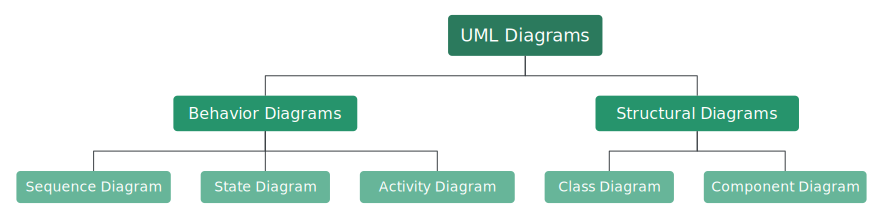

# [Pintorita - Pintora plugin for typst ](https://github.com/taylorh140/typst-pintora)

[Pintora](https://pintorajs.vercel.app/)

Typst package for drawing the following from markup:
- Sequence Diagram
- Entity Relationship Diagram
- Component Diagram
- Activity Diagram
- Mind Map Experiment
- Gantt Diagram Experiment
- DOT Diagram Experiment




````typ
#import "@preview/pintorita:0.1.0"

#set page(height: auto, width: auto, fill: black, margin: 2em)
#set text(fill: white)

#show raw.where(lang: "pintora"): it => pintorita.render(it.text)

= pintora

Typst just got a load of diagrams. 

```pintora
mindmap
@param layoutDirection TB
+ UML Diagrams
++ Behavior Diagrams
+++ Sequence Diagram
+++ State Diagram
+++ Activity Diagram
++ Structural Diagrams
+++ Class Diagram
+++ Component Diagram
```

```
mindmap
@param layoutDirection TB
+ UML Diagrams
++ Behavior Diagrams
+++ Sequence Diagram
+++ State Diagram
+++ Activity Diagram
++ Structural Diagrams
+++ Class Diagram
+++ Component Diagram
```

````


## Documentation

### `render`

Render a pintora string to an image

#### Arguments

* `src`: `str` - pintora source string
* `factor`": scale output svg, "factor:0.5" will scale images down by half, so scale can be consistent across renders.
* All other arguments are passed to `image.decode` so you can customize the image size

#### Returns

The image, of type `content`
