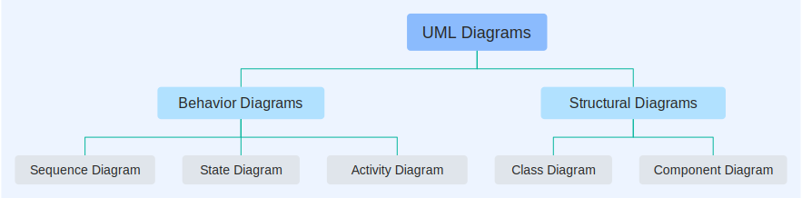

# [Pintorita - Pintora plugin for typst ](https://github.com/taylorh140/typst-pintora)

[Pintora](https://pintorajs.vercel.app/)

Typst package for drawing the following from markup:
- Sequence Diagram
- Entity Relationship Diagram
- Component Diagram
- Activity Diagram
- Mind Map Experiment
- Gantt Diagram Experiment
- DOT Diagram Experiment




````typ
#import "@preview/pintorita:0.1.4"

#set page(height: auto, width: auto, fill: black, margin: 2em)
#set text(fill: white)

#show raw.where(lang: "pintora"): it => pintorita.render(it.text)

= pintora

Typst just got a load of diagrams. 

```pintora
mindmap
@param layoutDirection TB
+ UML Diagrams
++ Behavior Diagrams
+++ Sequence Diagram
+++ State Diagram
+++ Activity Diagram
++ Structural Diagrams
+++ Class Diagram
+++ Component Diagram
```

```
mindmap
@param layoutDirection TB
+ UML Diagrams
++ Behavior Diagrams
+++ Sequence Diagram
+++ State Diagram
+++ Activity Diagram
++ Structural Diagrams
+++ Class Diagram
+++ Component Diagram
```

````


## Documentation

### `render`

Render a pintora string to an image

#### Arguments

* `src`: `str` - pintora source string
* `factor`: scale output svg, "factor:0.5" will scale images down by half, so scale can be consistent across renders.
* `style`: `str` diagram style, `default` or `dark` or `larkLight` or `larkDark`
* `font`: `str` font family, default is `Source Code Pro, sans-serif`
* All other arguments are passed to `image.decode` so you can customize the image size

#### Returns

The image, of type `content`

### `render-svg`

Render a pintora string to an image

#### Arguments

* `src`: `str` - pintora source string
* `style`: `str` diagram style, `default` or `dark` or `larkLight` or `larkDark`
* `font`: `str` font family, default is `Source Code Pro, sans-serif`
* All other arguments are passed to `image.decode` so you can customize the image size

#### Returns

The svg image

## History

* 0.1.0 - Inital Release
* 0.1.1 - Updated to Jogs 0.2.3 and pintora 0.7.3
* 0.1.2 - Fixed strange offset of text rows in class diagram, added `render-svg` function and more customization options
* 0.1.3 - Bug Fixes for argument handling. 
* 0.1.4 - Updated to Jogs 0.2.4 and pintora 0.7.5.  
