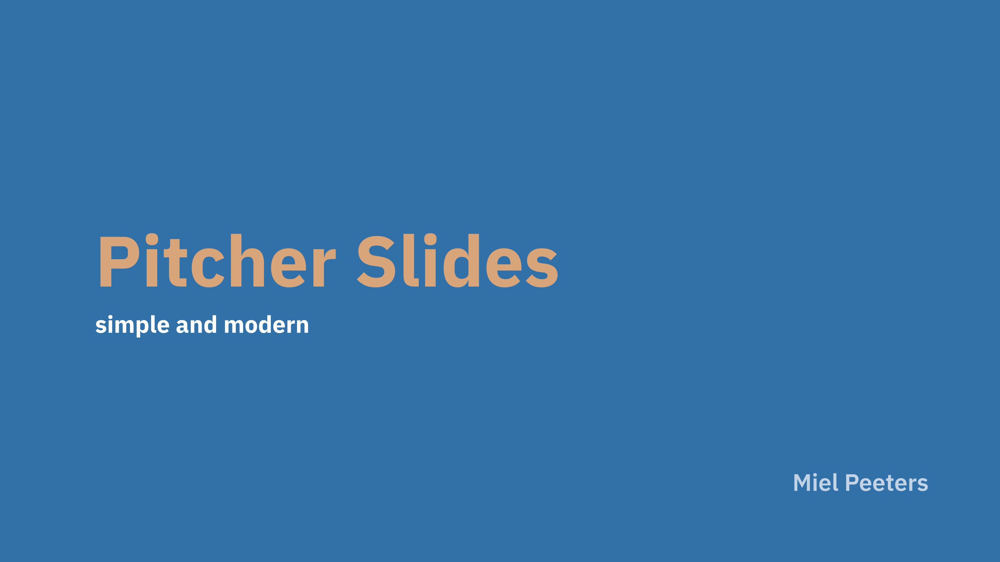
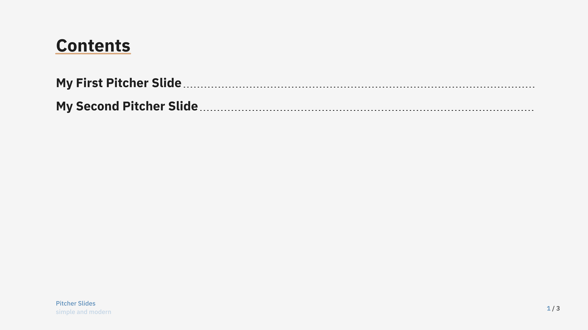
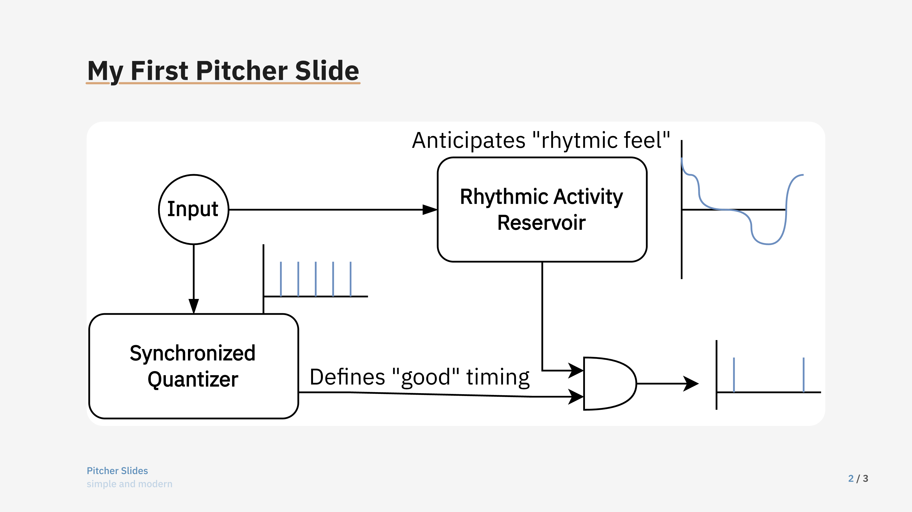
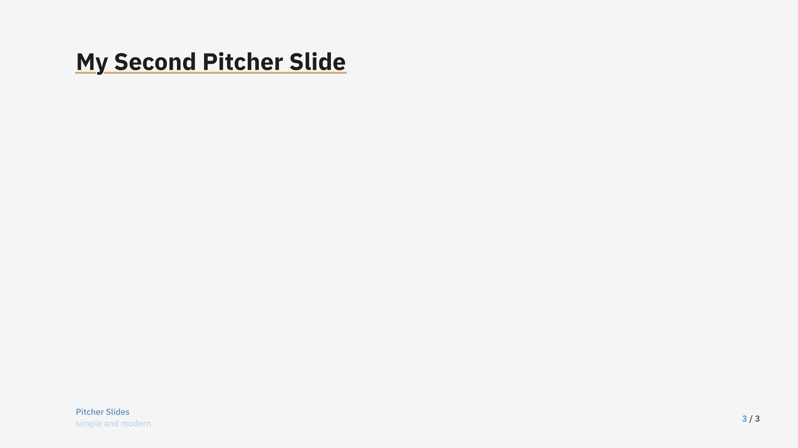
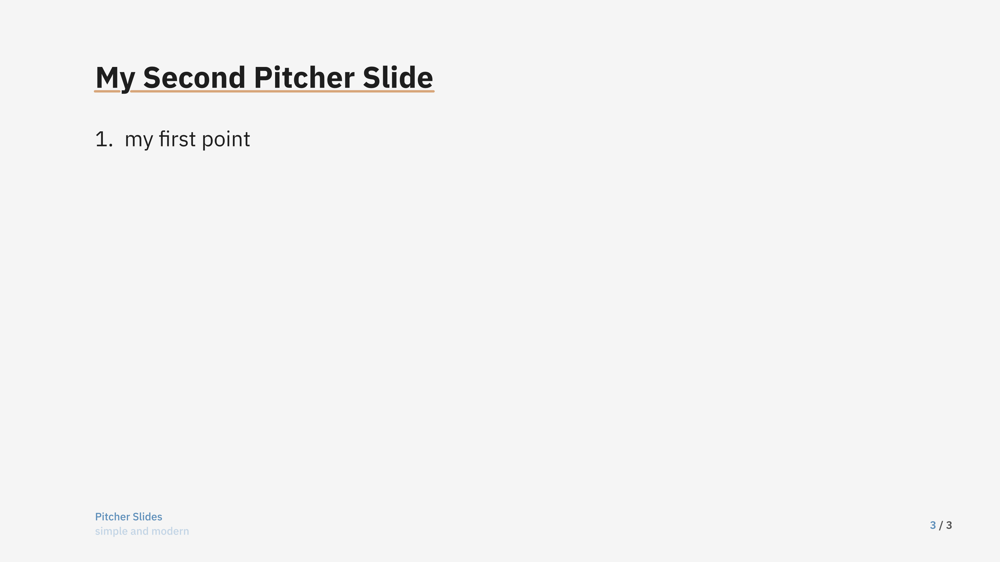
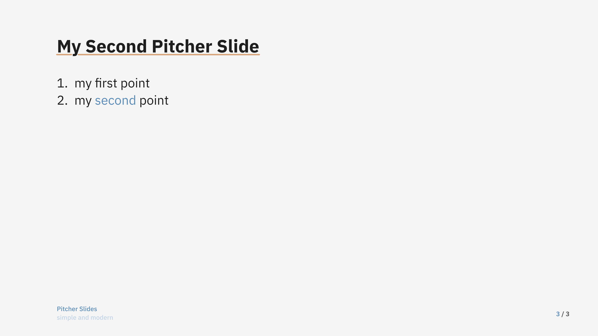

# Pitcher 

A simple and modern slideshow tool featuring configurable theme with automatic color palette selection.

---

## Usage

```typst
#import "@preview/pitcher:0.1.0": *

#let style = define_style(color: rgb("#3271a8"), font: "IBM Plex Sans")

#show: slides.with(
  title: "Pitcher Slides",
  description: "simple and modern",
  style: style,
  title_color: true,
)

#new_slide()

#outline()

#new_slide()

= My First Pitcher Slide
#figure(
  image("image.svg")
)

#new_slide()

#animated_slide(
  style,
  [= My Second Pitcher Slide],
  [1. my first point],
  [2. my #text(fill: style.secondary_color)[second] point],
)
```








# API
## `slides`
This is the main function of this package, which should be used like so:
```typst
#show: slides.with(...)
```

### arguments:
- `title`: `content` or `string`, will be displayed in the first slide and at the footer of every other slide
- `author` / `authors`: one author or an array of authors, will be displayyed in the first slide
- `description`: `content` or `string`, will be displayed in the first slide and at the footer of every other slide
- `style`: a style, generated by function [`define_style`](#define_style), includes colors, font, and `radius`. The latter controls the radius size of figures (default: `15pt`)
- `title_color`: `bool`, default: `true`: whether or not the title should be displayed in a contrasting color or not.

## `define_style`
This function creates a style dictionary, based on a color. 
Font and radius of figures can be specified too

### arguments:
- `color`: the main color of this presentation style
- `font`: the font for this presentation style
- `radius`: this radius is applied to figures

## `new_slide`
This function starts a new page, and keeps track of the current slide count (displayed at the right bottom).

## `animated_slide`
This function can be used to create slides which are split up to reveal new content.

### arguments:
- `style`: style dictionary (see [`define_style`](#define_style))
- `..content`: a variable amount of content arguments. For each of these, a new slide will be created.

## `accent_slide`
This function formats its body as an accented slide, with coloured background.

### arguments:
- `style`: style dictionary (see [`define_style`](#define_style))
- `body`: content to be shown in the accented slide style
