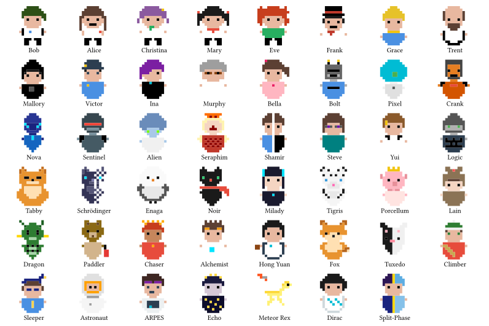

# Pixel Family

[](https://github.com/GiggleLiu/pixel-family/actions/workflows/ci.yml)

Inline pixel art characters for Typst, rendered as native vector graphics. Drop them into running text like emoji.

**[Download the manual (PDF)](https://github.com/GiggleLiu/pixel-family/releases/download/v0.2.1/manual.pdf)**

## Meet the Family



Their names come from the cast of cryptography: Alice and Bob exchange secret messages, Eve eavesdrops, Frank forges signatures, Grace certifies keys, Trent arbitrates, Mallory attacks, and Victor verifies.

**[Vote for your favorite character!](https://github.com/GiggleLiu/pixel-family/discussions/1)**

## Quick Start

```typst
#import "@preview/pixel-family:0.2.1": *

Hello #bob() and #alice() are talking while #eve() listens.
```

Characters default to `1em` and center-align with surrounding text. Pass `size` for explicit sizing:

```typst
#bob(size: 3cm)
```

Use `baseline: 0pt` for bottom alignment:

```typst
#bob(size: 3cm, baseline: 0pt)
```

## Color Customization

Every character accepts `skin`, `hair`, `shirt`, and `pants`:

```typst
#bob(size: 3cm, hair: blue, shirt: red)
#alice(size: 3cm, hair: black, shirt: green)
```

Built-in skin tone presets: `skin-default`, `skin-light`, `skin-medium`, `skin-dark`.

## License

MIT
