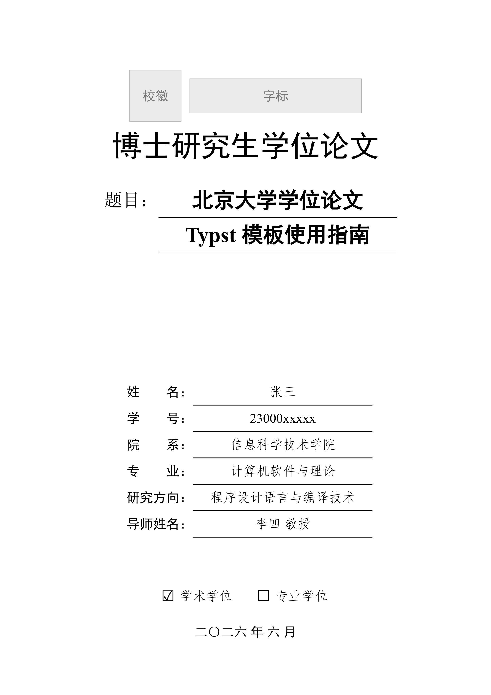

# pku-thesis-pass

北京大学学位论文 Typst 模板（博士 / 硕士） / Dissertation Thesis Typst Template (Doctoral / Master) for Peking University.

<p align="center">
  
</p>

## 使用方式

### 方式一：从 Typst Universe 创建（推荐）

```bash
typst init @preview/pku-thesis-pass:0.2.0 my-thesis
cd my-thesis
```

### 方式二：本地使用

```bash
git clone https://github.com/chuxinyuan/pku-thesis-pass.git
cd pku-thesis-pass
```

## 编译文档

```bash
# 普通版本
typst compile thesis.typ

# 盲审版本
typst compile thesis.typ --input blind=true

# 打印版本（链接不着色）
typst compile thesis.typ --input preview=false

# 章节不强制从奇数页开始
typst compile thesis.typ --input always-start-odd=false

# 指定系统字体方案（macOS/Windows/Linux）
typst compile thesis.typ --input system=linux
```

## 配置说明

在 `thesis.typ` 中调用 `config()` 函数配置论文信息，返回的字典解构后可按任意顺序编排：

```typst
#let (setup, cover, body-wrap, bibliography, ..) = config(
  author-zh: "张三",
  title-zh: "论文中文题目",
  system: "default",
)
```

| 参数 | 类型 | 说明 |
|------|------|------|
| `author-zh` | str | 中文姓名 |
| `author-en` | str | 英文姓名 |
| `student-id` | str | 学号 |
| `blind-id` | str | 盲审论文编号 |
| `thesis-name` | str | 论文类型（如"博士研究生学位论文"） |
| `header-text` | str | 页眉统一文本 |
| `title-zh` | str | 中文题目 |
| `title-en` | str | 英文题目 |
| `school` | str | 院系 |
| `first-major` | str | 一级学科 |
| `major-zh` | str | 专业中文名 |
| `major-en` | str | 专业英文名 |
| `direction` | str | 研究方向 |
| `supervisor-zh` | str | 导师中文名 |
| `supervisor-en` | str | 导师英文名 |
| `degree-type` | str | `"academic"` 或 `"professional"` |
| `year` | int | 提交年份 |
| `month` | int | 提交月份 |
| `system` | str | 系统字体方案：`"default"`/`"mac"`/`"windows"`/`"linux"` |
| `blind` | bool | 盲审模式（默认 `false`） |
| `preview` | bool | 预览模式（默认 `true`） |
| `first-line-indent` | length | 首行缩进（默认 `2em`） |
| `always-start-odd` | bool | 章节从奇数页开始（默认 `true`） |
| `clean-declaration` | bool | 声明页隐藏页眉页脚（默认 `false`） |
| `outline-depth` | int | 目录深度（默认 `3`） |
| `supplements` | dict | 自定义引用记号（图/表/代码/公式前缀） |
| `codly-args` | dict | 代码块样式参数（行号、语言图标等） |
| `logo` | path | 封面校徽图片路径，如 `path("assets/logo.svg")`（默认 `none`，显示占位框） |
| `wordmark` | path | 封面校名字标图片路径（默认 `none`，显示占位框） |
| `override-bib` | bool | 自定义参考文献样式（默认 `false`） |
| `bib-file` | path | BibTeX 文件路径，如 `path("ref.bib")` |
| `bib-style` | str | `"numeric"` 或 `"author-date"` |
| `bib-version` | str | `"2015"` 或 `"2025"` |
| `bib-cn-first` | bool | 中文文献优先（默认 `true`） |
| `bib-pinyin-override` | dict | 多音字校正，如 `("重": "chong2")` |

## 校徽和字标配置

出于版权考虑，这里**不包含**北京大学的官方校徽和字标，封面默认显示灰色占位框。

官方校徽和字标 pdf 文件建议请您自行从 CTAN 的 [pkuthss](https://ctan.org/pkg/pkuthss) 包获取，将相关文件放在项目根目录的 `assets` 路径下，然后在 `config()` 中配置，例如：

```typst
#let (.., cover) = config(
  logo: path("assets/pkulogo.pdf"),
  wordmark: path("assets/pkuword.pdf"),
)
```

注：CTAN 提供 eps 和 pdf 两种格式。Typst 目前仅支持 png/jpg/gif/webp/svg/pdf，暂不支持 eps 格式，建议直接用 pkuthss 包里的 pdf 格式文件，或者转换为 svg 等支持的格式。

## 功能特性

- 封面（含盲审版）
- 版权声明页
- 中英文摘要
- 自动目录（含图、表、代码列表）
- 中文章节编号（第X章 + 附录 A/B）
- GB/T 7714 参考文献（2015 / 2025 标准）
- 三线表、代码高亮
- 页眉页脚自动切换
- 脚注
- 附录
- 致谢、原创性声明
- 命令行参数控制（`blind` / `preview` / `system`）
- 跨平台字体方案（macOS / Windows / Linux）

## 字体配置

模板为每个平台预定义了字体方案，通过 `system` 参数切换：
`"default"` / `"mac"` / `"windows"` / `"linux"`。

Typst 按列表顺序依次 fallback，优先使用列表中靠前的字体。

### 跨平台通用（system: "default"）

优先 Windows 字体，次选 Noto / Source Han，无 macOS 独占字体。

| 用途 | 字体列表 |
|------|----------|
| 仿宋 | Times New Roman, FangSong, STFangsong |
| 宋体 | Times New Roman, SimSun, STSong, Noto Serif CJK SC, Source Han Serif |
| 黑体 | Times New Roman, SimHei, STHeiti, Noto Sans CJK SC, Source Han Sans |
| 楷体 | Times New Roman, KaiTi, STKaiti, AR PL UKai |
| 代码 | Consolas, Courier New, SimSun, STSong, Noto Serif CJK SC, Source Han Serif |

### macOS（system: "mac"）

使用 Apple 自带字体，无冗余 fallback。

| 用途 | 字体列表 |
|------|----------|
| 仿宋 | Times New Roman, STFangsong |
| 宋体 | Times New Roman, STSong |
| 黑体 | Arial, PingFang SC, STHeiti |
| 楷体 | Times New Roman, STKaiti |
| 代码 | Menlo, Courier New, STSong |

### Windows（system: "windows"）

使用 Windows 自带中文字体（SimSun / SimHei / KaiTi 等）。

| 用途 | 字体列表 |
|------|----------|
| 仿宋 | Times New Roman, FangSong |
| 宋体 | Times New Roman, SimSun |
| 黑体 | Times New Roman, SimHei |
| 楷体 | Times New Roman, KaiTi |
| 代码 | Consolas, SimSun |

### Linux（system: "linux"）

优先 Noto / Source Han 系列开源字体。

| 用途 | 字体列表 |
|------|----------|
| 仿宋 | Times New Roman, FangSong, STFangsong |
| 宋体 | Times New Roman, Noto Serif CJK SC, Source Han Serif, SimSun |
| 黑体 | Times New Roman, SimHei, Noto Sans CJK SC, Source Han Sans |
| 楷体 | Times New Roman, KaiTi, STKaiti, AR PL UKai |
| 代码 | Consolas, Courier New, Noto Serif CJK SC, Source Han Serif, SimSun |

## 致谢

感谢 [pkuthss-typst](https://github.com/pku-typst/pkuthss-typst) 项目成员前期的伟大贡献，让论文排版这项工作变得简单而有趣，我在此模板的基础上，借助 AI 的力量做了一点点调整。

## License

MIT License
