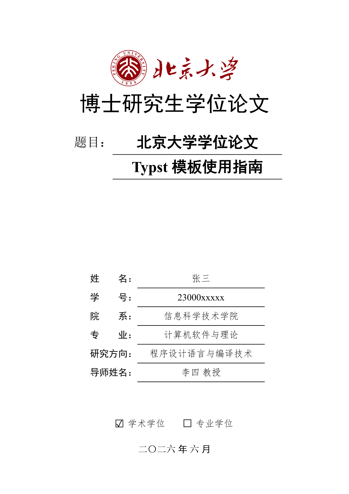

# pku-thesis-pass

北京大学学位论文 Typst 模板（博士 / 硕士） | Typst Template (Doctoral / Master) for Peking University Thesis

<p align="center">
  
</p>

## 功能特性

- 封面（正常版 + 盲审版）
- 盲审模式自动隐藏封面个人信息与成果页、致谢、原创声明
- 书脊页（打印装订用，盲审自动隐藏作者）
- 版权声明页
- 中英文摘要
- 自动目录
- 插图、表格、公式、代码列表、主要符号对照表
- 中文章节编号（第X章 + 附录 A/B）
- GB/T 7714 参考文献（2015 / 2025 标准）
- 页眉页脚自动切换
- 脚注
- 三线表、长表跨页自动续表（重复表头 + "续表"标注）
- 公式块（编号 + 描述）、代码高亮、斑马条纹背景、编程语言名称图标
- 子图（组合图 `(a)(b)(c)` 自动编号与交叉引用）
- 定理环境（定理 / 定义 / 引理 / 推论 / 命题 / 性质 / 例 / 注 / 证明）
- 附录
- 攻读学位期间发表的论文（作者加粗 + SCI/EI/IF 标注）
- 致谢、原创性声明
- 中文交叉引用（`@标签` 自动生成如"图 1.1"式编号）
- LaTeX 语法风格引用
- 正文字数统计（wordometer，标题不计入）
- 自动设置 PDF 元数据（标题 / 作者，盲审版隐藏作者）
- 命令行参数控制（`blind` / `preview` / `always-start-odd` / `system`）
- 跨平台字体方案（Windows / macOS / Linux）

## 获取模板

### 方式一：从 Typst Universe 创建（推荐）

```bash
typst init @preview/pku-thesis-pass:0.3.0 my-thesis
cd my-thesis
```

这会在 `my-thesis` 目录下创建一个包含 `assets`、`content`、`ref.bib` 和 `thesis.typ` 的干净项目。

### 方式二：克隆 GitHub 仓库

```bash
git clone https://github.com/chuxinyuan/pku-thesis-pass.git
cd pku-thesis-pass
```

如果需要完整的源代码对论文模板进行更多的定制，可以选择克隆仓库。其中，控制论文格式的源代码放在 `format` 目录下，模板放在 `template` 目录下。

## 配置说明

在 `thesis.typ` 中调用 `config()` 函数配置论文信息，返回值按字典形式访问，各组件可按任意顺序编排：

```typst
#let cfg = config(
  author-zh: "张三",
  title-zh: "论文中文题目",
  system: "windows",
)

#show: cfg.setup
#(cfg.cover)()
```

完整示例见 `template/thesis.typ`。

| 参数                     | 类型   | 说明                                                                                          |
| ------------------------ | ------ | -------------------------------------------------------------------------------------------- |
| `author-zh`            | str    | 中文姓名                                                                                        |
| `author-en`            | str    | 英文姓名                                                                                        |
| `student-id`           | str    | 学号                                                                                           |
| `blind-id`             | str    | 盲审论文编号                                                                                    |
| `thesis-name`          | str    | 论文类型（如"博士研究生学位论文"）                                                                |
| `header-text`          | str    | 页眉统一文本                                                                                    |
| `title-zh`             | str    | 中文题目                                                                                        |
| `title-en`             | str    | 英文题目                                                                                        |
| `school`               | str    | 院系                                                                                            |
| `first-major`          | str    | 一级学科                                                                                        |
| `major-zh`             | str    | 专业中文名                                                                                      |
| `major-en`             | str    | 专业英文名                                                                                      |
| `direction`            | str    | 研究方向                                                                                        |
| `supervisor-zh`        | str    | 导师中文名                                                                                      |
| `supervisor-en`        | str    | 导师英文名                                                                                      |
| `degree-type`          | str    | `"academic"` 或 `"professional"`                                                               |
| `year`                 | int    | 提交年份                                                                                        |
| `month`                | int    | 提交月份                                                                                        |
| `system`               | str    | 系统字体方案：`"windows"`/`"macos"`/`"linux"`                                                    |
| `blind`                | bool   | 盲审模式（默认`false`）                                                                          |
| `preview`              | bool   | 预览模式（默认`true`）                                                                           |
| `first-line-indent`    | length | 首行缩进（默认`2em`）                                                                            |
| `always-start-odd`     | bool   | 章节从奇数页开始（默认`true`）                                                                    |
| `clean-declaration`    | bool   | 声明页隐藏页眉页脚（默认`false`）                                                                 |
| `outline-depth`        | int    | 目录深度（默认`3`）                                                                              |
| `word-count`           | bool   | 统计正文与附录字数（默认`false`），正文中可用 `total-words` / `total-characters` 显示统计结果       |
| `achievement-outlined` | bool   | "攻读学位期间发表的论文"页是否出现在目录（默认`true`）                                              |
| `supplements`          | dict   | 自定义引用记号（图/表/代码/公式前缀）及列表标题（插图/表格/代码/公式列表、符号表、成果表）             |
| `use-latexref`         | bool   | LaTeX 引用兼容（默认`false`）                                                                    |
| `latexref-prefixes`    | array  | `use-latexref` 为 `true` 时尝试剥离的前缀列表                                                     |
| `codly-args`           | dict   | 代码块样式参数（行号、语言图标等）                                                                 |
| `logo`                 | path   | 封面校徽图片路径，如`path("assets/logo.svg")`（默认 `none`，显示占位框）                           |
| `wordmark`             | path   | 封面校名字标图片路径（默认`none`，显示占位框）                                                     |
| `override-bib`         | bool   | 自定义参考文献样式（默认`false`）                                                                 |
| `bib-file`             | path   | BibTeX 文件路径，如`path("ref.bib")`                                                             |
| `bib-style`            | str    | `"numeric"` 或 `"author-date"`                                                                  |
| `bib-version`          | str    | `"2015"` 或 `"2025"`                                                                            |
| `bib-cn-first`         | bool   | 中文文献优先（默认`true`）                                                                        |
| `bib-pinyin-override`  | dict   | 多音字校正，如`("重": "chong2")`                                                                 |

## 字体配置

模板为每个平台预定义了字体方案，通过 `system` 参数切换：`"windows"` / `"macos"` / `"linux"`，默认使用 Windows 系统字体方案。

Typst 按列表顺序依次 Fallback，优先使用列表中靠前的字体。

### Windows（system: "windows"）

Windows：使用系统自带字体

| 用途       | 字体列表                  |
| ---------- | ------------------------- |
| 仿宋       | Times New Roman, FangSong |
| 宋体       | Times New Roman, NSimSun  |
| 黑体       | Times New Roman, SimHei   |
| 楷体       | Times New Roman, KaiTi    |
| 代码       | Consolas, NSimSun         |
| 英文衬线   | Times New Roman           |
| 英文无衬线 | Arial                     |

### macOS（system: "macos"）

macOS：使用系统自带字体

| 用途       | 字体列表                     |
| ---------- | ---------------------------- |
| 仿宋       | Times New Roman, STFangsong  |
| 宋体       | Times New Roman, STSong      |
| 黑体       | Times New Roman, PingFang SC |
| 楷体       | Times New Roman, STKaiti     |
| 代码       | Menlo, STSong                |
| 英文衬线   | Times New Roman              |
| 英文无衬线 | Helvetica                    |

### Linux（system: "linux"）

Linux：纯开源字体，无商业字体依赖

| 用途       | 字体列表                                                            |
| ---------- | ------------------------------------------------------------------ |
| 仿宋       | Liberation Serif, FandolFang R, Zhuque Fangsong (technical preview) |
| 宋体       | Liberation Serif, Source Han Serif, Noto Serif CJK SC               |
| 黑体       | Liberation Serif, Source Han Sans, Noto Sans CJK SC                 |
| 楷体       | Liberation Serif, AR PL UKai                                        |
| 代码       | DejaVu Sans Mono, Source Han Serif, Noto Serif CJK SC               |
| 英文衬线   | Liberation Serif                                                    |
| 英文无衬线 | Liberation Sans                                                     |

注：FandolFang 字库不全，朱雀仿宋候补；Typst 目前对可变字体支持有限，优先使用 Adobe 发行的思源字体。

## 编译文档

这里以模板获取方式一（从 Typst Universe 创建）为例，代码如下：

```bash
# 普通版本
typst compile thesis.typ

# 盲审版本
typst compile thesis.typ --input blind=true

# 打印版本（链接不着色）
typst compile thesis.typ --input preview=false

# 章节不强制从奇数页开始
typst compile thesis.typ --input always-start-odd=false

# 指定系统字体方案（macOS/Windows/Linux）
typst compile thesis.typ --input system=linux
```

对于方式二（克隆 GitHub 仓库）的用户，进入 `pku-thesis-pass` 目录后，使用以下命令编译文档：

```bash
# 普通版本
typst compile template/thesis.typ --root .
```

需要特别注意的是，编译前需要仔细检查模板各模块的导入路径，例如，对于 `template/content/ch01-quickstart.typ`，它的文件头如下：

```typ
#import "../../format/lib.typ": code-block, booktab, font-set
// #import "@preview/pku-thesis-pass:0.3.0": code-block, booktab, font-set
```

未发布到官方仓库的改动需用本地相对导入（如上述 `../../format/...`），以免 `@preview` 包与本地源码不一致。

## 致谢

感谢 [pkuthss-typst](https://github.com/pku-typst/pkuthss-typst) 项目成员的杰出贡献，正是他们的卓越工作让北京大学学位论文排版变得简单而优雅。本模板在充分借鉴其理念与实现的基础上，借助 AI 辅助微调，最终形成了当前的论文模板。

## 许可证（License）

本项目中的 Typst 模板源代码依据 MIT 许可证进行授权。

模板内置的校徽（`assets/pkulogo.pdf`）和校名字标（`assets/pkuword.pdf`）文件取自 CTAN 的 [pkuthss](https://ctan.org/pkg/pkuthss) 包，属于受商标权、著作权保护的资源文件，不在 MIT 许可证授权范围内，其知识产权归相关权利人所有。上述资源仅限用于学位论文排版的学术、非商业用途，除法律法规另有规定或已获得相关授权外，不得对上述资源进行再分发、修改或用于其他用途。使用者需自行确认其对资源的使用符合北京大学的有关规定及适用法律法规。

The Typst template source code is licensed under the MIT License.

The Peking University emblem logo (`assets/pkulogo.pdf`) and name wordmark (`assets/pkuword.pdf`) files bundled with this template are taken from the [pkuthss](https://ctan.org/pkg/pkuthss) package on CTAN. They are trademarked and copyrighted assets, excluded from the MIT license, and remain the property of their respective owners. They may be used only for academic, non-commercial purposes such as thesis formatting. Unless otherwise permitted by law or authorized by the rights holders, these assets must not be redistributed, modified, or used for any other purpose. Users are responsible for ensuring that their use of these assets complies with the relevant policies of Peking University and applicable laws and regulations.
