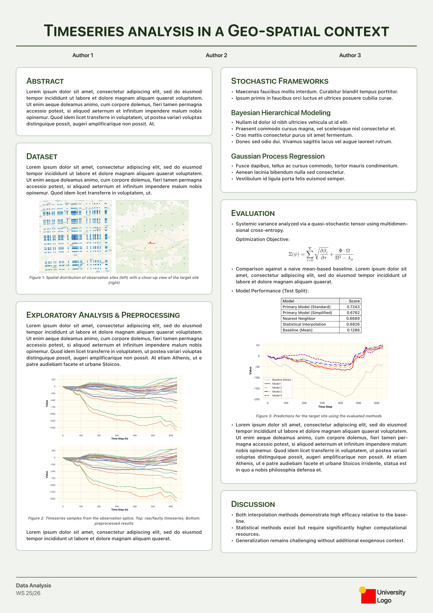
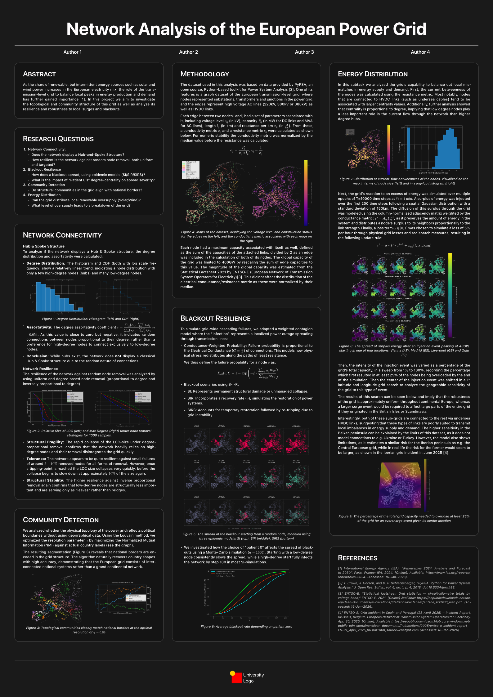
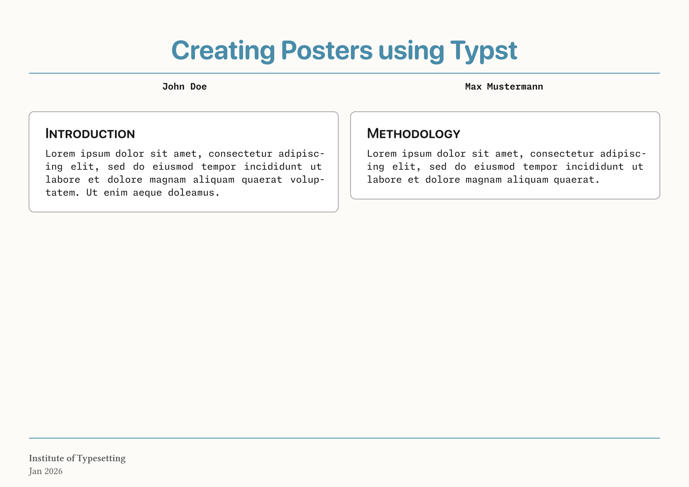

[](https://github.com/ant1isbusy/typst-placard)

# placard

_**placard** (noun) A sign or notice for display in a public place._

A [Typst](https://typst.app/) package for creating simple posters.


```typ
#import "@preview/placard:0.1.0": placard, card
```
<div align="center">
<table align="center">
  <tr>
    <td align="center" style="background: white; vertical-align: middle;">
      
    </td>
    <td align="center" style="background: white; vertical-align: middle;">
      
    </td>
  </tr>
</table>
</div>

## Configuration

The `placard` function is designed to be highly modular. You can pass dictionaries to `colors`, `sizes`, `fonts`, and `styles` to override specific elements without touching the rest of the theme.

## Core Parameters

| Parameter | Type | Default | Description |
| --- | --- | --- | --- |
| `title` | `string` | `"Poster Title"` | The main heading of the poster. |
| `authors` | `array` | `()` | A list of author names displayed below the title. |
| `scheme` | `string` | `"light"` | Base theme: `"light"` (Warm Linen) or `"dark"` (Midnight). |
| `paper` | `string` | `"a1"` | Standard poster paper size (e.g., `"a0"`, `"a1"`, `"a2"`). |
| `num-columns` | `int` | `2` | Number of columns for the body content. |
| `gutter` | `length` | `1.5em` | Spacing between columns. |
| `scaling` | `float` | `1.0` | Global multiplier for all text sizes (great for scaling A1 to A0). |

## Modular Dictionaries

In addition to the parameter above, the `placard`-function can override its default values using the following dictionaries and their options:

### Colors (`colors`)

Overrides the monochromatic theme defaults.

* `paper-fill`: Background color of the entire poster.
* `card-fill`: Background color inside the cards.
* `card-border`: Color of the card outlines.
* `title` / `heading` / `text`: Respective text colors.
* `accent`: Used for Level 2 headings and lines.

### Sizes (`sizes`)

Values are automatically multiplied by the `scaling` factor.

* `title`: Main title size (Default: `65pt`).
* `h1` / `h2`: Card headings and sub-headings.
* `body` / `card`: Main text sizes.
* `authors` / `footer`: Supporting text sizes.

### Fonts (`fonts`)

Configure fonts for each part of the poster.

* `title`, `authors`, `body`, `headings`, `card`, `footer`.

### Styles (`styles`)

Toggles specific typographic features.

* `title-smallcaps`: (Default: `false`)
* `h1-smallcaps`: (Default: `true`)
* `h2-smallcaps`: (Default: `true`)

---

### Footer Configuration

The `footer` parameter takes a dictionary to e.g. manage the institutional information.

```typ
footer: (
  content: [Company XY7],
  logo: image("logo.png"),
  logo-placement: right,
  text-placement: left,
)

```

---

### The `card` Element

Use the `card` function within your body to wrap content in a consistent container.

| Parameter | Type | Description |
| --- | --- | --- |
| `title` | `string` | Automatically creates a Level 1 heading inside the card. |
| `fill` | `color` | Override the background for a specific card. |
| `border-stroke` | `stroke` | Override the border style for a specific card. |
| `gap` | `length` | Vertical space after the card (Default: `1em`). |

---

### Example Usage
<div align="center">
  
</div>

```typ
#show: placard.with(
  title: "Creating Posters using Typst",
  authors: ("John Doe", "Max Mustermann"),
  flipped: true,
  sizes: (card: 23pt),
  paper: "a2",
  colors: (
    accent: rgb("#498ca9"),
    title: rgb("#498ca9")
  ),
  footer: (content: [*Institute of Typesetting* \ Jan 2026]),
  fonts: (
    title: "SF Pro Rounded",
    card: "Monaspace Neon NF",
    headings: "SF Pro Rounded",
    authors: "Monaspace Neon NF"
  )
)

#card(title: "Introduction")[
  #lorem(25)
]

#colbreak()

#card(title: "Methodology")[
  #lorem(20)
]
```
