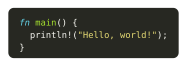

# Pleast

`pleast` is a Typst package designed to parse and process Property List files, which are commonly used to store configuration data, especially in macOS and iOS applications. This package enhances the experience of reading plist files by optimizing the process. It takes plist files read using Typst's built-in `xml()` function and converts them into a more user-friendly dictionary format.

## Notes
- **Data Types**: The package supports plist data types: `dict`, `array`, `date`, `string`, `integer`, `real`, `boolean`, and `data`. But the `date` type **ONLY** support [RFC 3339](https://www.ietf.org/rfc/rfc3339.txt) format, and `data` will be process as a string, because you can use another package [based](https://typst.app/universe/package/based) to process Base64 data.

## Installation

Import `@preview/pleast:0.2.0` in your `.typ` file.

```typst
#import "@preview/pleast:0.2.0": plist
```

## Usage Example

Here’s a simple example demonstrating how to use the `pleast` package in a Typst document:

```typst
#import "@preview/pleast:0.2.0": plist

#let data = plist(read("path/to/your/textmate-theme.tmTheme", encoding: none))
#let foreground = data.settings.at(0).settings.at("foreground", default: none)
#let background = data.settings.at(0).settings.at("background", default: none)

#set raw(theme: "path/to/your/textmate-theme.tmTheme")
#show raw: set text(fill: rgb(foreground)) if foreground != none

#place(
  block(
    radius: 0.5em,
    inset: 1em,
    fill: if background != none { rgb(background) } else { none },
    ```rust
    fn main() {
      println!("Hello, world!");
    }
    ```,
  ),
  center,
)
```

With the Monokai theme, the result of above code is:

<div align="center">
  
</div>

This might be the most common usage, because typst only support `.tmTheme` file as raw code synatx theme.

## License

`pleast` is licensed under the [MIT](LICENSE) license.