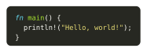

# Pleast

`pleast` is a Typst package designed to parse and process Property List files, which are commonly used to store configuration data, especially `.tmTheme` files. This package enhances the experience of reading plist files by optimizing the process. It takes plist files read using Typst's built-in `xml()` function and converts them into a more user-friendly dictionary format.

## Usages

Import `@preview/pleast:0.3.0` in your `.typ` file.

```typst
#import "@preview/pleast:0.3.0": plist
```

### TextMate Theme Reader

Typst only supports `.tmTheme` files, a type of Plist format file, for customizing syntax highlighting themes. Here is an example, using the background and foreground colors defined in `.tmTheme` in code blocks, which are two properties that would normally be ignored by Typst.

```typst
#import "@preview/pleast:0.3.0": plist

#let data = plist(read("path/to/your/textmate-theme.tmTheme", encoding: none))
#let foreground = data.settings.at(0).settings.at("foreground", default: none)
#let background = data.settings.at(0).settings.at("background", default: none)

#set raw(theme: "path/to/your/textmate-theme.tmTheme")
#show raw: set text(fill: rgb(foreground)) if foreground != none

#place(
  block(
    radius: 0.5em,
    inset: 1em,
    fill: if background != none { rgb(background) } else { none },
    ```rust
    fn main() {
      println!("Hello, world!");
    }
    ```,
  ),
  center,
)
```

With the Monokai theme, the result of above code is:

<div align="center">
  
</div>

### Custom Parsers

The plist data types supported by `pleast` are: `dict`, `array`, `date`, `string`, `integer`, `real`, `boolean`, and `data`. You can customize the parser for some types: `date`, `integer`, `real`, and `data`.

The default parser behavior of `pleast` is as follows:
- `date`: Uses `pleast.utils.parse-rfc3339()`, which **only** parses time strings in [RFC 3339](https://www.ietf.org/rfc/rfc3339.txt) format;
- `integer`: Uses Typst's built-in `int`;
- `real`: Uses Typst's built-in `float`;
- `data`: No processing, directly outputs the Base64 string.

You can override the default parsers via the `parsers` parameter of `plist()`. Below is an example using the [based](https://typst.app/universe/package/based) package to handle the `data` type.

A plist xml file `HelloWorld.xml` with Base64 data:

```xml
<?xml version="1.0" encoding="UTF-8"?>
<!DOCTYPE plist PUBLIC "-//Apple Computer//DTD PLIST 1.0//EN" "http://www.apple.com/DTDs/PropertyList-1.0.dtd">
<plist version="1.0">
<dict>
    <key>helloWord</key>
    <data>
    SGVsbG8sIHdvcmxkIQ==
    </data>
</dict>
</plist>
```

And a typst file:

```typst
#import "@preview/pleast:0.3.0": plist
#import "@preview/based:0.2.0": base64

#let data = plist(
  read("HelloWorld.xml", encoding: none),
  parsers: (data: base64.decode),
)

#assert.eq(str(data.helloWord), "Hello, world!")
```

## License

`pleast` is licensed under the [MIT](LICENSE) license.