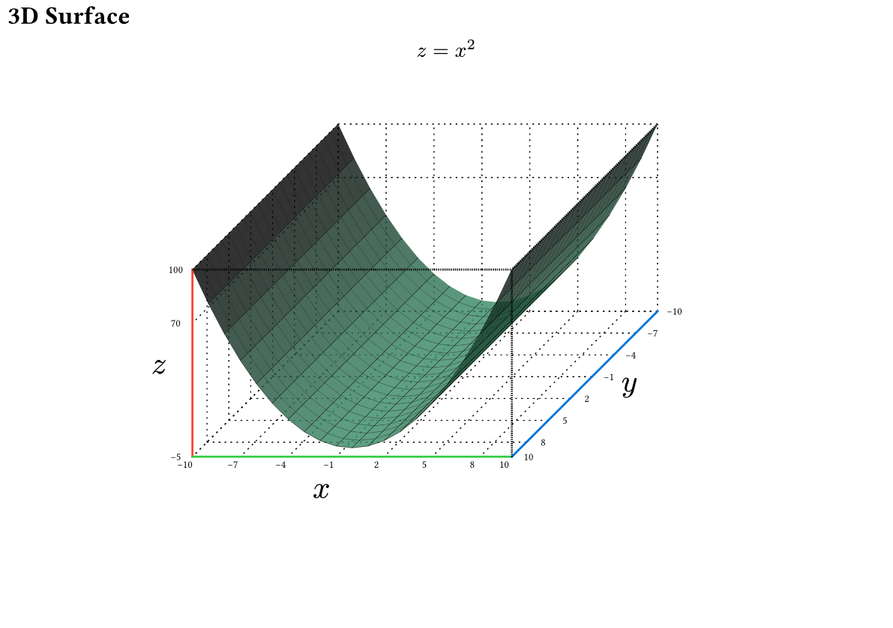

# The `plotsy-3d` Package
<div align="center">Version 0.1.0</div>


**plotsy-3d** is a [Typst](https://github.com/typst/typst) package for rendering 3D objects built on top of [CeTZ](https://github.com/cetz-package/cetz). Similar functionality to pgfplots for LaTeX but currently less developed.


<p>
    
    
</p>

<p>
    
    
</p>

<p>
    
    
</p>

## Features:

* 3D Function plotting of the form  `z = f(x,y)`
* Parametric curve plotting of the form `x(t), y(t), z(t)`
* Parametric surface plotting of the form `x(u,v), y(u,v), z(u,v)`
* Plots autoscale with font size for consistent style

See **Usage** or `examples/examples.typ` for the code


## Future Plans (contributors welcome):
- [ ] Nicer way to draw vectors
- [ ] Better way to handle render order
- [ ] User Manual
- [ ] Make the code and api nicer

## Usage

### Parametric Function Plotting
```typ
#import "@preview/plotsy-3d:0.1.0": plot-3d-parametric-curve

#let xfunc(t) = 15*calc.cos(t)
#let yfunc(t) = calc.sin(t)
#let zfunc(t) = t

== Parametric Curve
$ x(t) = 15 cos(t), space y(t)= sin(t), space z(t)= t $
#plot-3d-parametric-curve(
  xfunc,
  yfunc,
  zfunc,
  subdivisions:30, //number of line segments per unit
  scale_dim: (0.03,0.05,0.05), // relative and global scaling
  tdomain:(0,10), 
  axis_step: (5,5,5), // adjust distance between x, y, z number labels
  dot_thickness: 0.05em, 
  front_axis_thickness: 0.1em,
  front_axis_dot_scale: (0.04, 0.04),
  rear_axis_dot_scale: (0.08,0.08),
  rear_axis_text_size: 0.5em,
  axis_label_size: 1.5em,
  rotation_matrix: ((-2, 2, 4), (0, -1, 0)) // matrix.transform-rotate-dir() from cetz
)
```

### 3D Surface Plotting
```typ
#import "@preview/plotsy-3d:0.1.0": plot-3d-surface

#let size = 10
#let scale_factor = 0.11
#let (xscale,yscale,zscale) = (0.3,0.3,0.02)
#let scale_dim = (xscale*scale_factor,yscale*scale_factor, zscale*scale_factor)  
#let func(x,y) = x*x + y*y
#let color-func(x, y, z, x_lo,x_hi,y_lo,y_hi,z_lo,z_hi) = {
  return blue.transparentize(20%).darken((y/(y_hi - y_lo))*100%).lighten((x/(x_hi - x_lo)) * 50%)
}

== 3D Surface
$ z= x^2 + y^2 $
#plot-3d-surface(
  func,
  color-func: color-func,
  subdivisions: 2,
  subdivision_mode: "decrease",
  scale_dim: scale_dim,
  xdomain: (-size,size),
  ydomain:  (-size,size),
  pad_high: (0,0,0), // padding around the domain with no function displayed
  pad_low: (0,0,5),
  axis_step: (3,3,75),
  dot_thickness: 0.05em,
  front_axis_thickness: 0.1em,
  front_axis_dot_scale: (0.05,0.05),
  rear_axis_dot_scale: (0.08,0.08),
  rear_axis_text_size: 0.5em,
  axis_label_size: 1.5em,
)
```

### Parametric Surface Plotting
```typ
#import "@preview/plotsy-3d:0.1.0": plot-3d-parametric-surface

#let xfunc(u,v) = u*calc.sin(v) 
#let yfunc(u,v) = u*calc.cos(v) 
#let zfunc(u,v) = u
#let color-func(x, y, z, x_lo,x_hi,y_lo,y_hi,z_lo,z_hi) = {
  return purple.transparentize(20%).lighten((z/(z_hi - z_lo)) * 80%)

}
#let scale_factor = 0.25
#let (xscale,yscale,zscale) = (0.3,0.2,0.3)
#let scale_dim = (xscale*scale_factor,yscale*scale_factor, zscale*scale_factor)  

== Parametric Surface
$ x(u,v) = u sin(v), space y(u,v)= u cos(v), space z(u,v)= u $
#plot-3d-parametric-surface(
  xfunc,
  yfunc,
  zfunc,
  xaxis: (-5,5), // set the minimum axis size, scales with function if needed
  yaxis: (-5,5),
  zaxis: (0,5),
  color-func: color-func,
  subdivisions:5, 
  scale_dim: scale_dim,
  udomain:(0, calc.pi+1), // note this gets truncated to an integer
  vdomain:(0, 2*calc.pi+1), // note this gets truncated to an integer
  axis_step: (5,5,5),
  dot_thickness: 0.05em,
  front_axis_thickness: 0.1em,
  front_axis_dot_scale: (0.04, 0.04),
  rear_axis_dot_scale: (0.08,0.08),
  rear_axis_text_size: 0.5em,
  axis_label_size: 1.5em,
)
```

### Vector Field Plotting
```typ
#import "@preview/plotsy-3d:0.1.0": plot-3d-vector-field

#let size = 10
#let scale_factor = 0.12
#let (xscale,yscale,zscale) = (0.3,0.3,0.3)
#let i_func(x,y,z) = x + 0.5
#let j_func(x,y,z) = y + 0.5
#let k_func(x,y,z) = z + 1
#let color-func(x, y, z, x_lo,x_hi,y_lo,y_hi,z_lo,z_hi) = {
  return purple.darken(z/(z_hi - z_lo) * 100%) 
}

== 3D Vector Field
$ arrow(p)(x,y,z) = (x+0.5) hat(i) + (y+0.5) hat(j) + (z+1) hat(k) $
#plot-3d-vector-field(
    i_func,
    j_func,
    k_func,
    color-func: color-func,
    subdivisions: 3,
    subdivision_mode: "decrease",
    scale_dim: (xscale*scale_factor,yscale*scale_factor, zscale*scale_factor),
    xdomain: (-size,size),
    ydomain:  (-size,size),
    zdomain: (0,size),
    // pad_high: (0,0,2),
    rotation_matrix: ((-1.5, 1.2, 4), (0, -1, 0)),
    axis_label_offset: (0.4,0.2,0.2),
    axis_text_offset: 0.08,
    vector_size: 0.1em,
)
```

### Custom Plotting
For custom combinations of plots and lines, you can make a copy of the relevant plot function from `plotsy-3d.typ` and add multiple plots onto the same axis in the same cetz canvas using the backend render functions.

## More Examples

<!-- <p>
    
    
</p> -->

<p>
    
    
</p>

<p>
    

</p>

## Star History

<a href="https://star-history.com/#misskacie/plotsy-3d&Date">
 <picture>
   <source media="(prefers-color-scheme: dark)" srcset="https://api.star-history.com/svg?repos=misskacie/plotsy-3d&type=Date&theme=dark" />
   <source media="(prefers-color-scheme: light)" srcset="https://api.star-history.com/svg?repos=misskacie/plotsy-3d&type=Date" />
   
 </picture>
</a>

## Changelog

### V0.1.0
Initial release
* 3D Function plotting of the form  `z = f(x,y)`
* Parametric curve plotting of the form `x(t), y(t), z(t)`
* Parametric function plotting of the form `x(u,v), y(u,v), z(u,v)`
