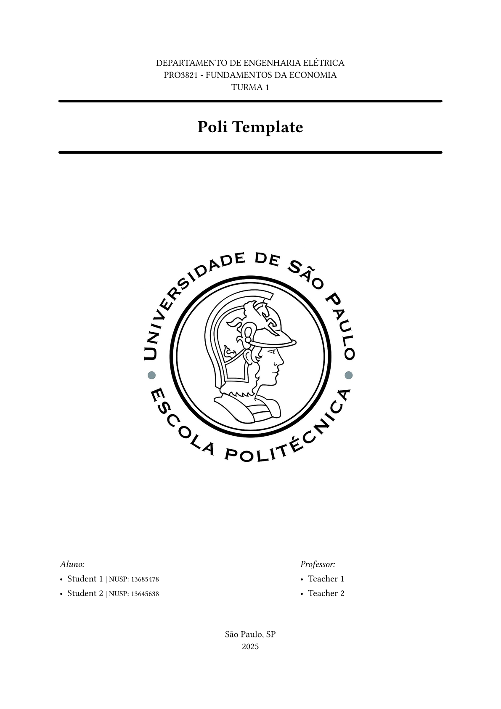

# The `politemplate` Package
<div align="center">Version 0.1.0</div>
<br/>

<p align="center">
  
</p>


<div align="center">Template I used when writing all sort of things in university</div>

## Getting Started

To use this template, simply import it as shown below:


```typ
#import "@preview/politemplate:0.1.0": politemplate

#show: politemplate.with(
  title: [Poli Template],
  students: (
    ([Student 1],[13685478]),
    ([Student 2]),
  ),
  teachers: (
    [Teacher 1],
    [Teacher 2],
  ),
  front_header: [
    departamento de engenharia elétrica\
    PRO3821 - Fundamentos da economia\
    Turma 1
  ],
  location: [São Paulo, SP],
  logo: image("./logo.jpg"),
  bibliography: bibliography(
    "./references.bib",
    style: "associacao-brasileira-de-normas-tecnicas",
    full: true,
  ),
  footer_ignore: ("Conclusão",)
)

// Your content goes here
```
