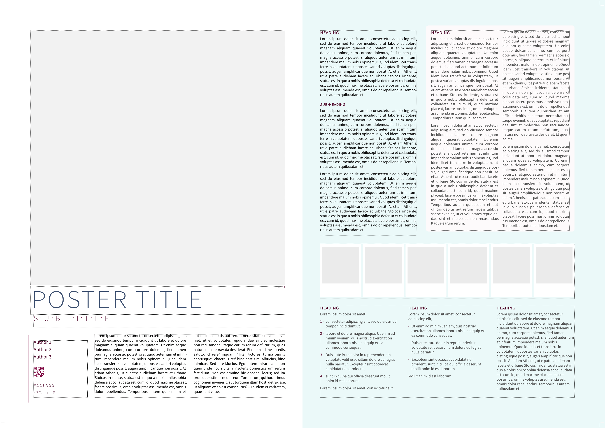

# poster-syndrome

A Typst template for posters with custom frame placemement. To get started:

```typst
typst init @preview/poster-syndrome:0.1.0
```

And edit the `main.typ` example. 


## Further examples

Aesthetics and layout can be configured by the user, see [examples/custom-theme.typ](examples/custom-theme.typ) for a minimal example.



## Contributing

PRs are welcome! And if you encounter any bugs or have any requests/ideas, feel free to open an issue.

## Changelog

### v 0.1.0 (2025-07-19)

- first release