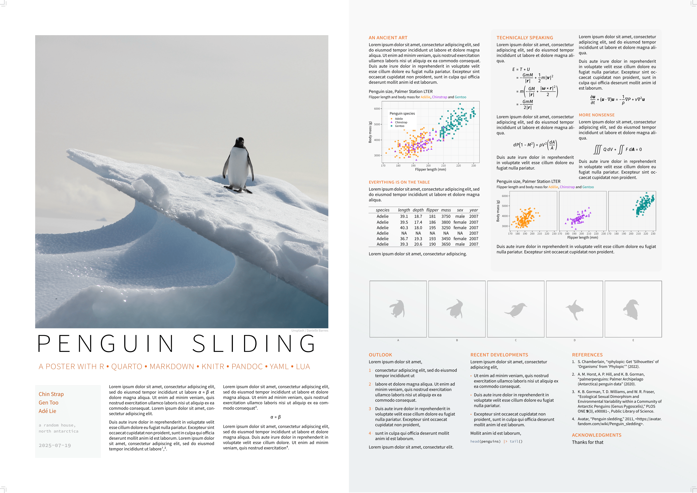
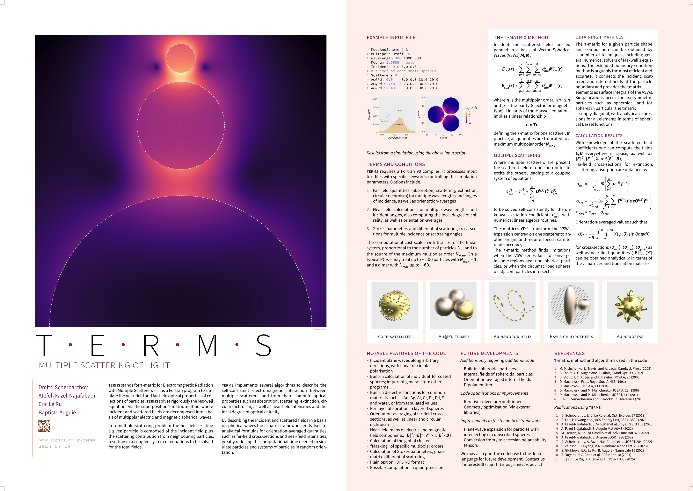
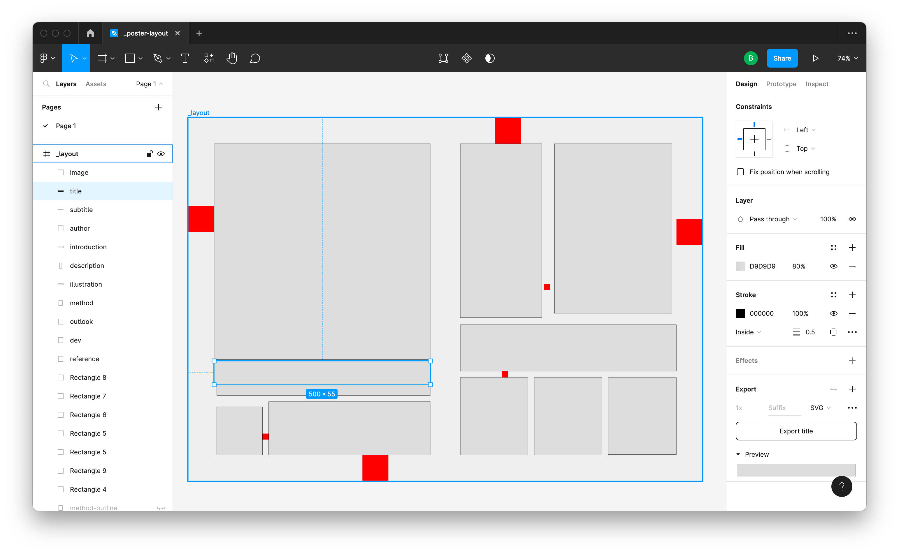
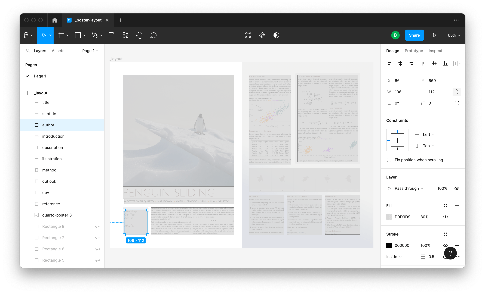
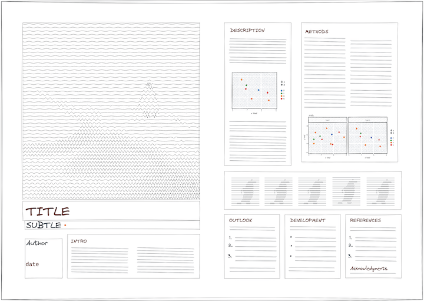

# poster-syndrome

A Typst template for posters with custom frame placement. To get started:

```
typst init @preview/poster-syndrome:0.1.0
```

And edit the `main.typ` example. 


## Further examples




Aesthetics and layout can be configured by the user, see [examples/custom-theme.typ](examples/custom-theme.typ) for a minimal example.


### Layout definition

The layout can be provided as a dictionary such as,

```
#let container = (
  x: 0,
  y: 0,
  width: 1189,
  height: 841,
)

#let frames = (
  methods: (x: 847, y: 60, width: 272, height: 410),
  illustration: (x: 629, y: 479, width: 500, height: 108),
  description: (x: 629, y: 60, width: 189, height: 403),
  introduction: (x: 186, y: 657, width: 374, height: 200),
  details: (x: 66, y: 660, width: 106, height: 112),
  subtitle: (x: 66, y: 618, width: 494, height: 25),
  title: (x: 60, y: 563, width: 500, height: 55),
  cover-image: (x: 60, y: 60, width: 500, height: 500),
  outlook: (x: 629, y: 601, width: 500, height: 200),
)
```

Alternatively, the frames may be obtained from a Figma project [exported as JSON](https://www.figma.com/developers/api#files-endpoints), using the helper function provided (it may need to be adapted if your Figma file differs substantially),



```
#let (container, frames) = figma-layout(json("figma_layout.json")) 
```
Using Figma (or a similar design tool) for defining the layout has several advantages: 

- the drawing tools have automatic alignment features
- objects can be assigned an ID
- objects can be switched to invisible, e.g aligment helpers, or other layers used in the design process but not needed in the output
- the final graphic can even be added as a semi-transparent layer, allowing us to _iterate_ by making slight adjustments to the frames



Other vector drawing tools can be used, as long as they export identifying labels alongside the rectangular regions.



Parsing SVGs to extract attributes seems a little painful in plain typst, however, so an external tool (Python, R) might be preferred, to produce a simple dictionary as above.

### Theme aesthetics

Once the labelled frames are defined, one should provide a _theme_, which is a nested dictionary of presentation attributes for the different frames. It consists of 3 main objects,

- _palette_ defining some colours, notably `base`, `highlight`, `contrast` (and others as needed)
- _text_ defining the text attributes for different types of elements (frames, but also specific items such as title, heading, etc.)
- _par_ defining the corresponding par attributes (kept separate from `text` as some parameters can have the same name in both)

If this sounds a bit vague, the best reference is the default theme built into the `theme-helper()` function in `defaults.typ`. This function is meant to help define full themes with just a few high-level parameters such as font family and colour palette. A complete theme can also be provided entirely manually. 
For small tweaks to a theme, e.g. changing the font of the title but keeping the rest as-is, `theme-helper()` also provides a `overrides: (:)` parameter, which allows overriding of specific elements in the theme (note that the nesting can go to several levels).

The theme is used to produce `styles`, which are `show:-set` rules applied to each element when the poster is typeset. For instance, where the theme defined,

```
theme = ( ...
text: (
subtitle: (
  font: "Source Sans Pro",
  size: 54pt,
  weight: 200,
  tracking: 0pt,
  fill: palette.highlight.darken(40%),
  features: (smcp: 1, c2sc: 1, onum: 1),
),
)
...
)
```
this is turned (internally) into,

```
#show: set text(..theme.text.subtitle)
```
within the scope where the subtitle is rendered.

A user might wish to provide their show rules directly as the `styles` argument of `poster`, if they wanted to set further parameters that way.


## Contributing

PRs are welcome! And if you encounter any bugs or have any requests/ideas, feel free to open an issue.

## Changelog

### v 0.1.0 (2025-07-19)

- first release