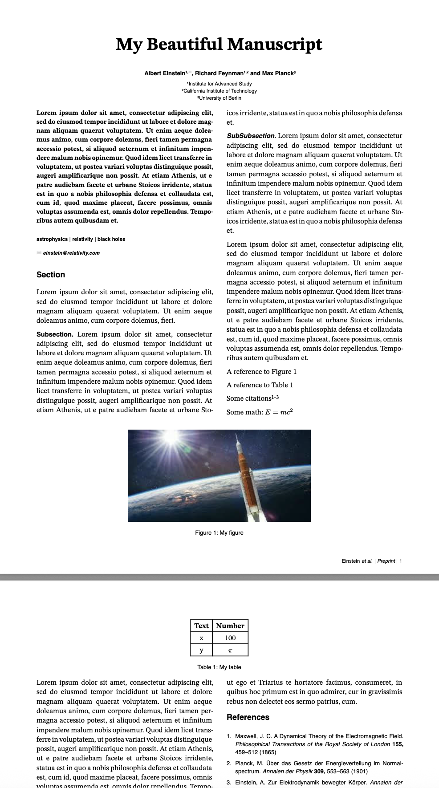

# preprintx

A Typst rewrite of [HenriquesLab bioRxiv template](https://www.overleaf.com/latex/templates/henriqueslab-biorxiv-template/nyprsybwffws) for manuscripts.



## Usage

### Import

```typst
#import "@preview/preprintx:0.1.0": preprintx
```

### Main body

```typst
#show: preprintx.with(
  title: "My Beautiful Manuscript",
  authors: (
    ("Einstein, Albert", "1,✉"),
    ("Feynman, Richard", "1,2"), 
    ("Planck, Max", "3"),
  ),
  affils: (
    "1": "Institute for Advanced Study",
    "2": "California Institute of Technology", 
    "3": "University of Berlin"
  ),
  // Insert your abstract after the colon, wrapped in brackets.
  // Example: `abstract: [This is my abstract...]`
  abstract: [Your abstract goes here...],
  keywords: ([astrophysics], [relativity], [black holes]),
  correspondence: "einstein@relativity.com",
)

= Introduction

Your content goes here...

= Methods

== Subsection

Content...

=== Subsubsection  

Content...

= Results

Add figures and tables:

#figure(
  image("figure.png", width: 80%),
  caption: [Your figure caption],
) <fig1>

#figure(
  table(
    columns: 2,
    [*Column 1*], [*Column 2*],
    [Data], [More data],
  ),
  caption: [Your table caption],
) <table1>

= References
#v(-3em)
#bibliography("references.bib", style: "nature", title: "")
```

## API

### preprintx.with

- **title**: `String` - Title of the document.
- **authors**: `Array<(String, String)>` - List of author tuples containing (name, affiliation indices). 
  - Format: `("Last, First", "1,2,✉")` where numbers are affiliation indices and ✉ indicates correspondence
- **affils**: `Dictionary` - Dictionary mapping affiliation indices to institution names.
  - Format: `("1": "Institution Name", "2": "Another Institution")`
- **abstract**: `Content` - Abstract of the document.
- **keywords**: `Array<Content>` - List of keywords wrapped in brackets or quotes.
- **correspondence**: `String` - Email address for correspondence.

### Author Format

Authors should be formatted as tuples:
```typst
("Last, First", "affiliation_indices")
```

Where:
- `"Last, First"` is the author's name in "Last, First" format
- `"affiliation_indices"` contains comma-separated numbers corresponding to affiliations, with optional ✉ for correspondence

### Affiliation Format

Affiliations should be provided as a dictionary:
```typst
affils: (
  "1": "First Institution",
  "2": "Second Institution", 
  "3": "Third Institution"
)
```

## Features

- Two-column layout 
- Title, author block, and figures span the full width of the page
- Serif font (STIX Two Text) for body text, sans-serif (Helvetica) for headings and captions
- Automatic author formatting with superscript affiliation numbers
- Footer with author name(s) and page numbers
- Figure and table placement with proper captions
- Bibliography support with Nature style by default
- Responsive heading styles (3 levels supported)

## Fonts
This template requires these two fonts to be installed on your system:

- [STIX Two Text](https://github.com/stipub/stixfonts/tree/master/zipfiles)
- Helvetica

## To do

- Without `#v(-3em)` prior to references, there is too much of a break
- Better support for figure placement

## License

MIT License

Copyright (c) 2025 Jonathan Skaza

Permission is hereby granted, free of charge, to any person obtaining a copy
of this software and associated documentation files (the "Software"), to deal
in the Software without restriction, including without limitation the rights
to use, copy, modify, merge, publish, distribute, sublicense, and/or sell
copies of the Software, and to permit persons to whom the Software is
furnished to do so, subject to the following conditions:

The above copyright notice and this permission notice shall be included in all
copies or substantial portions of the Software.

THE SOFTWARE IS PROVIDED "AS IS", WITHOUT WARRANTY OF ANY KIND, EXPRESS OR
IMPLIED, INCLUDING BUT NOT LIMITED TO THE WARRANTIES OF MERCHANTABILITY,
FITNESS FOR A PARTICULAR PURPOSE AND NONINFRINGEMENT. IN NO EVENT SHALL THE
AUTHORS OR COPYRIGHT HOLDERS BE LIABLE FOR ANY CLAIM, DAMAGES OR OTHER
LIABILITY, WHETHER IN AN ACTION OF CONTRACT, TORT OR OTHERWISE, ARISING FROM,
OUT OF OR IN CONNECTION WITH THE SOFTWARE OR THE USE OR OTHER DEALINGS IN THE
SOFTWARE.. 