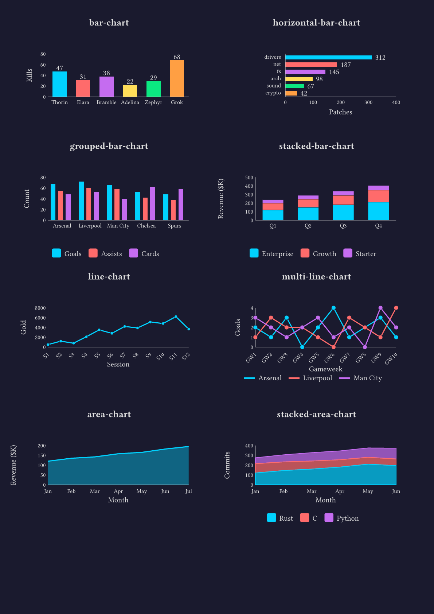
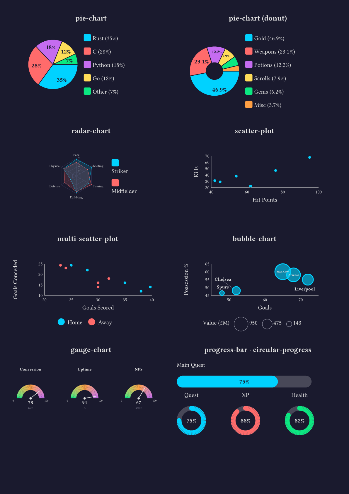
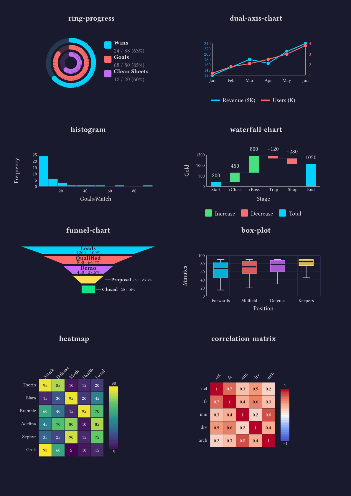
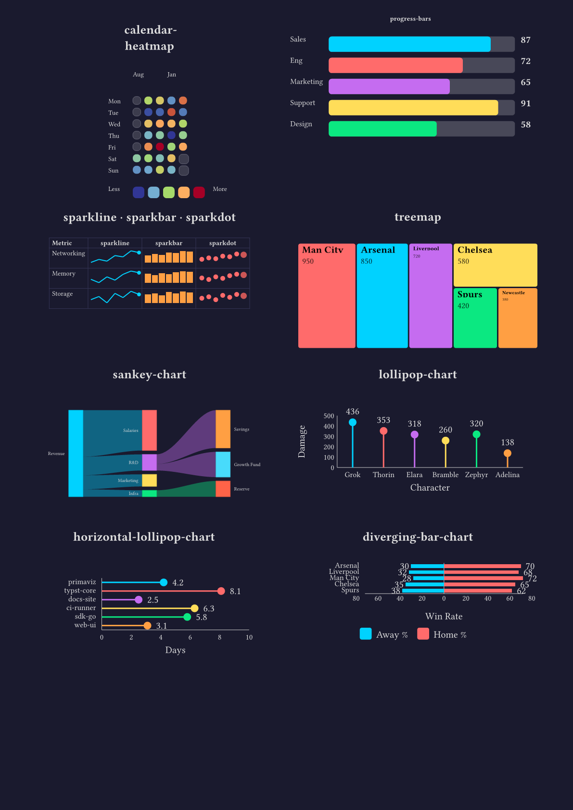
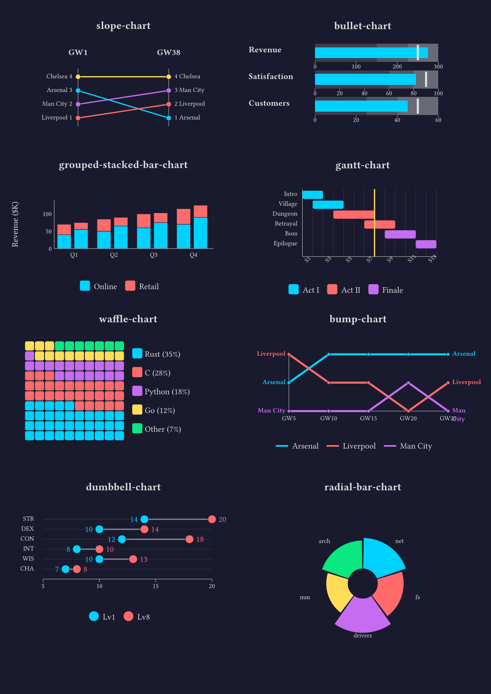
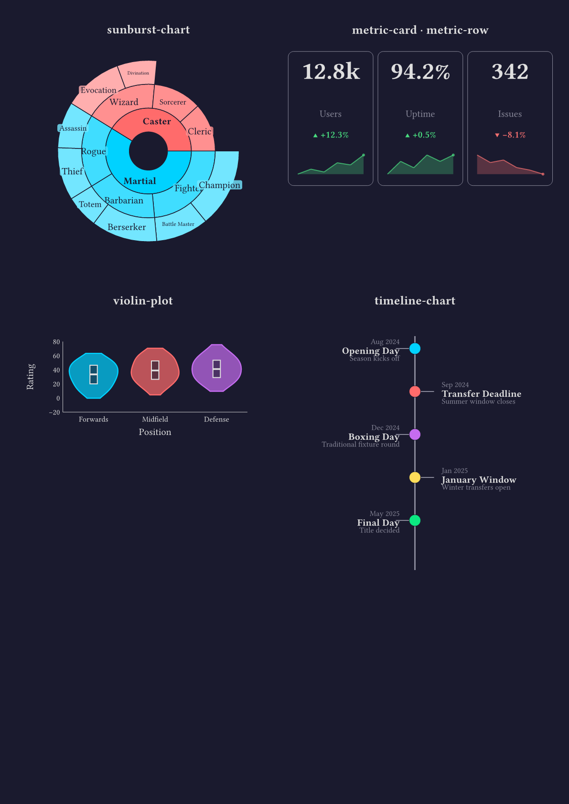
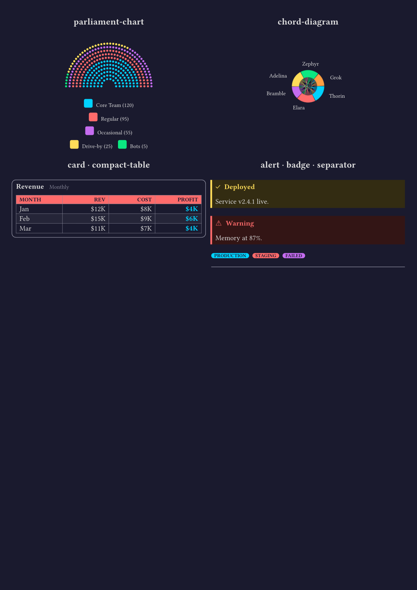
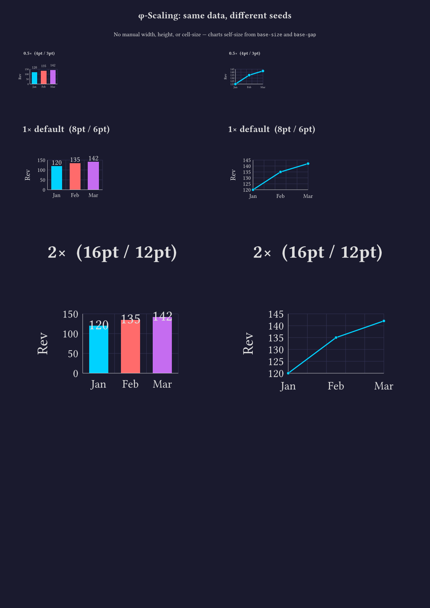
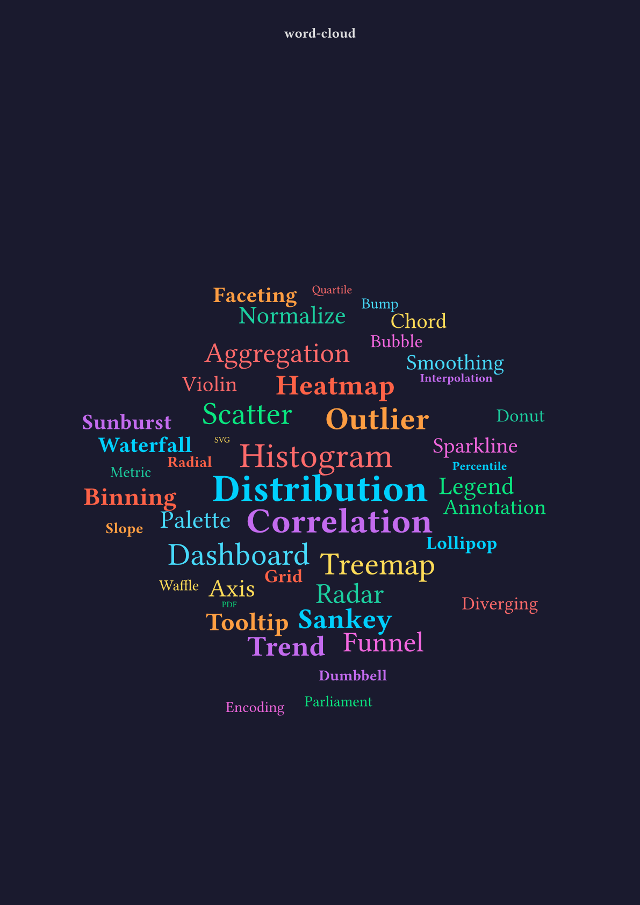

# Primaviz

[](LICENSE)
[](https://github.com/typst/typst)
[](screenshots/)
[](https://github.com/phiat/primaviz)

A charting library for [Typst](https://github.com/typst/typst) built entirely with native primitives (`rect`, `circle`, `line`, `polygon`, `place`). No external dependencies required.

## Gallery

All 50+ chart types across 8 pages — see [`examples/showcase.typ`](examples/showcase.typ) for the source:











## Examples

| File | Description |
|---|---|
| [`examples/demos/`](examples/demos/) | 21 per-chart demo files, each a 2×2 grid (light/dark + variations) |
| [`examples/showcase.typ`](examples/showcase.typ) | Compact 8-page showcase of all chart types (dark theme) |
| [`examples/demo.typ`](examples/demo.typ) | Comprehensive demo with all features, themes, and data loading |

Shared datasets in [`data/`](data/) used by both demo and showcase:
- [`data/sales.json`](data/sales.json) — SaaS startup metrics
- [`data/codebase.json`](data/codebase.json) — Open source project stats
- [`data/league.json`](data/league.json) — Soccer league data
- [`data/rpg.json`](data/rpg.json) — D&D campaign tracker
- [`data/words.json`](data/words.json) — Data visualization vocabulary

Compile any example directly with `typst compile examples/demos/demo-bar.typ`.

## Features

- **50+ chart types** for data visualization
- **JSON data input** — load data directly from JSON files
- **Theme system** — golden-ratio proportional scaling from two seeds (`base-size`, `base-gap`), preset themes, custom overrides, and `with-theme()` for document-wide defaults
- **Nice ticks** — D3-style axis tick algorithm produces round, evenly-spaced values; auto-detects decimal precision from step size
- **Smart label placement** — automatic fit detection, font shrinking, and greedy deconfliction for overlapping labels
- **Layout primitives** — shared utilities for label density, font scaling, and label placement
- **Annotations** — overlay reference lines, bands, labels, content, points, error bars, and rectangles on any Cartesian chart
- **Error bars** — native `errors:` parameter on bar and line charts (symmetric or asymmetric)
- **Outliers** — native `outliers:` field on box-plot boxes
- **Relative widths** — use `width: 100%` for responsive charts inside containers and grids
- **Dashboard primitives** — `card`, `compact-table`, `alert`, `badge`, `separator`, and `dashboard-layout` for report layouts
- **Customizable** — colors, sizes, labels, legends
- **Pure Typst** — no packages or external tools needed

## Chart Types

### Bar Charts
- `bar-chart` - Vertical bar chart
- `horizontal-bar-chart` - Horizontal bar chart
- `grouped-bar-chart` - Side-by-side grouped bars
- `stacked-bar-chart` - Stacked bar segments
- `grouped-stacked-bar-chart` - Groups of stacked segments side by side
- `lollipop-chart` - Vertical stem + dot (cleaner bar alternative)
- `horizontal-lollipop-chart` - Horizontal stem + dot
- `diverging-bar-chart` - Left/right bars from center axis

### Line & Area Charts
- `line-chart` - Single line with points
- `multi-line-chart` - Multiple series comparison
- `dual-axis-chart` - Two independent Y-axes
- `area-chart` - Filled area under line
- `stacked-area-chart` - Stacked area series

### Circular Charts
- `pie-chart` - Pie chart with legend
- `pie-chart` (donut mode) - Donut/ring chart
- `radar-chart` - Spider/radar chart

### Scatter & Bubble
- `scatter-plot` - X/Y point plotting
- `multi-scatter-plot` - Multi-series scatter
- `bubble-chart` - Scatter with size dimension, smart label deconfliction (inside/outside with leaders)
- `multi-bubble-chart` - Multi-series bubble chart

### Gauges & Progress
- `gauge-chart` - Semi-circular dial gauge
- `progress-bar` - Horizontal progress bar
- `circular-progress` - Ring progress indicator
- `ring-progress` - Concentric fitness rings (Apple Watch style)
- `progress-bars` - Multiple comparison bars

### Sparklines (inline)
- `sparkline` - Tiny line chart for tables and text
- `sparkbar` - Tiny bar chart
- `sparkdot` - Tiny dot chart

### Heatmaps
- `heatmap` - Grid heatmap with color scale
- `calendar-heatmap` - GitHub-style activity grid
- `correlation-matrix` - Symmetric correlation display

### Statistical
- `histogram` - Auto-binned frequency distribution
- `waterfall-chart` - Bridge/waterfall chart with pos/neg/total segments
- `funnel-chart` - Conversion funnel with percentages, auto external labels for narrow sections
- `box-plot` - Box-and-whisker distribution plot
- `treemap` - Nested rectangles for hierarchical data
- `slope-chart` - Two-period comparison with connecting lines
- `bullet-chart` - Compact gauge with qualitative ranges and target
- `bullet-charts` - Multiple bullet charts stacked vertically

### Proportional & Hierarchical
- `waffle-chart` - 10×10 grid of colored squares for proportions
- `sunburst-chart` - Multi-level hierarchical pie with nested rings
- `parliament-chart` - Semicircle dot layout for seat visualization

### Comparison & Ranking
- `bump-chart` - Multi-period ranking chart
- `dumbbell-chart` - Before/after dot comparisons with connecting lines
- `radial-bar-chart` - Circular bars radiating from center

### Distribution
- `violin-plot` - Kernel density estimation with mirrored polygon

### Flow & Timeline
- `sankey-chart` - Flow diagram with curved bands between nodes
- `gantt-chart` - Timeline bar chart for project scheduling
- `timeline-chart` - Vertical event timeline with alternating layout
- `chord-diagram` - Circular flow diagram with chord bands

### Dashboard
- `metric-card` - KPI tile with value, delta, and sparkline
- `metric-row` - Horizontal row of metric cards
- `card` - Themed container with optional title and description
- `compact-table` - Dense data table with header styling and highlight column
- `alert` - Info/warning/error/success notification block with left border accent
- `badge` - Inline colored pill (default/secondary/destructive/outline/success)
- `separator` - Themed horizontal rule
- `dashboard-layout` - Grid layout helper for multi-row dashboard pages
- `word-cloud` - Weighted text layout sized by importance

### Annotations
Overlay extra elements on any cartesian chart (bar, line, area, scatter, bubble, box-plot, histogram, violin, waterfall, dual-axis, ...) via the `annotations:` parameter. All coordinates are in data space.

- `h-line` — horizontal reference line (target, average, threshold)
- `v-line` — vertical reference line
- `h-band` — horizontal shaded region (goal zone, range)
- `label` — text label at a data point
- `content` — place arbitrary Typst content at (x, y); `anchor:` controls positioning (`top-left`, `top`, `center`, `bottom-right`, etc.)
- `point` — circle marker at (x, y) with configurable `radius`, `fill`, `stroke`
- `errorbar` — vertical (default) or horizontal (`orientation: "h"`) error bar with caps
- `rect` — rectangle in data coordinates with `fill`, `stroke`, `opacity`

```typst
#bar-chart(data, annotations: (
  (type: "h-line", value: 160, dash: "dashed", label: "target"),
  (type: "content", x: 2, y: 165, body: [★ best], anchor: "bottom"),
  (type: "errorbar", x: 0, low: 115, high: 125),
))
```

### Error bars (native)

Bar and line charts accept an `errors:` parameter. Axis range auto-extends to cover the error extremes.

```typst
#bar-chart(data, errors: (10, 12, 8, 15))                       // symmetric
#line-chart(data, errors: ((0.5, 0.7), (0.3, 0.4), (1, 2)))     // asymmetric (low, high)
```

### Box-plot outliers

Each box can carry an optional `outliers:` array. Outlier values are drawn as small dots and extend the y-axis range.

```typst
#box-plot((
  labels: ("A", "B"),
  boxes: (
    (min: 20, q1: 35, median: 50, q3: 65, max: 80, outliers: (95, 5)),
    (min: 15, q1: 30, median: 45, q3: 60, max: 75),
  ),
))
```

## Installation

```typst
#import "@preview/primaviz:0.6.0": *
```

## Usage

```typst
#import "@preview/primaviz:0.6.0": *

// Load data from JSON
#let data = json("mydata.json")

// Create a bar chart
#bar-chart(
  (
    labels: ("A", "B", "C", "D"),
    values: (25, 40, 30, 45),
  ),
  width: 300pt,
  height: 200pt,
  title: "My Chart",
)

// Create a pie chart
#pie-chart(
  (
    labels: ("Red", "Blue", "Green"),
    values: (30, 45, 25),
  ),
  size: 150pt,
  donut: true,
)

// Create a radar chart
#radar-chart(
  (
    labels: ("STR", "DEX", "CON", "INT", "WIS", "CHA"),
    series: (
      (name: "Fighter", values: (18, 12, 16, 10, 13, 8)),
      (name: "Wizard", values: (8, 14, 12, 18, 15, 11)),
    ),
  ),
  size: 200pt,
  title: "Character Comparison",
)
```

## Theming

Every chart function accepts an optional `theme` parameter. Themes control colors, font sizes, grid lines, backgrounds, and other visual properties.

### Using a preset theme

```typst
#import "@preview/primaviz:0.6.0": *

#bar-chart(data, theme: themes.dark)
```

### Document-wide theme

Use `with-theme()` to set a default theme for all charts in a block — no need to pass `theme:` to every chart. Explicit per-chart `theme:` parameters still override.

```typst
// Block wrapper
#with-theme(themes.dark)[
  #bar-chart(data)       // uses dark theme
  #pie-chart(data2)      // uses dark theme
  #line-chart(data3, theme: themes.minimal) // explicit override wins
]

// Or as a show rule for the entire document
#show: with-theme.with(themes.dark)
```

### Scaling with seeds

All font sizes and spacing are derived from two seed values via golden-ratio (φ = 1.618) powers. Change the seeds to scale everything proportionally:

```typst
#bar-chart(data, theme: (base-size: 10pt, base-gap: 8pt))  // larger text and spacing
#bar-chart(data, theme: (base-size: 5pt, base-gap: 3pt))   // compact
```

### Custom overrides

Pass a dictionary with only the keys you want to change. Unspecified keys fall back to the active theme (global or default). Partial overrides merge onto the global theme set by `with-theme()`, so `theme: (show-grid: true)` inside a `with-theme(themes.dark)` block gives you dark + grid:

```typst
#bar-chart(data, theme: (show-grid: true, palette: (red, blue, green)))
#bar-chart(data, theme: (tick-digits: 2))  // force 2 decimal places on axis ticks
```

### Theme from JSON

Build a theme from a JSON tokens file (e.g., exported from a CSS design system):

```typst
#let tokens = json("tokens.json")
#let my-theme = theme-from-json(tokens.light)
#let my-dark = theme-from-json(tokens.dark)

#show: with-theme.with(my-theme)
```

Expected JSON format: `palette` (array of hex strings), `text-color`, `text-color-light`, `text-color-inverse`, `background` (hex or null), `border-color`, `border-radius` (number in pt).

### Extracting themes from CSS

Two optional helper scripts — a Python version ([`scripts/extract-theme.py`](https://github.com/phiat/primaviz/blob/v0.6.0/scripts/extract-theme.py), `uv` + `coloraide`) and a TypeScript version ([`scripts/extract-theme.ts`](https://github.com/phiat/primaviz/blob/v0.6.0/scripts/extract-theme.ts), Bun + `culori`) — live in the [project repository](https://github.com/phiat/primaviz/tree/v0.6.0/scripts). They convert CSS design tokens (`--chart-1`..N, `--foreground`, `--background`, etc.) into primaviz theme files in `.typ` and/or `.json` format, handling oklch/hsl/rgb/hex color spaces with alpha blending.

> ⚠️ **Security note:** These scripts are not part of the published package archive. Before running them on your machine, please read the source in the links above to understand what they do — don't blindly execute third-party scripts.

Both accept the same flags: `--out-dir`, `--format` (`typst`/`json`/`both`), `--name`, `--dark-selector`. See the repo's README for the full run-through.

### Custom theme keys

Themes support passthrough of custom keys not in the default theme. This lets you extend the theme system for your own components:

```typst
#let my-theme = (
  palette: (red, blue, green),
  card-fill: rgb("#f5f5f5"),  // custom key — preserved and accessible
)
#show: with-theme.with(my-theme)
```

### Available presets

| Preset | Description |
|---|---|
| `themes.default` | Tableau 10 color palette, no grid, standard font sizes |
| `themes.minimal` | Lighter axis strokes, grid enabled, regular-weight titles |
| `themes.dark` | Dark background (`#1a1a2e`), vibrant neon palette (cyan, pink, purple, ...) |
| `themes.presentation` | Larger font sizes across the board for slides and projectors |
| `themes.print` | Grayscale palette with grid lines, optimized for black-and-white printing |
| `themes.accessible` | Okabe-Ito colorblind-safe palette |
| `themes.compact` | Smaller fonts, tighter padding for dense dashboard layouts |

## Data Formats

### Simple data (labels + values)
```typst
(
  labels: ("Jan", "Feb", "Mar"),
  values: (100, 150, 120),
)
```

### Multi-series data
```typst
(
  labels: ("Q1", "Q2", "Q3"),
  series: (
    (name: "Product A", values: (100, 120, 140)),
    (name: "Product B", values: (80, 90, 110)),
  ),
)
```

### Scatter/bubble data
```typst
(
  x: (1, 2, 3, 4, 5),
  y: (10, 25, 15, 30, 20),
  size: (5, 10, 8, 15, 12),  // for bubble chart
)
```

### Heatmap data
```typst
(
  rows: ("Row1", "Row2", "Row3"),
  cols: ("Col1", "Col2", "Col3"),
  values: (
    (1, 2, 3),
    (4, 5, 6),
    (7, 8, 9),
  ),
)
```

## Color Palette

The default theme uses Tableau 10 colors. You can access colors from any theme via the `get-color` function:

```typst
#import "@preview/primaviz:0.6.0": get-color, themes

// Default palette
#get-color(themes.default, 0)  // blue
#get-color(themes.default, 1)  // orange
#get-color(themes.default, 2)  // red

// Or use a theme preset
#get-color(themes.dark, 0)  // cyan
```

## Repository & contributing

Source, issue tracker, development scripts, and project structure live at [github.com/phiat/primaviz](https://github.com/phiat/primaviz). Bug reports and pull requests are welcome there.

## License

MIT
