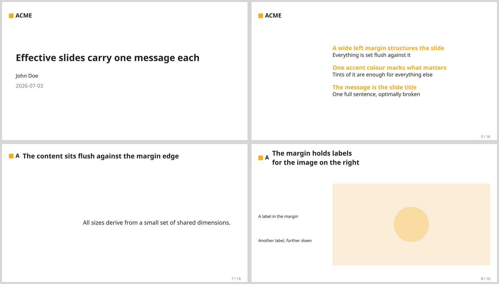

# prinzipien

[](https://typst.app/universe/package/prinzipien)
[](LICENSE.txt)
[](https://touying-typ.github.io/)

Prinzipien is a [Typst](https://typst.app) theme for
[Touying](https://touying-typ.github.io/) presentations, built on the design
principles of Jean-luc Doumont's _Trees, maps, and theorems_: **one message per
slide**. Each slide states a single, full-sentence message as its title, set
flush against a wide left margin, and a single accent colour — with tints
derived from it — does all the visual work.

- **One message per slide** — the slide title is a full sentence stating the takeaway.
- **A wide, Doumont-style left margin** that structures every slide.
- **A single accent colour**, with tints derived automatically for emphasis and de-emphasis.
- **Automatic overview slides** — `preview`, section `transition`s, and `review` build a map of your points.
- **Batteries included** — a title slide, appendix numbering, and logo support.
- **Configured in one place** — aspect ratio, margin width, colours, and logo.

## Showcase



The slides above come from the `examples/demo.typ` deck, which relies on the
theme's defaults; `examples/full-demo.typ` exercises every configuration option.
Both live in the [source repository](https://github.com/Entze/prinzipien).

## Installation

Prinzipien is published on
[Typst Universe](https://typst.app/universe/package/prinzipien), so no manual
installation is required. To start a new presentation from the bundled template:

```sh
typst init @preview/prinzipien
```

Or import the theme into an existing document:

```typ
#import "@preview/prinzipien:0.1.1": *
```

### Requirements

- Typst 0.15.0 or newer.
- The Noto Sans and Noto Sans Mono fonts (bundled with Typst). Override them
  with your own `set text(font: ..)` rules after the theme's show rule if you
  prefer different fonts.

## Usage

Apply the theme with a show rule, then write one message per slide as a
level-2 heading:

```typ
#import "@preview/prinzipien:0.1.1": *

#show: prinzipien-theme.with(
  config-info(
    title: [One sentence to remember],
    author: [Ada Lovelace],
    date: datetime.today(),
  ),
)

#title-slide()

== Give every slide a full-sentence message

The heading carries the takeaway; the body only supports it.
```

Highlight the words that matter with `#alert[..]`, mark the main points of your
talk with `#point[..]`, and let `#preview()` / `#review()` build the overview
maps automatically. See [`template/main.typ`](template/main.typ) for a complete
starting point, and the `examples/` directory in the
[repository](https://github.com/Entze/prinzipien) for fuller decks.

### Configuration

`prinzipien-theme` takes a handful of options, all with sensible defaults:

| Option | Default | Description |
| --- | --- | --- |
| `aspect-ratio` | `"16-9"` | Slide aspect ratio (`"16-9"` or `"4-3"`). |
| `margin` | `33%` | Width of the reserved left margin (a ratio of the slide width, or a length). |
| `background` | `#ffffff` | Background colour. |
| `foreground` | `#221f21` | Text (foreground) colour. |
| `accent` | `#f9ab1a` | The one accent colour. |
| `suppressed` | `#7a7d80` | Colour for muted / de-emphasised content. |
| `accent-tint` | `auto` | Tint of the accent, used behind `#alert`; derived from `accent` by default. |
| `logo-square` | `auto` | Square logo shown beside the slide title; derived from `config-info`'s `logo` by default. |

## Contributing

Contributions are welcome. This repository uses
[mise](https://mise.jdx.dev) to pin tool versions and
[hk](https://hk.jdx.dev) to run formatters and checks:

```sh
mise install               # install the pinned tools (Typst, hk, typstyle, ..)
mise exec -- hk run fix     # format and auto-fix
mise exec -- hk run check   # run checks that cannot be auto-fixed
mise exec -- hk run lint    # verify package-submission compliance
```

Please run the formatters before opening a pull request, and open an issue for
larger changes first. Bug reports and feature requests go to the
[issue tracker](https://github.com/Entze/prinzipien/issues).

## Authors and Acknowledgment

- **Lukas Grassauer** — author and maintainer (<lukas@grassauer.eu>).

Prinzipien builds on [Touying](https://touying-typ.github.io/) and follows the
design principles of Jean-luc Doumont's _Trees, maps, and theorems_ (2009).

Parts of this project — code, examples, and documentation — were written with
the assistance of an AI coding agent (Anthropic's Claude Code) under the
author's direction and review. If you would like to audit the prompts see
[`plans`](plans/).

## License

Distributed under the Boost Software License 1.0 (BSL-1.0).
See [`LICENSE.txt`](LICENSE.txt) for the full text.
