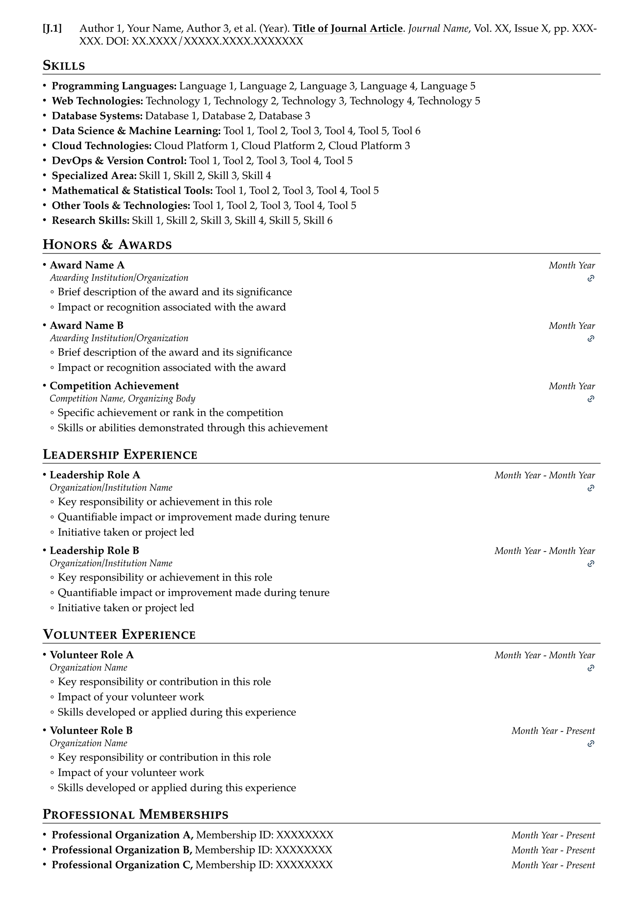
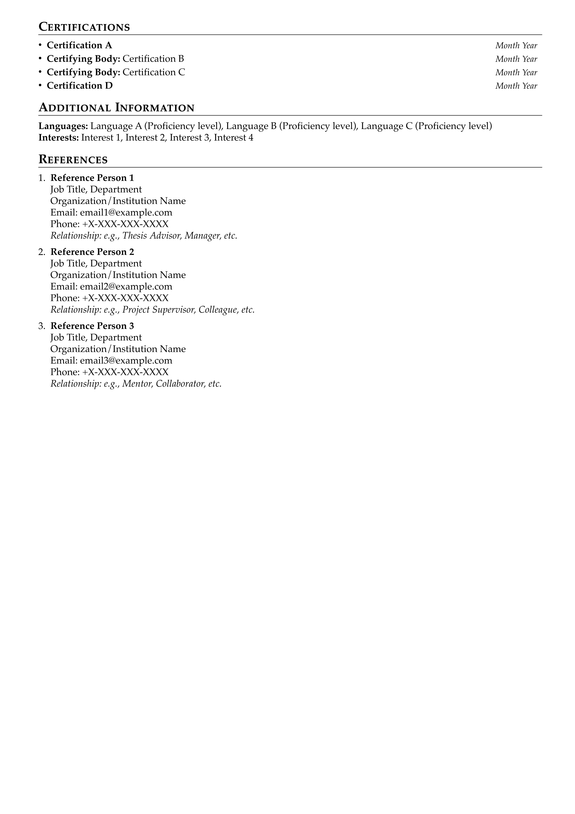

# Pro Academic CV — Typst Template

A professional, highly configurable academic CV template built with [Typst](https://typst.app/). We hope this template helps you create a standout academic CV. Good luck with your academic endeavors!

<table>
<tr>
  <td>
    
  </td>
  <td>
    
  </td>
  <td>
    
  </td>
</tr>
<tr>
  <td style="text-align: center;">P1</td>
  <td style="text-align: center;">P2</td>
  <td style="text-align: center;">P3</td>
</tr>
</table>

You can find the examples in [examples/main.pdf](./examples/main.pdf).

- **Clean & professional design** — Organized layout suitable for various academic disciplines, with customizable sections for education, experience, publications, awards, and more
- **Powered by Typst** — Faster compilation, simpler syntax, and easier setup than LaTeX; works locally or in the [Typst online editor](https://typst.app/) with no package installation
- **Friendly, composable API** — Modular primitives and templates (`r2c2-entry-list`, `publication-entry-list`, etc.) that can be mixed and reused with minimal boilerplate
- **Refined spacing & typography** — Fine-tuned vertical spacing (automatically adjusts based on font size) for headings, paragraphs, lists, and entries to maintain consistent visual rhythm across sections
- **Elegant link styling** — Links use a subtle light-gray underline instead of colored text, keeping the focus on content while remaining identifiable; an optional lightweight SVG link icon is available for compact link indicators
- **Fully configurable** — All settings (fonts, margins, heading styles, list spacing, link appearance) are exposed as named parameters with sensible defaults

## Quick Start

Use the following CLI command to initialize a new project from this template:

```bash
typst init @preview/pro-academic-cv
```

Or search for **pro-academic-cv** on [Typst Universe](https://typst.app/universe/) to use it directly in the online editor.

## Interface Reference

### `resume` — Page & Document Setup

The top-level `show` rule that configures the entire document. All parameters have sensible defaults and can be overridden individually.

```typst
#show: resume.with(
  margin: (left: 1.4cm, right: 1.2cm, top: 0.8cm, bottom: 1cm),
  font-settings: (
    font-family: "Palatino",
    font-size: 10pt,
    author-font-size: 25pt,
    lang: "en",
  ),
  par-settings: (
    leading: 0.5em,
    spacing: 0.5em,
  ),
  list-settings: (
    bullet-list-spacing: 0.7em,
    numbered-list-spacing: 0.7em,
  ),
  link-line-settings: (
    stroke: 0.5pt + luma(200),
    offset: 2pt,
  ),
  heading-settings: (
    above-spacing: 1.2em,
    below-spacing: 0.6em,
    section-title-size: 1.1em,
    section-title-weight: "semibold",
    section-note-size: 0.8em,
    section-note-weight: "light",
    section-line-above-spacing: -0.85em,
    line-length: 100%,
    line-stroke: 0.04em + black,
  ),
  author-info: (
    name: "John Doe",
    primary-info: [+1-234-567-8900 | john.doe\@example.com | john-doe.com],
    secondary-info: [linkedin | github | google-scholar | orcid],
    tertiary-info: "Your City, Your State - Your ZIP, Your Country",
  ),
  author-position: center,
)
```

| Parameter | Type | Description |
|---|---|---|
| `margin` | dictionary | Page margins (`left`, `right`, `top`, `bottom`) |
| `font-settings` | dictionary | Font family, sizes, and language |
| `par-settings` | dictionary | Paragraph leading and spacing |
| `list-settings` | dictionary | Bullet and numbered list spacing |
| `link-line-settings` | dictionary | Underline stroke and offset for hyperlinks |
| `heading-settings` | dictionary | Section title size, weight, line style, and spacing |
| `author-info` | dictionary | Name and up to three rows of contact info |
| `author-position` | alignment | Header alignment (default: `center`) |

### `link-icon` — Inline Link Icon

Renders an SVG link icon inline with text. Useful for compact link indicators in entry headers.

```typst
#link("https://example.com")[#link-icon()]
#link("https://example.com")[#link-icon(color: blue, height: 1em, baseline: 15%)]
```

| Parameter | Type | Default | Description |
|---|---|---|---|
| `color` | color | `rgb("#1a405d")` | Icon stroke color |
| `height` | length | `0.9em` | Icon height |
| `baseline` | ratio | `20%` | Vertical baseline shift |

---

## Section Heading Notes

Section headings support an inline note via the `(note: ...)` syntax:

```typst
== Patents~&~Publications (note:C=Conference, J=Journal, P=Patent)
```

This renders the main title in small caps on the left and the note text in lighter weight on the right.

---

## Primitives

Low-level building blocks used directly or composed into templates.

### `row2col` — Two-Column Row

A single row with left-aligned and right-aligned content.

```typst
#row2col([Left content], [Right content])
```

### `single-line-entry` — Single-Line Entry

A labeled entry with a bold label, inline value, and right-aligned content. Use for memberships, certifications, and simple dated items.

```typst
#single-line-entry("Programming Languages:", [Python, Rust, Go], [])
#single-line-entry([Certification A], [], [Month Year])
```

| Parameter | Type | Default | Description |
|---|---|---|---|
| `label` | content | — | Bold label text |
| `value` | content | — | Inline value after the label |
| `rcontent` | content | — | Right-aligned content |
| `label-args` | dictionary | `(weight: "bold")` | Override label text style |
| `rc-args` | dictionary | `(size: 0.9em, style: "italic")` | Override right-content text style |

### `multi-line-list` — Multi-Line List

Renders items as a bullet or numbered list.

```typst
#multi-line-list(
  [Item 1],
  [Item 2],
)
#multi-line-list(list-type: "enum", [First], [Second])
```

| Parameter | Type | Default | Description |
|---|---|---|---|
| `list-type` | string | `"list"` | `"list"` for bullets, `"enum"` for numbered |
| `list-args` | dictionary | `(:)` | Extra arguments passed to `list()` |
| `enum-args` | dictionary | `(:)` | Extra arguments passed to `enum()` |

### `multi-line-text` — Multi-Line Text

Renders content items separated by line breaks (no bullets).

```typst
#multi-line-text(
  [Line 1],
  [Line 2],
)
```

### `r2c2-entry-header` — Two-by-Two Entry Header

A two-row, two-column header block. Top-left is bold, others are italic/smaller.

```typst
#r2c2-entry-header(
  top-left: [Company Name],
  top-right: [2020 - 2024],
  bottom-left: [Software Engineer],
  bottom-right: [San Francisco, CA],
)
```

| Parameter | Type | Default Style | Description |
|---|---|---|---|
| `top-left` | content | bold | Primary title (company, school, project) |
| `top-right` | content | 0.9em, italic | Date range |
| `bottom-left` | content | 0.9em, italic | Subtitle (role, degree) |
| `bottom-right` | content | 0.9em | Location or link |
| `*-args` | dictionary | — | Override text style for any quadrant |

### `r2c2-entry` — Entry with List Items

Combines an `r2c2-entry-header` with a bullet (or numbered) list of detail items underneath.

```typst
#r2c2-entry(
  entry-header-args: (
    top-left: [Google Research],
    top-right: [2022 - Present],
    bottom-left: [Research Scientist],
    bottom-right: [Mountain View, CA],
  ),
  list-items: (
    [Developed a novel approach to ...],
    [Published 3 papers in top venues],
  ),
)
```

| Parameter | Type | Default | Description |
|---|---|---|---|
| `entry-header-args` | dictionary | — | Arguments forwarded to `r2c2-entry-header` |
| `list-items` | array | `()` | Array of content items |
| `list-type` | string | `"list"` | `"list"` for bullets, `"enum"` for numbered |
| `list-args` | dictionary | `(spacing: 0.5em)` | Extra arguments for `list()` |
| `enum-args` | dictionary | `(spacing: 0.5em)` | Extra arguments for `enum()` |

### `personal-info` — Personal Info Block

A multi-line text block for a single person's contact information.

```typst
#personal-info(
  [Prof. Jane Smith],   // name
  [Associate Professor], // title
  [MIT CSAIL],           // org
  [jane\@mit.edu],      // email
  [+1-555-0100],        // phone
  [Thesis Advisor],     // note
)
```

---

## Templates

Higher-level components that compose primitives into repeatable section patterns.

### `r2c2-entry-list` — Entry List

Renders a vertical stack of `r2c2-entry` items. Use for experience, education, projects, awards, leadership, and volunteer sections.

```typst
#r2c2-entry-list(
  (
    entry-header-args: (:),
    list-items: (:),
  ),
  (
    entry-header-args: (:),
    list-items: (:),
  ),
)
```

| Parameter | Type | Default | Description |
|---|---|---|---|
| `spacing` | length | `0.8em` | Vertical gap between entries |
| `..entries` | variadic | — | Each entry is a dictionary forwarded to `r2c2-entry` |

### `publication-entry-list` — Publication List

Auto-numbered publication list grouped by category prefix (e.g., C for Conference, J for Journal).

```typst
#publication-entry-list(
  (
    (category: "C", value: [Author et al. (2024). *Title*. In _Proc. ..._.]),
    (category: "C", value: [Author et al. (2023). *Title*. In _Proc. ..._.]),
    (category: "J", value: [Author et al. (2023). *Title*. _Journal_, ...]),
    (category: "P", value: [Inventor et al. (2023). *Patent Title*. ...]),
  ),
)
```

| Parameter | Type | Default | Description |
|---|---|---|---|
| `entries` | array | — | Array of `(category: str, value: content)` dictionaries |
| `number-style` | string | `"descending"` | `"descending"`: most recent = highest number; `"ascending"`: first = 1 |
| `column-gutter` | length | `1.3em` | Gap between label and content columns |
| `row-gutter` | length | `0.9em` | Vertical gap between entries |
| `label-width` | length/auto | `auto` | Width of the label column |

### `personal-info-list` — Personal Info List

Renders a list of `personal-info` blocks. Use for reference sections.

```typst
#personal-info-list(
  (
    (name: [Prof. Jane Smith], title: [Associate Professor], org: [MIT], email: [jane\@mit.edu], phone: [+1-555-0100], note: [Thesis Advisor]),
    (name: [Dr. John Doe], title: [Senior Engineer], org: [Google], email: [john\@google.com], phone: [+1-555-0200], note: [Manager]),
  ),
)
```

| Parameter | Type | Default | Description |
|---|---|---|---|
| `items` | array | — | Array of personal info dictionaries |
| `spacing` | length | `1em` | Vertical gap between entries |
| `list-type` | string | `"enum"` | `"enum"` for numbered, `"list"` for bullets |

---

## Dependency Graph

Shows how primitives compose into templates.

```
Primitives                          Templates
──────────                          ─────────

row2col ◄─────────┐
                   ├── r2c2-entry-header ◄── r2c2-entry ◄── r2c2-entry-list
                   │
single-line-entry ◄┘
                        (used directly with multi-line-list)

multi-line-text ◄────── personal-info ◄──── personal-info-list

multi-line-list          (used directly in sections)

publication-entry-list   (standalone template, uses grid internally)

link-icon                (standalone primitive, used inline)
```

Detailed composition:

| Template | Depends on (Primitives) |
|---|---|
| `r2c2-entry-header` | `row2col` |
| `r2c2-entry` | `r2c2-entry-header` |
| `r2c2-entry-list` | `r2c2-entry` → `r2c2-entry-header` → `row2col` |
| `personal-info` | `multi-line-text` |
| `personal-info-list` | `personal-info` → `multi-line-text` |
| `publication-entry-list` | _(self-contained, uses `grid`)_ |

---

## Contributing

Contributions are welcome! Please feel free to submit issues and pull requests.

## License

This project is licensed under the [MIT License](LICENSE).

### Original Template Attribution

This Typst template is derived from the [Academic CV Template - Overleaf, Online LaTeX Editor](https://www.overleaf.com/latex/templates/academic-cv-template/gmyytjmdbvdm) by **Dubasi Pavan Kumar**, originally written in LaTeX and licensed under the [Creative Commons Attribution 4.0 International License (CC BY 4.0)](https://creativecommons.org/licenses/by/4.0/).
