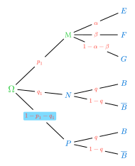

# probability-tree

Arbres de probabilités **n×p**, croissant de **gauche à droite** (sens de lecture standard pour les arbres de probabilités). Ce module s'appuie sur [CeTZ](https://typst.app/universe/package/cetz) (`@preview/cetz:0.5.2`).




## Fonctionnalités

- Arbres de probabilités n×p, croissant de gauche à droite.
- Réglages locaux pour chaque nœud et chaque probabilité (`sn` / `sp`).
- Styles de texte globaux et locaux (gras, italique, petites capitales, surlignage, fonction personnalisée…).
- Étiquettes de probabilités au-dessus, en dessous ou sur le trait (`above`, `below`, `on`, `hybrid`), éventuellement alignées le long du trait.
- En mode `on`, le trait est découpé sous l'étiquette, avec transparence préservée.
- Messages d'erreur améliorés pour les données d'arbre mal formées.
- Positions exactes des nœuds exposées pour des étiquettes ou annotations personnalisées précises (callback `extra`).

## Sommaire

- [Installation](#installation)
- [Démarrage rapide](#démarrage-rapide)
- [Structure de `data`](#structure-de-data)
- [API](#api)
- [Positions des nœuds (`extra`)](#positions-des-nœuds-extra)
- [Styles de texte](#styles-de-texte)
- [Positions des probas](#positions-des-probas)
- [Arbre par défaut](#arbre-par-défaut)
- [Gestion des erreurs](#gestion-des-erreurs)
- [Dépendances](#dépendances)
- [Licence](#licence)
- [Auteurs](#auteurs)

## Installation

> [!NOTE]
> **Pas encore publié sur le Typst Universe (`@preview`).** L'import `@preview` ci-dessous ne fonctionnera qu'une fois le paquet publié. En attendant, installe le paquet localement et utilise l'import `@local`, ou récupère les fichiers depuis le [dépôt GitHub](https://github.com/mmaunier/probability-tree).

```typ
#import "@preview/probability-tree:0.1.2": proba-tree, sn, sp
```

Si le paquet est installé localement :

```typ
#import "@local/probability-tree:0.1.2": proba-tree, sn, sp
```

## Démarrage rapide

```typ
#proba-tree(data: (
  [$Omega$],
  (sn($A$, style: (fill: green)), $p$, ([$B$], $q$), ([$overline(B)$], $1-q$)),
  ([$overline(A)$], $1-p$, ([$B$], $q$), ([$overline(B)$], $1-q$)),
))
```

## Structure de `data`

Chaque nœud est un tableau `(label, proba, ..children)` :

- `label` : contenu du nœud (ex. `$A$`, `[A]`, `"A"`) ou réglage local `sn(...)`.
- `proba` : probabilité affichée sur la branche (ex. `$p$`, `$1-p$`) ou réglage local `sp(...)`.
- `..children` : zéro ou plusieurs sous-nœuds, de structure identique.

La racine n'a pas de probabilité : `[$Omega$]` est simplement le label.

```typ
#proba-tree(data: (
  [$Omega$],
  (sn($A$, style: (fill: green)), sp($p$, style: (fill: red, weight: "bold")), ([$B$], $q$)),
  ([$overline(A)$], $1-p$, ([$B$], $q$)),
))
```

## API

### `proba-tree(...)`

| Paramètre | Type | Défaut | Description |
|---|---|---|---|
| `h` | `float` | `2.0` | Allongement horizontal des traits. |
| `v` | `float` | `0.8` | Écartement vertical entre embranchements. |
| `proba-position` | `string` | `hybrid` | Placement des probas : `above`, `below`, `on` ou `hybrid`. |
| `proba-distance` | `float` | `0.3` | Distance de l'étiquette au trait. |
| `proba-sloped` | `bool` | `false` | Aligne les probas le long du trait (« sloped »). |
| `proba-padding` | `length` | `3pt` | En mode `on`, écart entre le trait coupé et la bbox de la proba. |
| `proba-style` | `dictionary` | `(size: 80%)` | Style global des probas (la taille `80%` est toujours conservée comme base). |
| `node-style` | `dictionary` | `none` | Style global des textes de nœuds. |
| `first-child-top` | `bool` | `true` | Place le 1er enfant listé en haut. |
| `node-padding` | `float` | `0.3` | Vide laissé autour de chaque lettre (le trait n'est pas dessiné là). |
| `data` | `array` | arbre Ω par défaut | L'arbre à dessiner. |
| `extra` | `function` | `none` | Callback `(pos, draw) => ...` dessiné dans le même canvas, recevant la position exacte de chaque nœud. |

### `sp(content, ...)` — réglage local d'une probabilité

Retourne un dictionnaire utilisable comme probabilité dans `data`. Tout paramètre omis retombe sur les réglages globaux.

| Paramètre | Type | Défaut | Description |
|---|---|---|---|
| `content` | `content` | — | La probabilité affichée (ex. `$p$`, `1-p`). |
| `position` | `string` | `auto` | `above`, `below`, `on` ou `hybrid`. |
| `sloped` | `bool` | `auto` | Aligne la proba le long du trait (« sloped »). |
| `distance` | `number` | `auto` | Distance de l'étiquette au trait. |
| `style` | `dictionary` | `auto` | Style local fusionné avec `proba-style`. |

```typ
#proba-tree(data: (
  [$Omega$],
  ([$A$], sp($p$, style: (fill: red, weight: "bold")), ([$B$], $q$)),
  ([$overline(A)$], $1-p$),
))
```

### `sn(content, ...)` — réglage local d'un nœud

| Paramètre | Type | Défaut | Description |
|---|---|---|---|
| `content` | `content` | — | Le texte du nœud (ex. `$A$`, `[A]`, `"A"`). |
| `style` | `dictionary` | `auto` | Style local fusionné avec `node-style`. |

```typ
#proba-tree(data: (
  [$Omega$],
  (sn($A$, style: (fill: green, weight: "bold")), $p$, ([$B$], $q$)),
  ([$overline(A)$], $1-p$),
))
```

## Positions des nœuds (`extra`)

`proba-tree` expose la **position exacte sur le canvas de chaque nœud**, afin de superposer des étiquettes, annotations ou traits parfaitement alignés sur l'arbre — sans avoir à importer CeTZ soi-même.

```typ
#proba-tree(
  data: (
    [$Omega$],
    ($F$, $$, ($F$, $$, ($F$, $$), ($P$, $$)), ($P$, $$, ($F$, $$), ($P$, $$))),
    ($P$, $$, ($F$, $$, ($F$, $$), ($P$, $$)), ($P$, $$, ($F$, $$), ($P$, $$))),
  ),
  extra: (pos, draw) => {
    let issues = ("FFF", "FFP", "FPF", "FPP", "PFF", "PFP", "PPF", "PPP")
    for i in range(0, 8) {
      let p = pos.at("N4" + str(i + 1))
      draw.content((p.at(0) + 0.35, p.at(1)), anchor: "west", [$space arrow.long.r space #issues.at(i)$])
    }
  },
)
```

Le callback reçoit deux arguments :

- `pos` : un dictionnaire indexé par `N<niveau><index>` (1-indexé) → `(x, y)` en unités canvas. `N11` est la racine, `N41` la 1ᵉʳᵉ feuille d'un arbre à 4 niveaux, etc. Les indices suivent l'**ordre visuel du haut vers le bas**, quelle que soit la valeur de `first-child-top`.
- `draw` : l'espace de noms `draw` de CeTZ, utilisable directement (`draw.content`, `draw.line`, …).

## Styles de texte

Les styles s'appliquent globalement (`proba-style` / `node-style`) ou localement (`sp(style:)` / `sn(style:)`). Les clés locales **écrasent** celles du global ; les autres sont conservées.

Clés acceptées :

- **Tous les paramètres de `#text`** : `size`, `fill`, `weight`, `style` (italique), `background`, `font`, `features`, …
- **`smallcaps`** (`bool`) : petites capitales (via la fonctionnalité OpenType `smcp`).
- **`highlight`** (`color`) : surlignage (boîte de fond) — fonctionne avec le **texte et les équations**.
- **`function`** (`content -> content`) : fonction personnalisée appliquée **en dernier**.

```typ
#proba-tree(
  proba-style: (fill: blue),
  node-style: (size: 11pt, fill: blue),
  data: (
    [$Omega$],
    ([$A$], $p$, ([$B$], sp($q$, style: (highlight: yellow)))),
    ([$overline(A)$], $1-p$),
  ),
)
```

## Positions des probas

Constantes : `above`, `below`, `on`, `hybrid`.

- `above` / `below` : au-dessus / en dessous du trait.
- `on` : la proba repose **sur** le trait, qui est **découpé** sous l'étiquette (aucun fond coloré, transparence préservée). L'écart entre le trait coupé et la proba se règle avec `proba-padding`.
- `hybrid` (défaut) : `above` si la branche monte, `below` si elle descend.

```typ
#proba-tree(proba-position: "on", proba-padding: 5pt)
```

## Arbre par défaut

Si `data` est omis, l'arbre suivant est dessiné : racine Ω, avec A/Ā (probabilités p/1-p), chacun menant à B/B̄ (q/1-q).

## Gestion des erreurs

Si un nœud non-racine ne possède pas de probabilité (c'est-à-dire que le tuple est mal formé), le paquet fournit désormais un message d'erreur clair :

```
proba-tree: nœud non-racine sans probabilité — le format attendu est (label, proba, ..enfants). Nœud reçu : ...
```

Cela remplace l'erreur d'index Typst générique, facilitant le débogage.

## Dépendances

- [CeTZ](https://typst.app/universe/package/cetz) `@preview/cetz:0.5.2`

## Licence

Distribué sous [licence MIT](LICENSE).

```
Copyright (c) 2026 Mikaël MAUNIER et DeepSeek
```

## Auteurs

- Mikaël MAUNIER
- DeepSeek
- Claude