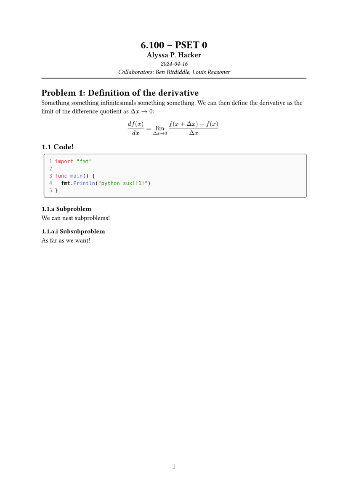

# problemst

Simple and easy-to-use template for problem sets/homeworks/assignments.



## Usage
Click "Start from template" in the Typst web app and search for `problemst`.

Alternatively, run the following command to create a directory initialized with all necessary files:

```
typst init @preview/problemst:0.1.1
```

## Configuration
The `pset` function takes the following named arguments:
- `class` (string): Class the assignment is for.
- `student` (string): Student completing the assignment.
- `title` (string): Title of the assignment.
- `date` (datetime): Date to be displayed on the assignment.
- `collaborators` (array of strings): Collaborators that worked on the assignment with the student. Can be `()`.
- `subproblems` (string): Numbering scheme for the subproblems.
