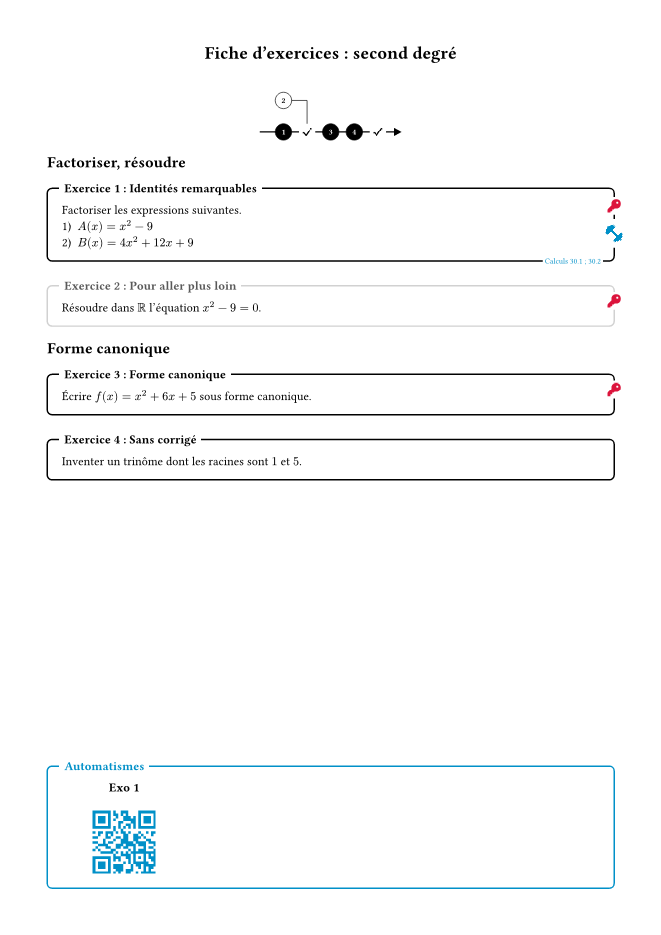
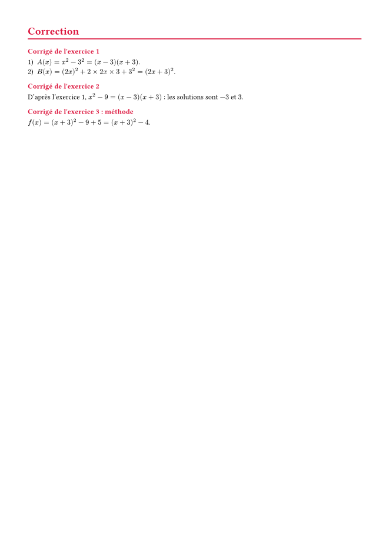

# profmaquette-minimal

Fiches d'exercices à la manière du package LaTeX
[ProfMaquette](https://ctan.org/pkg/profmaquette) de **Christophe Poulain** :
exercices numérotés, feuille de route, entraînements par QR code, cartouche de
titre, corrigés affichés ou non d'un seul réglage, et un mode « interro »
(zones de réponse Seyes, barème).

📖 **[Documentation complète](https://amjmeyer.github.io/profmaquette-minimal/)**

> **Note :** une petite partie seulement de ProfMaquette, qui reste la
> référence. Écrit d'abord pour mon usage personnel, le paquet pourra évoluer
> de façon incompatible entre deux versions `0.x`.

*Exercise sheets (in French) inspired by Christophe Poulain's LaTeX package
ProfMaquette. See the [documentation, in French](https://amjmeyer.github.io/profmaquette-minimal/).*

<p align="center">
  
  
</p>

## Démarrage rapide

```typ
#import "@preview/profmaquette-minimal:0.1.0": maquette, exercice, corrige, afficher-fdr, thematique, seyes

#show: maquette.with(
  position-corriges: "fin",
  titre-maquette: (gauche: "CH 02", centre: "Suites numériques", droite: "1 C"),
)

#afficher-fdr

#thematique[Factoriser]
#exercice(titre: "Identités remarquables", entrainement: "https://exemple.fr")[
  Factoriser $x^2 - 9$.
]
#corrige[
  $x^2 - 9 = (x - 3)(x + 3)$.
]

#thematique[Résoudre]
#exercice(titre: "Pour aller plus loin", route: false)[
  Résoudre $x^2 - 9 = 0$.
]
#corrige[
  Les solutions sont $-3$ et $3$.
]
```

## Remerciements

Merci à **Christophe Poulain** : les idées et une partie du vocabulaire viennent
de [ProfMaquette](https://ctan.org/pkg/profmaquette), les limites de cette
adaptation sont les miennes. QR codes :
[tiaoma](https://typst.app/universe/package/tiaoma). Icônes :
[Font Awesome Free](https://fontawesome.com), fournies avec le paquet (aucune
police à installer).

## Licence

[LPPL 1.3c](LICENSE) ou ultérieure, comme ProfMaquette. Icônes de `src/icones/` :
*Font Awesome Free by @fontawesome — https://fontawesome.com*, sous licence
[CC BY 4.0](https://creativecommons.org/licenses/by/4.0/).
