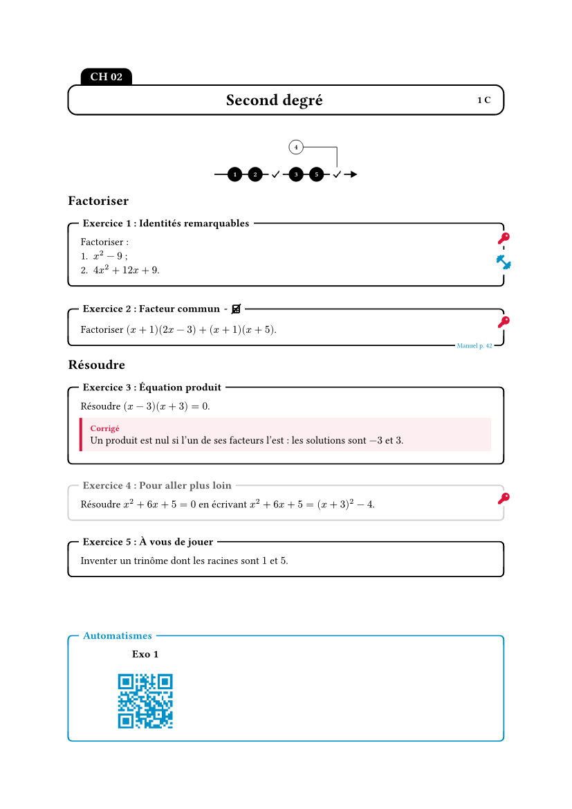
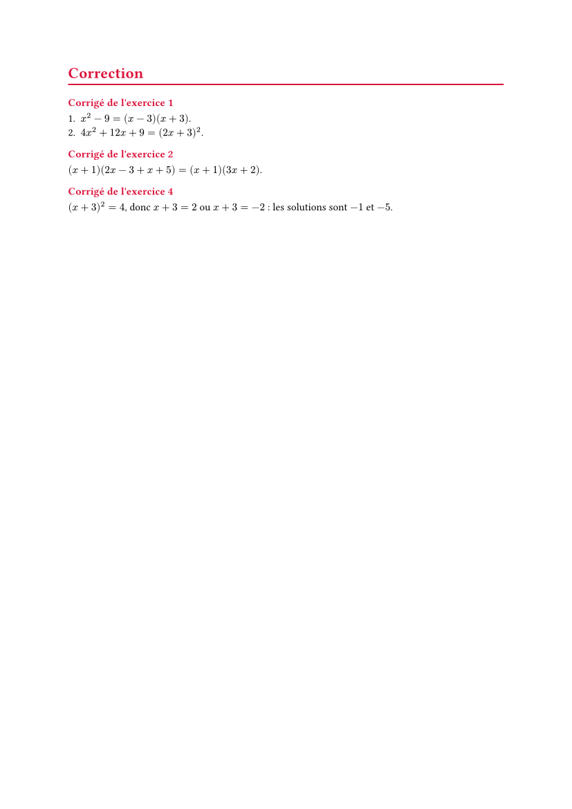

# profmaquette-minimal

Fiches d'exercices à la manière du package LaTeX
[ProfMaquette](https://ctan.org/pkg/profmaquette) de **Christophe Poulain** :
exercices numérotés, feuille de route, entraînements par QR code, cartouche de
titre, corrigés affichés ou non d'un seul réglage, et un mode « interro »
(zones de réponse Seyes, barème).

📖 **[Documentation complète](https://amjmeyer.github.io/profmaquette-minimal/)**

> **Note :** une petite partie seulement de ProfMaquette, qui reste la
> référence. Écrit d'abord pour mon usage personnel, le paquet pourra évoluer
> de façon incompatible entre deux versions `0.x`.

*Exercise sheets (in French) inspired by Christophe Poulain's LaTeX package
ProfMaquette. See the [documentation, in French](https://amjmeyer.github.io/profmaquette-minimal/).*

<p align="center">
  
  
</p>

## Démarrage rapide

Le code ci-dessous donne exactement les deux pages ci-dessus.

```typ
#import "@preview/profmaquette-minimal:0.2.0": maquette, exercice, corrige, afficher-fdr, thematique, seyes

#show: maquette.with(
  position-corriges: "fin",
  titre-maquette: (gauche: "CH 02", centre: "Second degré", droite: "1 C"),
)

#align(center, afficher-fdr)

#thematique[Factoriser]
#exercice(titre: "Identités remarquables", entrainement: "https://exemple.fr")[
  Factoriser :
  + $x^2 - 9$ ;
  + $4x^2 + 12x + 9$.
]
#corrige[
  + $x^2 - 9 = (x - 3)(x + 3)$.
  + $4x^2 + 12x + 9 = (2x + 3)^2$.
]

#exercice(titre: "Facteur commun", source: "Manuel p. 42", calculatrice: false)[
  Factoriser $(x + 1)(2x - 3) + (x + 1)(x + 5)$.
]
#corrige[
  $(x + 1)(2x - 3 + x + 5) = (x + 1)(3x + 2)$.
]

#thematique[Résoudre]
#exercice(titre: "Équation produit")[
  Résoudre $(x - 3)(x + 3) = 0$.
  #seyes(2, afficher: true)[Un produit est nul si l'un de ses facteurs l'est :
    les solutions sont $-3$ et $3$.]
]

#exercice(titre: "Pour aller plus loin", route: false)[
  Résoudre $x^2 + 6x + 5 = 0$ en écrivant $x^2 + 6x + 5 = (x + 3)^2 - 4$.
]
#corrige[
  $(x + 3)^2 = 4$, donc $x + 3 = 2$ ou $x + 3 = -2$ : les solutions sont $-1$ et $-5$.
]

#exercice(titre: "À vous de jouer", pas-corrige: true)[
  Inventer un trinôme dont les racines sont $1$ et $5$.
]
```

## Remerciements

Merci à **Christophe Poulain** : les idées et une partie du vocabulaire viennent
de [ProfMaquette](https://ctan.org/pkg/profmaquette), les limites de cette
adaptation sont les miennes. QR codes :
[tiaoma](https://typst.app/universe/package/tiaoma). Icônes :
[Font Awesome Free](https://fontawesome.com), fournies avec le paquet (aucune
police à installer).

## Licence

[LPPL 1.3c](LICENSE) ou ultérieure, comme ProfMaquette. Icônes de `src/icones/` :
*Font Awesome Free by @fontawesome — https://fontawesome.com*, sous licence
[CC BY 4.0](https://creativecommons.org/licenses/by/4.0/).
