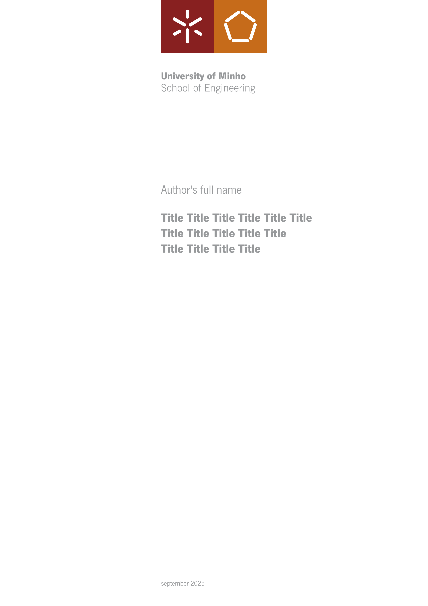

# prometeu-thesis

The unofficial Typst template for writing theses at the University of Minho (UMinho). 



It is based on the [official LaTeX template provided by the Department of Informatics](https://web.di.uminho.pt/sitedi/latex/) and fully complies with the [university’s required formatting standards and guidelines](https://alunos.uminho.pt/PT/estudantes/Paginas/InfoUteisFormatacao.aspx). 

This template closely follows the LaTeX version, while providing improvements in features, usability and presentation. It is designed to be as extensible, customizable, and comprehensible as possible right out of the box.

You can find the unmodified output of the template in [example.pdf](./example.pdf).

## How to use this template

### Setting up fonts

This template requires the following fonts: NewsGotT (001.005), NewsGotTBold (001.005) and NewsGoth Lt BT (2.001 mfgpctt 4.4).

Unfortunately, Typst [disallows font files to be bundled in packages](https://github.com/typst/packages/blob/main/docs/resources.md#fonts-are-not-supported-in-packages). The original fonts (.ttf files) should be grabbed from the zip file on the [official LaTeX template](https://web.di.uminho.pt/sitedi/latex/).

### Using on Typst Web

Create a new project by selecting "Start from template" and searching for this project. Then create a `fonts` folder in your project and add the three required fonts there.
 
### Using Locally

To work locally, first [install Typst](https://typst.app/open-source/), then initialize your project with:
```
typst init @preview/prometeu-thesis:0.1.0
```

Make the required fonts available by either installing them system-wide (use `typst fonts` to verify detection) or by placing them in a folder of your choice (e.g., `./fonts`) and referencing it via your Typst LSP settings or use the CLI option `--font-path <folder>`.

---

Always ensure that the output generated by this template complies with the latest formatting standards.

## Current Limitations

Currently, this template only supports covers for Master's theses and does not yet accommodate Doctoral (PhD) theses, and it is only available in English (there is no Portuguese version yet). Contributions to expand support are welcome.

By default, the template includes only the required School of Engineering logos for the cover, but you can easily change these to your own school's logo. The official and high-resolution logos are available in the [official formatting guidelines](https://alunos.uminho.pt/PT/estudantes/Paginas/InfoUteisFormatacao.aspx).

## License

This template is provided under the [MIT License](./LICENSE).

The official logos located in [template/logos/uminho](./template/logos/uminho) are the property of Universidade do Minho. They are not covered by the [LICENSE](./LICENSE) included with this template and remain under the copyright of the university.
