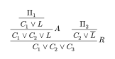
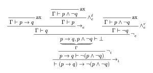
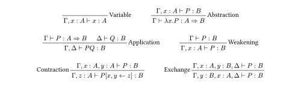

# typst-prooflists

This is a [Typst](https://typst.app) package that provides for typesetting Gentzen-style proof trees in a maximally succinct notation. It builds atop [`curryst`](https://typst.app/universe/package/curryst).

The canonical representation of a tree is a nested list. So, it only makes sense that when working with trees (proof trees or otherwise), you'd want to notate them down as a list (if not drawing them by hand). Yet existing typesetting packages don't do this!

This is mostly the fault of LaTeX. LaTeX is a intensely verbose (and intensely hostile) piece of software... the normal syntax for lists goes something like `\begin{itemize}` `\item ...` `\end{itemize}` -- terrible! For this reason, LaTeX packages that aim to improve the ergonomics of typesetting trees ([`bussproofs`](https://ctan.org/pkg/bussproofs) for proof trees, [`forest`](https://ctan.org/pkg/forest) for syntax trees) have not so much as considered lists as an option. On the other hand, however, Typst provides a special list syntax, that can be introspected on and assigned custom semantics: which is what we do here.

The use of lists as a domain-specific language allows for typesetting (proof) trees in a compact, coherent, and compositional fashion.

## Usage



```typst
#import "@preview/prooflists:0.1.0": prooflist

#prooflist[
  / $R$: $C_1 or C_2 or C_3$
    / $A$: $C_1 or C_2 or L$
      - $C_1 or L$
        + $Pi_1$
    - $C_2 or overline(L)$
      + $Pi_2$
]
```

Typst has three types of list items: `-` (bullet lists), `+` (numbered lists), and `/` (term lists).
All three have their own semantics within the context of a call to `#prooflist`.

The `+ premise` node is a **terminal rule**.
It returns its content directly as a (single) premise.
Any sublists are interpreted as lists directly, not proof lists or premises.

The `- conclusion` node is a **non-terminal rule**.
Any sublists are interpreted as premises, as are any nested calls to `#prooflist`.
If no premises are provided, a top bar will still be drawn (as in the case of axioms).

The `/ label: conclusion` node is a **labelled non-terminal rule**.
Any sublists are premises (as are any nested calls to `#prooflist`).
If no premises are provided a top bar will still be drawn.
The `label` field is technically optional -- if omitted, `/ : conclusion` behaves identically to `- conclusion`.

## Advanced Usage



```typst
#import "@preview/prooflists:0.1.0": prooflist

#let ax(conclusion) = prooflist[/ ax: #conclusion]
#let ax-1 = ax($Gamma tack p -> q$)
#let ax-2 = ax($Gamma tack p and not q$)

#prooflist[
  / $scripts(->)_i$: $tack (p -> q) -> not (p and not q)$
    / $not_i$: $p -> q tack  not (p and not q)$
      / $not_e$: $ underbrace(p -> q\, p and not q, Gamma) tack bot $
        / $scripts(->)_e$: $Gamma tack q$
          #ax-1
          / $and_e^ell$: $Gamma tack p$
            #ax-2
        / $and_e^r$: $Gamma tack not q$
          #ax-2
]
```

Calls to `#prooflist` can be composed.
`#prooflist` does not strip any content besides whitespace, and so calls to other functions may compose, too.

A limitation of the `/ label: conclusion` syntax is that it only provides for providing *one* label, by default on the right.
If labels appearing on the left is desired, `label-dir: left` can be passed as an optional argument to `#prooflist`, which will affect all `/ label: conclusion` invocations.
The `label-lhs` and `label-rhs` arguments can also be provided and will add custom labels to all inference rules on the left/right, respectively.

Finally, this package is built atop [`curryst`](https://typst.app/universe/package/curryst) and specifically [`#prooftree`](https://typst.app/universe/package/curryst#advanced-usage).
`#prooftree` may take a number of optional arguments, which `#prooflist` plumbs through to additionally expose to the user.
Documentation may be found [in the function source](https://codeberg.org/apropos/typst-prooflists/src/branch/main/src/main.typ) (reproduced from `curryst`).
The `#rule-set` function provided by `curryst` may be useful, also.



```typst
#import "@preview/prooflists:0.1.0": prooflist
#import "@preview/curryst:0.6.0": rule-set

#let variable = prooflist[
  / Variable: $Gamma, x : A tack x : A$
]

#let abstraction = prooflist[
  / Abstraction: $Gamma tack lambda x . P : A => B$
    + $Gamma, x: A tack P : B$
]

#let application = prooflist[
  / Application: $Gamma, Delta tack P Q : B$
    + $Gamma tack P : A => B$
    + $Delta tack Q : B$
]

#let weakening = prooflist[
  / Weakening: $Gamma, x : A tack P : B$
    + $Gamma tack P : B$
]

#let contraction = prooflist(label-dir: left)[
  / Contraction: $Gamma, z : A tack P[x, y <- z]: B$
    + $Gamma, x : A, y : A tack P : B$
]

#let exchange = prooflist(label-dir: left)[
  / Exchange: $Gamma, y : B, x: A, Delta tack P : B$
    + $Gamma, x : A, y: B, Delta tack P : B$
]

#align(center, rule-set(
  variable,
  abstraction,
  application,
  weakening,
  contraction,
  exchange
))
```

See [`examples/`](https://codeberg.org/apropos/typst-prooflists/src/branch/main/examples) for further use cases.
