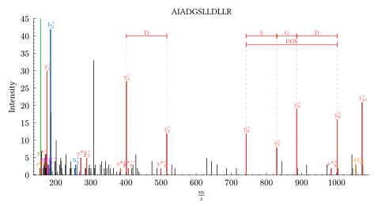
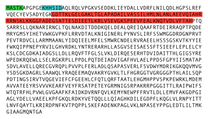

# proteograph

proteomics data visualization in Typst

**Table of Contents**

- [Introduction](#introduction)
- [Documentation](#documentation)
- [License](#license)

## Introduction

The ProteoGraph package for Typst is a plotting library for proteomics based on [Lilaq](https://lilaq.org/).
It currently defines functions to display MS2 annotated fragmentation spectra and eXtracted Ion Current (XIC).

[MS2 annotated fragmentation spectra](examples/complete_psm_highlight_peaks.typ)

[eXtracted Ion Current (XIC)](examples/xic_plot.typ)

")

[Retention time alignment between 2 MS runs](examples/rt_align.typ)

[Protein sequence diagram showing highlighted subsequences](examples/protein_diag.typ)

## Documentation

Here [proteograph-docs](docs/proteograph-docs.pdf) you have the reference documentation that describes the functions and parameters used in this package. (_Generated with [tidy](https://github.com/Mc-Zen/tidy)_)

## License
[GPLv3 License](./LICENSE)
