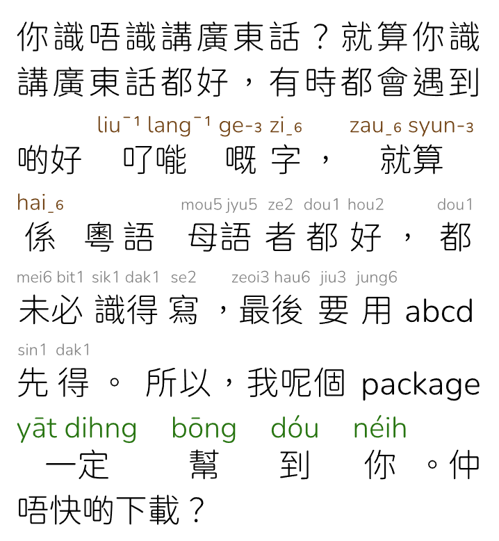

PyCantonese Parser
===

A Typst package to render Cantonese text with Jyutping (粵拼) or Yale
romanizations from "Cantonese words JSON array" generated from the python script
below.



Prerequisites
---

[PyCantonese](https://pycantonese.org) must be installed in your Python environment:

```bash
pip install pycantonese
```

```py
import pycantonese
import json
import sys

lines = sys.argv[1].split('\n')
result = []

for line in lines:
    words = pycantonese.segment(line)

    for word in words:
        pairs = pycantonese.characters_to_jyutping(word)
        jyutping = pairs[0][1] if pairs and pairs[0][1] else None
        yale = pycantonese.jyutping_to_yale(jyutping) if jyutping else None
        result.append({"word": word, "jyutping": jyutping, "yale": yale})

    result.append({"word": "\n", "jyutping": None})

result.pop()
print(json.dumps(result, ensure_ascii=False, indent=2))
```

This script takes a Chinese string as the user input, and outputs it as a JSON
array of "Cantonese word groups objects", which is a JSON object with

- `word`: the word group
- `jyutping`: the Cantonese romanization of the word
- `yale`: an array of character-by-character romanizations

Usage
---

1. Save the above python script (as `test_pycanto.py`).
1. Run `python test_pycanto.py "[YOUR_TEXT]" > [OUTPUT_FILENAME]` to save the
script's output.

    ```sh
    $ python test_pycanto.py "𠮩𠹌嘅字，就算係" > output.json
    $ cat output.json
    [
      {
        "word": "𠮩𠹌",
        "jyutping": "liu1lang1",
        "yale": [
          "līu",
          "lāng"
        ]
      },
      {
        "word": "嘅",
        "jyutping": "ge3",
        "yale": [
          "ge"
        ]
      },
      …
    ```

1. In your typst file, import this package and load the JSON data file, before
calling the `render-word-groups` function.

    ```typ
    #import "@preview/pycantonese-parser:0.2.0": *
    // set to any font that supports Cantonese characters (粵字)
    #set text(32pt, font: ("Chiron GoRound TC L"))
    #set par(justify: true)
    // JSON files generated by `python test_pycanto.py "用戶輸入" > outputX.json`
    #let data1 = json("output1.json")
    #let data2 = json("output2.json")
    #let data3 = json("output3.json")
    // override default style in "src/renderer.typ" (optional)
    #let myjp-style = (
      rb-color: rgb("#724416"),
      rb-size: 0.7em,
    )
    #let yale-style = (
      rb-color: rgb("#287511"),
      rb-size: 0.9em,
      word-sep: 1em
    )
    
    你識唔識講廣東話？就算你識講廣東話都好，有時都會遇到啲好 #render-word-groups(data1, style: myjp-style) 粵語
    #render-word-groups(data2, visual-tones: false)
    所以，我呢個 package
    #render-word-groups(data3, romanization: "yale", style: yale-style)。仲唔快啲下載？
    ```

License
---

MIT
