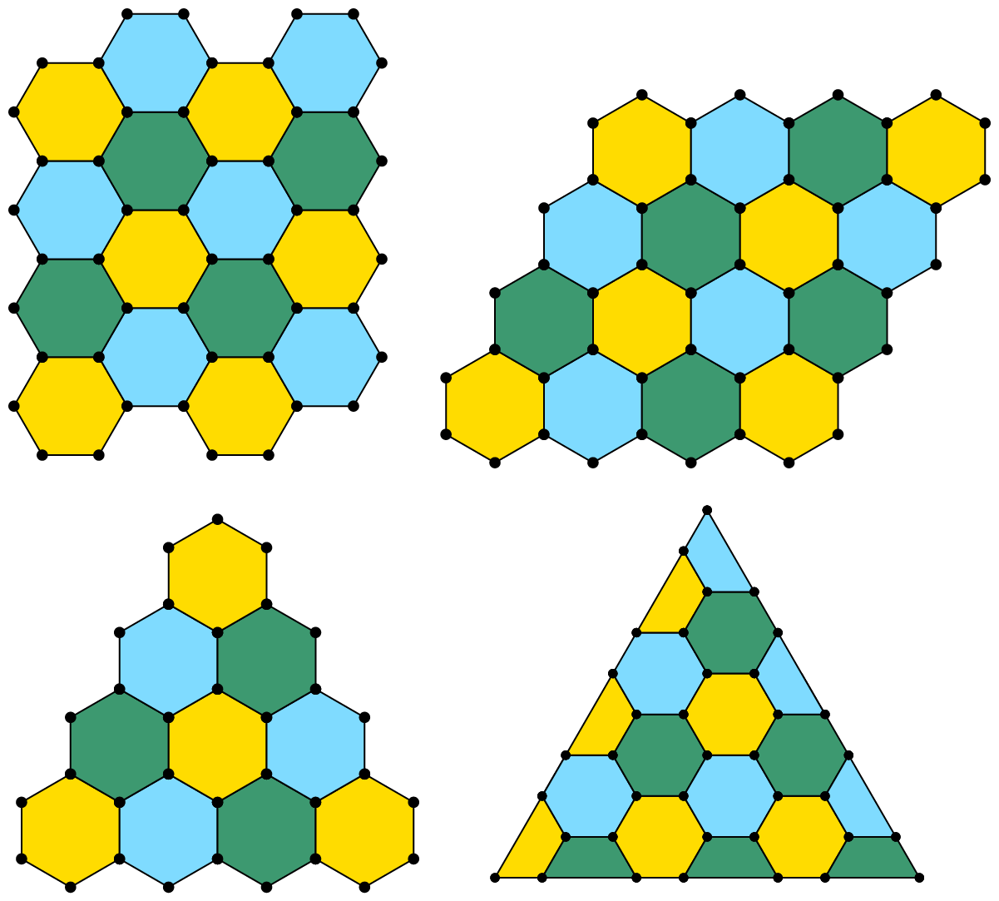
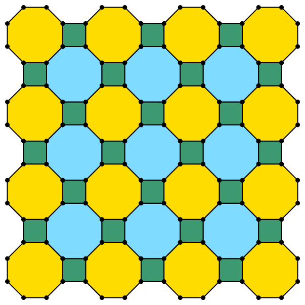
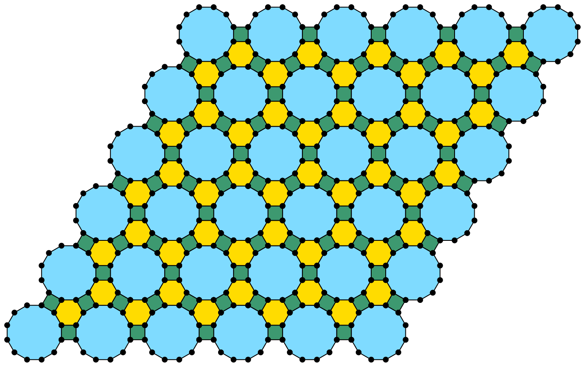

# Visualization of Quantum Error Correction Codes
This is a Typst package for visualizing quantum error correction codes.

**Note: Requires CeTZ version >= 0.4.0 and compiler version >= 0.13**


## Steane code
You can draw a Steane code by calling the `steane-code` function. The name of the qubits are automatically generated as `steane-1`, `steane-2`, etc.
```typ
#import "@preview/qec-thrust:0.1.2": *

#canvas({
  import draw: *
  steane-code((0, 0), size: 3)
    for j in range(7) {
      content((rel: (0, -0.3), to: "steane-" + str(j+1)), [#(j)])
    }
})
```


## Surface code
You can draw a surface code with different size, color and orientation by `surface-code` function. The name of the qubits can be defined with `name` parameter as `name-i-j`. By default, they will be named as `surface-i-j`. The `type-tag` parameter can be set to `false` to change the orientation of the surface code. You can also tweak `point-radius` (relative to `size`) and `boundary-bulge` for the boundary curves. Here is an example of two surface codes.
```typ
#canvas({
  import draw: *
  let n = 3
  surface-code((0, 0),size:1.5, n, n,name: "surface1")
  for i in range(n) {
    for j in range(n) {
      content((rel: (0.3, 0.3), to: "surface1" + "-" + str(i) + "-" + str(j)), [#(i*n+j+1)])
    }
  }
  surface-code((4, 0), 15, 7,color1:red,color2:green,size:0.5,type-tag: false)
  })
```


## Toric code
You can draw a toric code with different size and color by `toric-code` function. The name of the qubits can be defined with `name` parameter as `name-point-vertical-i-j` and `name-point-horizontal-i-j`. By default, they will begin with `toric`. Here is an example of a toric code with 5x3 size. `plaquette-code-label` and `vertex-code-label` functions can be used to label the plaquette and vertex stabilizers at a specified location. `stabilizer-label` generates a stabilizer legend.
```typ
#canvas({
  import draw: *
  let m = 5
  let n = 3
  let size = 2
  let circle-radius = 0.4
  toric-code((0, 0), m, n, size: size, circle-radius: circle-radius)
  plaquette-code-label((0, 0),2,0, size: size, circle-radius: circle-radius)
  vertex-code-label((0, 0),3,2, size: size, circle-radius: circle-radius)
  stabilizer-label((12, -2))
  for i in range(m){
    for j in range(n){
      content( "toric-point-vertical-" + str(i) + "-" + str(j), [#(i*n+j+1)])
      content( "toric-point-horizontal-" + str(i) + "-" + str(j), [#(i*n+j+1+m*n)])
    }
  }
})
```


`plaquette-code-label` and `vertex-code-label` functions can be adjusted to change the label of the stabilizers. Here is an example of$〚98,8,12〛$BB code.

```typ
#canvas({
  import draw: *
  toric-code((0, 0), 7, 7, size: 1)
  plaquette-code-label((0, 0),2,4,ver-vec:((-1,0),(2,1),(3,1)),hor-vec:((0,0),(-1,-4),(-1,-3)), size: 1)
  vertex-code-label((0, 0),6,1,ver-vec:((-1,0),(0,4),(0,3)),hor-vec:((-4,-1),(0,0),(-3,-1)), size: 1)
  stabilizer-label((10, -3))
})
```


## 2D color code
Use `color-code-2d` to draw 2D color code patches. Control the tiling with `tiling`, the shape with `shape` (`rect`, `tri`, `tri-cut`, or `para`), and the size with a `size` dictionary. For `tiling: "6.6.6"`, set `hex-orientation` to `"flat"` or `"pointy"` (`tri-cut` requires `"flat"`). Set `show-stabilizers: true` to overlay X/Z markers. (Currently `tiling: "6.6.6"`, `tiling: "4.6.12"`, and `tiling: "4.8.8"` are implemented; `4.6.12` and `4.8.8` support `shape: "rect"` only.)
```typ
#canvas({
  import draw: *
  let qubit-radius = 0.1
  color-code-2d(
    (0, 0),
    tiling: "6.6.6",
    shape: "rect",
    size: (rows: 4, cols: 4),
    hex-orientation: "flat",
    scale: 1.2,
    color1: yellow,
    color2: aqua,
    color3: olive,
    name: "color-rect",
    show-qubits: true,
    qubit-radius: qubit-radius,
  )
  color-code-2d(
    (0, -9),
    tiling: "6.6.6",
    shape: "tri",
    size: (n: 4),
    hex-orientation: "pointy",
    scale: 1.2,
    color1: yellow,
    color2: aqua,
    color3: olive,
    name: "color-tri",
    show-qubits: true,
    qubit-radius: qubit-radius,
  )
  color-code-2d(
    (9, 0),
    tiling: "6.6.6",
    shape: "para",
    size: (rows: 4, cols: 4),
    hex-orientation: "pointy",
    scale: 1.2,
    color1: yellow,
    color2: aqua,
    color3: olive,
    name: "color-para",
    show-qubits: true,
    qubit-radius: qubit-radius,
  )
  color-code-2d(
    (9, -10),
    tiling: "6.6.6",
    shape: "tri-cut",
    size: (n: 3),
    hex-orientation: "flat",
    scale: 1.0,
    color1: yellow,
    color2: aqua,
    color3: olive,
    name: "color-tri-cut",
    show-qubits: true,
    qubit-radius: qubit-radius,
  )
})
```


## 2D color code (4.8.8)
```typ
#canvas({
  import draw: *
  color-code-2d(
    (0, 0),
    tiling: "4.8.8",
    shape: "rect",
    size: (rows: 4, cols: 4),
    scale: 0.8,
    color1: yellow,
    color2: aqua,
    color3: olive,
    name: "color-488",
    show-qubits: true,
    qubit-radius: 0.1,
  )
})
```


## 2D color code (4.6.12)
```typ
#canvas({
  import draw: *
  color-code-2d(
    (0, 0),
    tiling: "4.6.12",
    shape: "rect",
    size: (rows: 6, cols: 6),
    scale: 0.6,
    color1: yellow,
    color2: aqua,
    color3: olive,
    show-qubits: true,
    qubit-radius: 0.2,
  )
})
```


## Notes
- If you draw multiple codes of the same type in one canvas, set a unique `name` prefix to avoid anchor collisions.
- `surface-code` uses +y upward, while `toric-code` uses -y downward (grid grows down).
## License

Licensed under the [MIT License](LICENSE).
