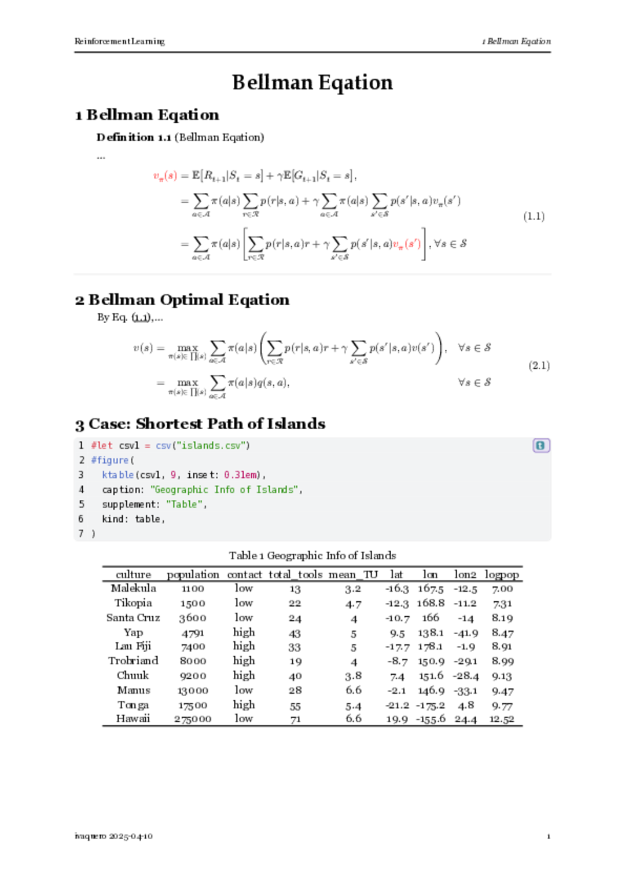

# Qooklet

A quick start template for scientific booklets.

## Features

- Math Equation
  - auto numbering based on chapter
  - link quote to source
- Figure
  - auto numbering based on chapter
- Table
  - read as three-line table (`tableq()`)
- Code Block
  - stylized by (using [coldly](https://github.com/Dherse/codly))
  - read code block (`#code(text, lang: "python", breakable: true, width: 100%)`)
- Theorem
  - theorems enviroment is implemented by using [theorion](https://github.com/OrangeX4/typst-theorion)

## Get Started

Import `qooklet` from the `@preview` namespace.

```typst
#import "@preview/qooklet:0.2.2": *
#show: body-style.with(
  title: "Bellman Eqation",
  // the following are optional arguments
  // info: none
  // outline-on: false,
  // paper: "iso-b5",
)
```

where `info` is an argument that let you customize the information of your book using a toml file (if you leave it alone, the following info will be empty). The toml file should look like this

```toml
[key-you-like]
    book = "My First Book"
    footer-cap = "ivaquero"
    header-cap = "Reinforcement Learning"
    lang = "en"
```

You can read you info file by the following sentence

```typst
#let info = toml("your path").key-you-like
```

## Useful Functions

The function `tableq(data, k, stroke: table-three-line(rgb("000")), inset: 0.3em)` is a quick shortcut of reading .csv, where `k` is the number of columns, and for stroke, `qooklet` provide 2 predefined styles

- `table-three-line(stroke-color)`: default style, for three-line table
- `table-no-left-right(stroke-color)`: for grid without left border and right border



## Clone Official Repository

Clone the [qooklet](https://github.com/ivaquero/typst-qooklet) repository to your `@local` workspace:

- Linux：
  - `$XDG_DATA_HOME/typst/packages/local`
  - `~/.local/share/typst/packages/local`
- macOS：`~/Library/Application\ Support/typst/packages/local`
- Windows：`%APPDATA%/typst/packages/local`

Import `qooklet` in the document

```typst
#import "@local/qooklet:0.1.0": *
```

> For developement convinience, local repo never changes the version
