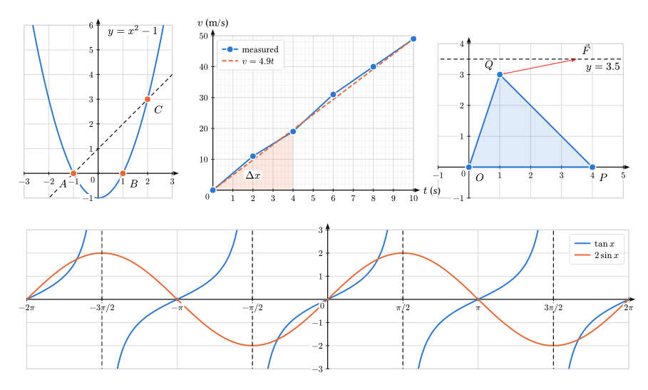

# quadrille

Graph paper for Typst: plot functions, points, lines and vectors for math and
physics homework, with grid steps, scale and cropping you choose. Written in plain
Typst, with no dependencies.

```typst
#import "@preview/quadrille:0.1.0": *

#graph(
  x: (-3, 3), y: (-1, 6), scale: 8mm,
  fn(x => x * x - 1, [$y = x^2 - 1$]),
  points((-1, 0, $A$), (1, 0, $B$), (2, 3, $C$)),
  segment((-1, 0), (2, 3), extend: true, stroke: (dash: "dashed")),
)
```



## The rules

Everything follows the same few rules, so once you know them you can guess the rest:

| | |
|---|---|
| a **point** | `(x, y)`; a named point is `(x, y, $A$)` |
| a **range** | `(from, to)`: the window `x:` / `y:` of a graph, the `domain:` of an element |
| **axis options** | come as `x-…` and `y-…`; the plain name sets both: `step: 1` = `x-step: 1, y-step: 1` |
| `stroke:` | anything Typst's `stroke` takes: `red`, `2pt`, `2pt + red`, `(dash: "dashed")` |
| `label:` | the element's entry in the legend |
| a trailing **text** | `fn(f, [$y = x^2$])`, `vector(a, b, $arrow(F)$)`: written on the graph next to the element; `pos:` picks the side (`top`, `bottom + left` …), `auto` finds a free spot |
| colors | curves and points take the next palette color; helper lines (segment, vector, hline, vline) are ink; an `area` takes the color of the curve before it |

## `graph`

`graph(..elements, options)` draws a grid, axes and everything given to it. All options
are optional.

| option | default | |
|---|---|---|
| `x`, `y` | `auto` | the visible window `(from, to)`: **cropping**. Everything outside is cut off. `auto` fits the data and rounds out to whole steps |
| `step`, `x-step`, `y-step` | `auto` | distance between grid lines and numbered ticks, in graph units (`x-step: calc.pi / 2`) |
| `minor`, `x-minor`, `y-minor` | `none` | extra grid lines between two numbered ones: `minor: 5` gives millimetre paper with `step: 1` |
| `scale`, `x-scale`, `y-scale` | `auto` | the length of one unit on paper: `scale: 1cm`. Takes priority over `width` / `height` |
| `width`, `height` | `10cm`, `auto` | the size of the gridded area. `height: auto` keeps both axes at the same scale when that gives a sensible shape, else 0.65 × width. `width: 100%` fills the column |
| `ticks`, `x-ticks`, `y-ticks` | `auto` | `none`, or which values get numbers: `(1, 2, 5)`, or your own text: `((1, $a$), (3, $b$))` |
| `format`, `x-format`, `y-format` | `auto` | how numbers are written: `auto`, `"pi"` (π/2, π, 3π/2 …) or a function `v => [#v s]` |
| `x-label`, `y-label` | `none` | names at the ends of the axes: `x-label: [$t$ (s)]` |
| `axes` | `"origin"` | `"origin"`: the axes cross at 0 (at the edge when 0 is out of view). `"edge"`: bottom and left. `none` |
| `grid` | `true` | draw the grid |
| `legend` | `auto` | where the legend goes: `auto` (the emptiest corner), `top + left` …, or `none` |
| `clip` | `true` | cut curves off at the window |
| `style` | `(:)` | change the look, see [Style](#style) |

Numbers that would overlap are thinned out automatically; very large or small values
share one power of ten, written once at the end of the axis (`× 10⁻³`).

## Elements

| element | draws |
|---|---|
| `fn(f)` | the graph of y = f(x). Options: `domain`, `step` or `samples` (how densely it is sampled, default 400 values), `stroke`, `label` |
| `parametric(f)` | the curve `t => (x, y)` for t in `domain` (default 0 to 2π) |
| `points(p, q, …)` | points; also `points(data)` with `data` an array of points, or `points(f, step: 0.5)`: marks on a function. Options: `mark` (`"dot"`, `"circle"`, `"square"`, `"diamond"`, `"triangle"`, `"cross"`, `"plus"`, `none`), `size`, `connect: true` (lines from each point to the next), `close: true` (also back to the first), `fill` (for closed shapes), `stroke`, `label` |
| `segment(a, b)` | the segment from a to b; `extend: true` draws the whole line through a and b |
| `vector(to)`, `vector(from, to)` | an arrow; `vector(to)` starts at the origin |
| `hline(y)`, `vline(x)` | a dashed line across the graph (asymptotes, x = 2) |
| `area(f)`, `area(f, g)` | fills between f and the x axis, or between f and g, over `domain`. `f` and `g` may be numbers: `area(4, domain: (0, 3))` |
| `annotate(p, body)` | text or math at a point; `pos: top` puts it above the point |

`vector` and `annotate` are not called `arrow` and `note` on purpose: those names
belong to math (`$arrow(F)$`) and to the music-note symbols, and importing
quadrille must not hide them.

### Where a function is undefined

Return `none` there and the curve gets a gap:

```typst
fn(x => if x != 0 { 1 / x })
fn(x => if x >= 0 { calc.sqrt(x) })
```

Jumps such as `tan x` crossing π/2 are found by themselves: no vertical line is
drawn there.

## Recipes

**A physics lab graph** (measurements joined by lines, a fitted line, mm paper):

```typst
#graph(
  x: (0, 10), y: (0, 50), x-step: 1, y-step: 10, minor: 5,
  width: 12cm, height: 7cm, axes: "edge",
  x-label: [$t$ (s)], y-label: [$v$ (m/s)],
  points((0, 0), (2, 11), (4, 19), (6, 31), (8, 40), (10, 49), connect: true, label: [measured]),
  fn(x => 4.9 * x, stroke: (dash: "dashed"), label: $v = 4.9 t$),
  area(x => 4.9 * x, domain: (0, 4), [$Delta x$]),
)
```

**Data from a file:** `points(csv("data.csv").slice(1).map(r => r.map(float)))`.

**Trigonometry:** `graph(x: (-2 * calc.pi, 2 * calc.pi), x-step: calc.pi / 2, x-format: "pi", fn(x => calc.sin(x)))`.

**Piecewise, with open and filled end points:**

```typst
#let (c1, c2) = (palette.at(0), palette.at(1))
#graph(x: (-3, 3), y: (-2, 4), scale: 8mm,
  fn(x => x + 2, domain: (-3, 0), stroke: c1), points((0, 2), mark: "circle", stroke: c1),
  fn(x => x * x, domain: (0, 3), stroke: c2), points((0, 0), stroke: c2),
)
```

**Vectors:**

```typst
#graph(x: (-1, 5), y: (-1, 4), scale: 1cm,
  vector((3, 2), $arrow(v)$),
  vector((3, 2), (4, 3.5), $arrow(F)$, stroke: red),
)
```

## Style

`graph(style: (...))` changes the look; `default-style` lists every key:

| key | default |
|---|---|
| `palette` | eight colors, chosen to stay distinguishable with color blindness |
| `ink` | axes, helper lines, text |
| `line`, `helper`, `axis` | thickness of curves, helper lines, axes |
| `grid`, `minor-grid` | strokes of the grid lines |
| `tick`, `tick-label`, `axis-label` | tick length, and the size of numbers and axis names |
| `arrow`, `overhang` | arrowhead length, how far the axes stick out |
| `mark`, `area`, `gap`, `halo` | point size, how see-through areas are, text distance, background behind texts |

For a house style, set the defaults once with Typst's own `.with`:

```typst
#let graph = graph.with(scale: 1cm, minor: 2, style: (grid: 0.4pt + luma(190)))
```

## Contributing

Issues and pull requests are welcome at
[github.com/ngelkind/quadrille](https://github.com/ngelkind/quadrille). The files in
`tests/` there compile every feature:

```sh
for f in tests/*.typ; do typst compile --root . "$f" /tmp/out.pdf || echo "FAILED: $f"; done
```

## Author

Made by Nachum Getzel Elkind ([@ngelkind](https://github.com/ngelkind)) for math and physics homework.
If quadrille helps you, a star on GitHub or a mention is appreciated.

Released under the [MIT licence](LICENSE).
