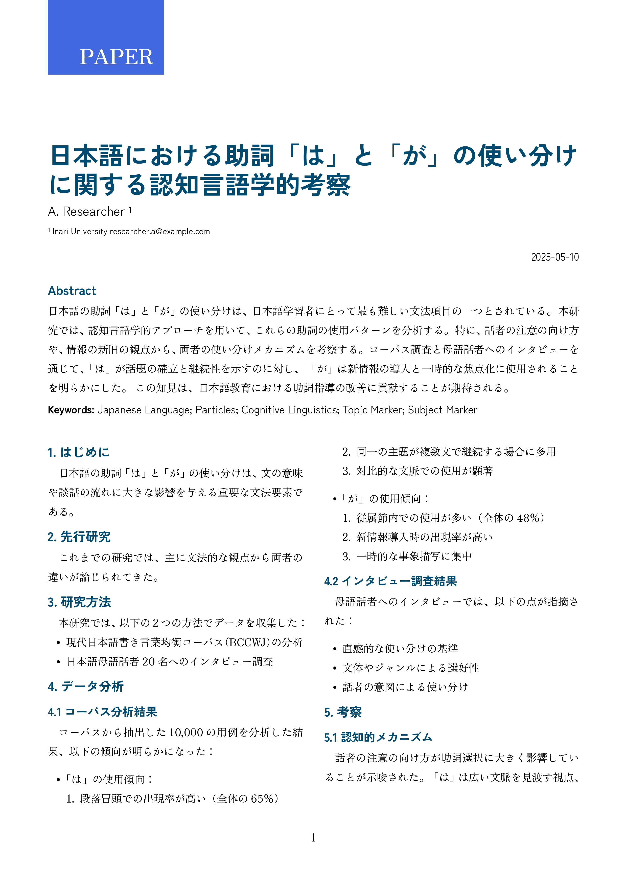

# typst-quic-style


A cohesive Typst design template that can be used in various situations—daily life, research, and experiments!

Forked from [JamesxX/graceful-genetics](https://github.com/JamesxX/graceful-genetics) — thanks!

## 日本語対応

- 段落の字下げ (見出しの直下も字下げする)
- 行間
- 日本語フォント (Zen Kaku Gothic New, Zen Old Mincho)
- 表の上にキャプション

など...

## Required Fonts

This template requires the following fonts:

- [Zen Kaku Gothic New](https://fonts.google.com/specimen/Zen+Kaku+Gothic+New) - For Japanese sans-serif text
- [Zen Old Mincho](https://fonts.google.com/specimen/Zen+Old+Mincho) - For Japanese serif text
- TeX Gyre Heros - For English sans-serif text
- TeX Gyre Pagella - For English serif text

Please download and install these fonts on your system before using the template.

### Font Installation

1. Download the fonts:

   - Zen fonts can be downloaded from Google Fonts
   - TeX Gyre fonts can be downloaded from [GUST e-foundry](https://www.gust.org.pl/projects/e-foundry/tex-gyre)

2. Install the fonts on your system:
   - For Linux: Copy the font files to `~/.local/share/fonts/` and run `fc-cache -f -v`
   - For macOS: Double-click the font files and click "Install Font"
   - For Windows: Double-click the font files and click "Install"

## Package Installation

- Linux: ~/.local/share/typst/packages/local
- macOS: ~/Library/Application Support/typst/packages/local
- Windows: %APPDATA%\typst\packages\local

## Package Structure

The main components of this package are:

- `src/` - Core implementation files
- `template/` - Template files for different document types
- `thumbnails/` - Preview images of the templates

Additional files for development and documentation:

- `docs/manual.pdf` - Detailed documentation of the package
- `examples/` - Example documents showcasing different use cases
- `tests/` - Test files for development

## Media

<p align="center">
  
&nbsp; &nbsp; &nbsp; &nbsp;
  
&nbsp; &nbsp; &nbsp; &nbsp;
</p>

<p align="center">
  
&nbsp; &nbsp; &nbsp; &nbsp;
  
</p>

## Getting Started

To use this template, simply import it as shown below:

```typ
#import "@preview/quic-style:0.0.1"

#show: quic-style.template.with(
  title: [タイトル],
  authors: (
    (
      name: "name",
      department: "department",
      institution: "institution",
      city: "city",
      country: "country",
      mail: "mail@example.com",
    ),
  ),
  date: (
    year: 2025,
    month: "May",
    day: 7,
  ),
  keywords: (
    "Space",
    "Mail",
    "Astromail",
    "Faster-than-Light",
    "Mars",
  ),
  doi: "",
  abstract: [
    Recent advances in space-based document processing have enabled faster mail delivery between different planets of a solar system. Given the time it takes for a message to be transmitted from one planet to the next, its estimated that even a one-way trip to a distant destination could take up to one year. During these periods of interplanetary mail delivery there is a slight possibility of mail being lost in transit. This issue is considered so serious that space management employs P.I. agents to track down and retrieve lost mail. We propose A-Mail, a new anti-matter based approach that can ensure that mail loss occurring during interplanetary transit is unobservable and therefore potentially undetectable. Going even further, we extend A-Mail to predict problems and apply existing and new best practices to ensure the mail is delivered without any issues. We call this extension AI-Mail.
  ],
  doc_type: "PROGRESS_REPORT", // or "NOTE", "LOG", "PAPER"
)

// セクション
= 1.
```
