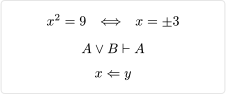

# quick-maths

A package for creating custom shorthands for math equations.

## Usage

The package comes with a single template function `shorthands` that takes one or more tuples of the form `(shorthand, replacement)`, where `shorthand` can be a string or content.

There are some small quality of life features for interaction of shorthands with fractions and attachments:

- If the right-most symbol of a shorthand has any attachments, they are moved to the shorthand's replacement.
- If a shorthand ends in the numerator of a fraction, the whole replacement is placed in the numerator.
- If a shorthand starts in the denominator of a fraction, the whole replacement is placed in the denominator.

As the implementation of these features is quite hacky, you may encounter some edge cases, where the use of explicit parentheses hopefully saves you.

## Notes

- Shorthands are parsed in the order they are given, so if you have a shorthand that is a prefix of another shorthand, you should put the longer shorthand first.

- The content of an equation is traversed from left to right, so the left-most matching shorthand will be replaced first.

- Shorthands consisting of only a single character or element may be applied using show rules, so that they can affect non-sequence elements. This may lead to different behavior than multi-character shorthands.

- If the replacement of a shorthand contains a shorthand itself, there are no protections against infinite recursion or overflows.

## Example

```typ
#import "@preview/quick-maths:0.2.1": shorthands

#show: shorthands.with(
  ($+-$, $plus.minus$),
  ($|-$, math.tack),
  ($<=$, math.arrow.l.double) // Replaces '≤'
)

$ x^2 = 9 quad <==> quad x = +-3 $
$ A or B |- A $
$ x <= y $
```


