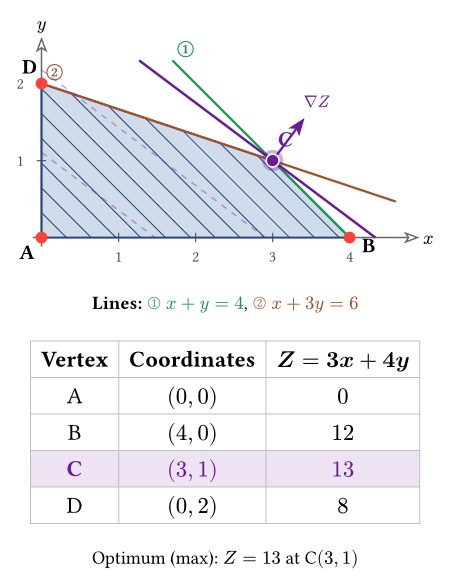
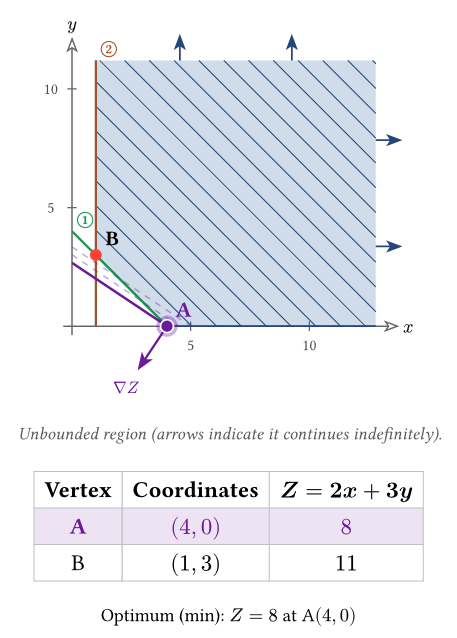
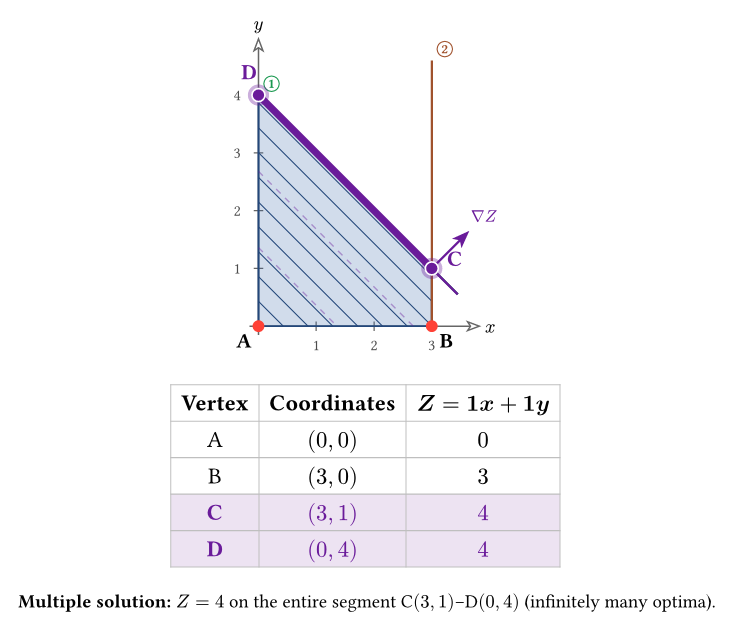
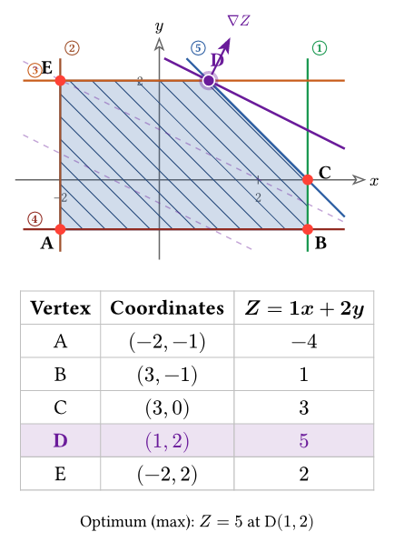

# quick-vertex

Plot **feasible regions of two-variable linear programs** in [Typst](https://typst.app),
drawn with [CeTZ](https://github.com/cetz-package/cetz). One call gives you the
shaded region, the boundary lines, the vertices, the objective's level lines and
gradient, and a vertex table with the optimum highlighted.

It is built for teaching (secondary school / early undergraduate), and it handles
the cases a synthetic example set usually forgets: **unbounded regions, multiple
optima, unbounded objectives, empty regions, strict inequalities and any quadrant**.

<p align="center">
  
  
</p>
<p align="center">
  
  
</p>

## Usage

```typ
#import "@preview/quick-vertex:0.1.1": feasible-region

#feasible-region(
  ((1, 1, 4, "<="), (1, 3, 6, "<=")),
  objective: (3, 4),
  sense: "max",
  labels: ($x + y = 4$, $x + 3y = 6$),
)
// → Optimum (max): Z = 13 at C(3, 1)
```

This is exactly the first image in the gallery above.

Each constraint is a 4-tuple `(a, b, c, op)` meaning `a·x + b·y op c`, where
`op` is one of `"<="`, `">="`, `"<"`, `">"`. The objective is `Z = c1·x + c2·y`,
given as `(c1, c2)`.

## Parameters

| Parameter        | Default      | Meaning |
|------------------|--------------|---------|
| `constraints`    | *(required)* | Array of `(a, b, c, op)`. `op ∈ "<=", ">=", "<", ">"`. An optional 5th element sets that line's color: `(a, b, c, op, color)`. |
| `objective`      | `none`       | `(c1, c2)` of `Z = c1·x + c2·y`. Omit to just draw the region. An optional 3rd element sets the objective color: `(c1, c2, color)`. |
| `sense`          | `"max"`      | Optimization sense: `"max"` or `"min"`. |
| `gradient`       | `true`       | Draw the `∇Z` vector at the optimum. |
| `table`          | `true`       | Show the vertex table; if `false`, a compact vertex legend. |
| `first-quadrant` | `true`       | Add `x ≥ 0, y ≥ 0` implicitly. See the note below. |
| `labels`         | `none`       | Line equations (content), in the order of `constraints`. |
| `lang`           | `"en"`       | Language of the rendered labels: `"en"` or `"es"`. |
| `region-color`   | blue         | Fill / hatch / border color of the feasible region. |
| `size`           | `(6, 4.5)`   | Canvas size, in CeTZ units — with `equal-aspect: true`, an **upper bound**: the drawn extent shrinks in whichever dimension isn't the tightest fit. |
| `margin`         | `1.15`       | Padding factor around the region. |
| `equal-aspect`   | `true`       | Both axes use the same units-per-length scale (textbook square-grid convention; both axes also share one tick step). `false` stretches each axis independently to fill `size` exactly, with its own tick step — `∇Z` stays perpendicular to the level lines either way. |

> **⚠️ `first-quadrant` is `true` by default**, so **`x ≥ 0` and `y ≥ 0` are added
> automatically** (the usual assumption in school problems). Pass
> `first-quadrant: false` to draw only the constraints you write — for example
> when the region lives in another quadrant.

> **Note on two "senses".** The 4th tuple element is the inequality *operator*
> (`"<="`, …). The `sense` parameter is the *optimization* sense (`"max"`/`"min"`).
> They are unrelated.

## Colors

Every boundary line gets a **distinct color automatically** — a curated palette
first, then generated hues — so colors never repeat, no matter how many
constraints you add. Override any of them explicitly:

```typ
#feasible-region(
  (
    (1, 1, 4, "<=", red),          // this line in red
    (1, 3, 6, "<="),               // auto color
  ),
  objective: (3, 4, olive),        // objective, optimum and ∇Z in olive
  region-color: rgb("#2b8a3e"),    // the feasible region in green
)
```

## What it handles

| Case | Behavior |
|---|---|
| Bounded region | Filled + hatched polygon. |
| **Unbounded region** | Filled correctly; arrows on the open sides + an "unbounded" note. |
| Unique optimum | Highlighted vertex, optimal level line, `∇Z`, table with the optimal row marked. |
| **Multiple optima** | Detects the tie between adjacent vertices; highlights the **segment** (or ray) and labels it. |
| **Unbounded objective** | Detects that no finite max/min exists and says so, instead of inventing a vertex. |
| Empty region | Labels "Infeasible region". |
| **Strict inequalities** (`<`, `>`) | Correct region + **dashed** boundary. |
| **Any quadrant** | `first-quadrant: false` works (frame, axes and ticks with negatives). |

## Localization

Rendered labels default to English. Pass `lang: "es"` for Spanish. Adding a
language is a matter of copying one block in the `_i18n` dictionary in `lib.typ`
and translating it — contributions welcome.

## How it works

The shading is obtained by clipping the visible frame against each half-plane
(Sutherland–Hodgman), so open regions fill correctly whether bounded or not. A
recession-cone sample decides whether the region is unbounded, extends the frame
towards where it escapes, and detects when the objective has no finite optimum.

## Compatibility

- Typst `>= 0.14.0`
- CeTZ `0.5.2`

## Known limitations

See [`ROADMAP.md`](ROADMAP.md). In short: a couple of cosmetic issues (a vertex
label can still land on an axis tick; zero-area regions) and two rare semantic
edge cases (a strict inequality binding the optimum; more than two vertices
tied in `Z`). None affect ordinary textbook problems.

## License

[MIT](LICENSE).
