# Quill Assignment

A clean, minimal Typst template for assignments, lab reports, and technical documents. Designed for academic coursework with elegant typography, multiple cover page styles, and flexible component blocks.

## Features

- **Academic Layout**: Clean margins, structured headers/footers, and custom heading typography.
- **7 Cover Page Styles**: Modern, Swiss, Geometric, Architecture, Minimal, Classic, and Editorial.
- **Color Themes**: Built-in palettes (`nord-light`, `catppuccin-latte`, `paper`, `github-light`) with custom color support.
- **Coursework Components**: Question & answer blocks, note callouts, key-value tables, and watermarks.
- **Technical Metadata**: Blueprint-style drawing title blocks with scale, revision, and document reference fields.
- **Flexible Sizing**: Standard page formats or continuous page height (`height-auto`).

## Preview

| Cover Page | Document Page |
| :---: | :---: |
| 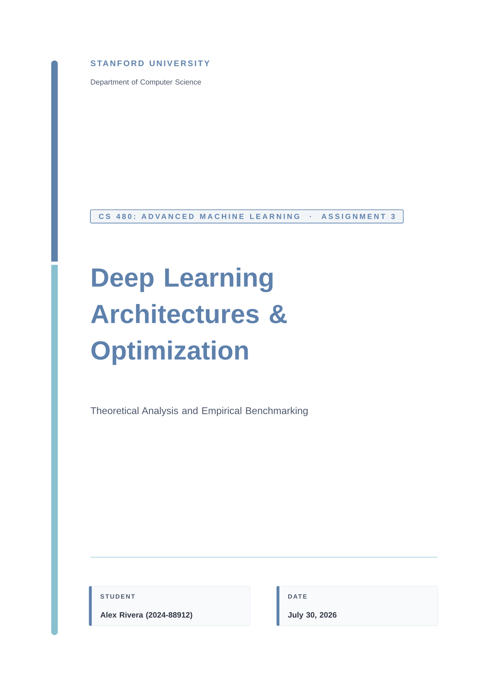 | 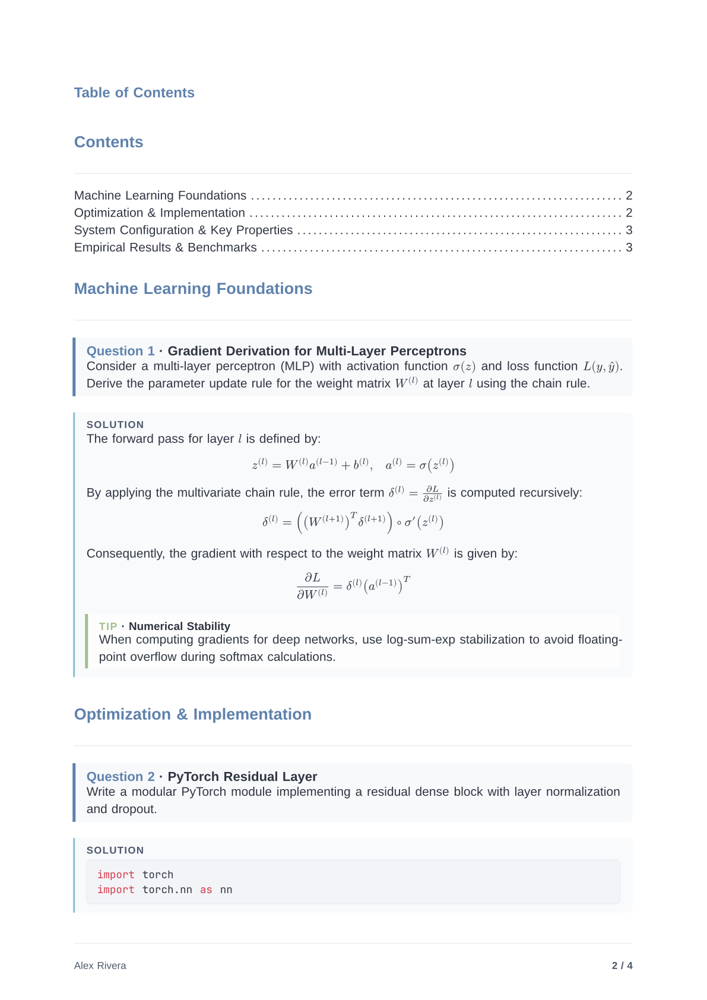 |
| 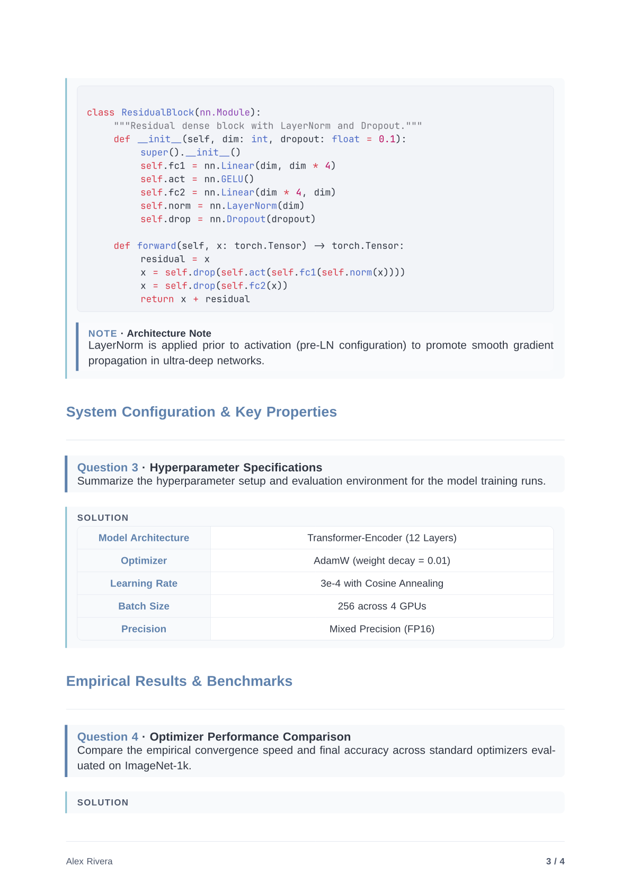 | 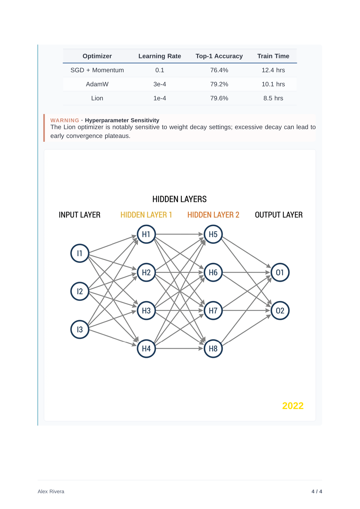 |

### Cover Page Gallery

Quill offers 7 cover page styles (`modern`, `swiss`, `geometric`, `architecture`, `minimal`, `classic`, and `editorial`).

| Modern | Swiss | Geometric |
| :---: | :---: | :---: |
| 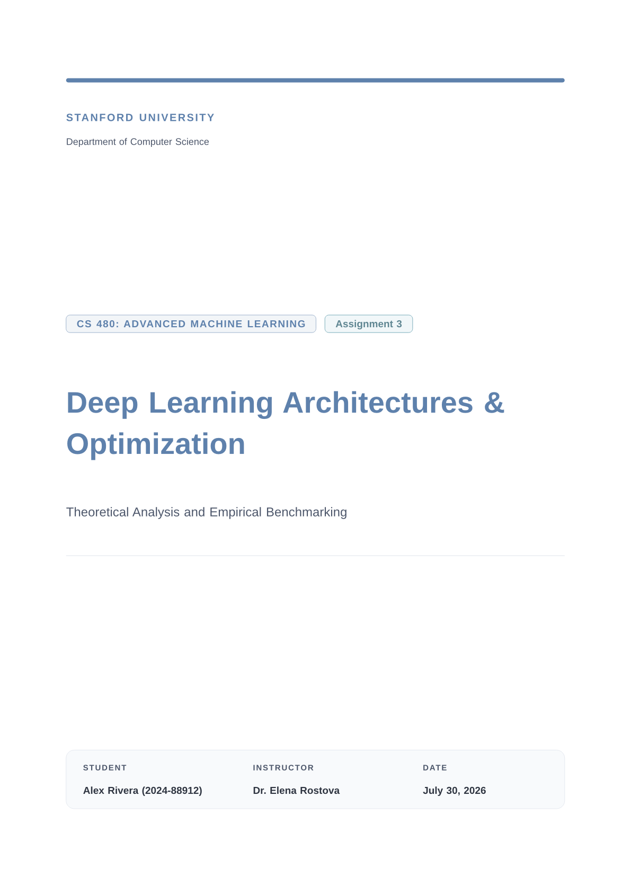 | 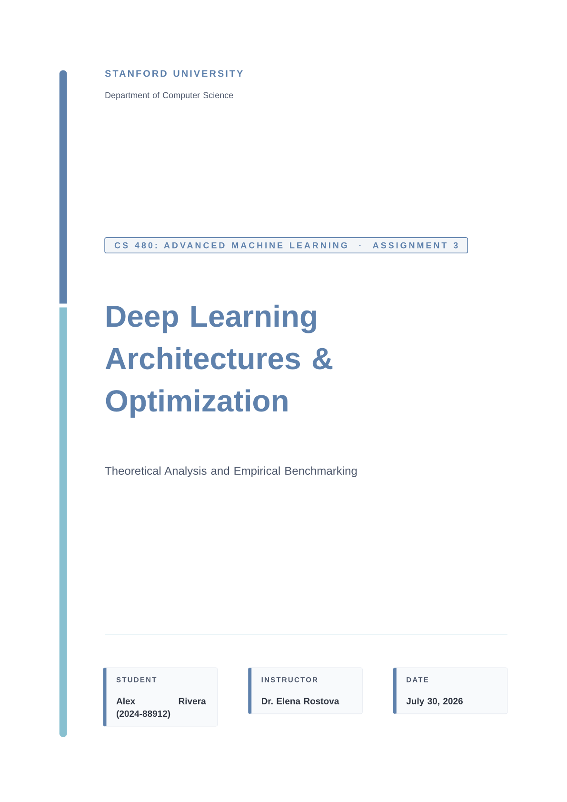 | 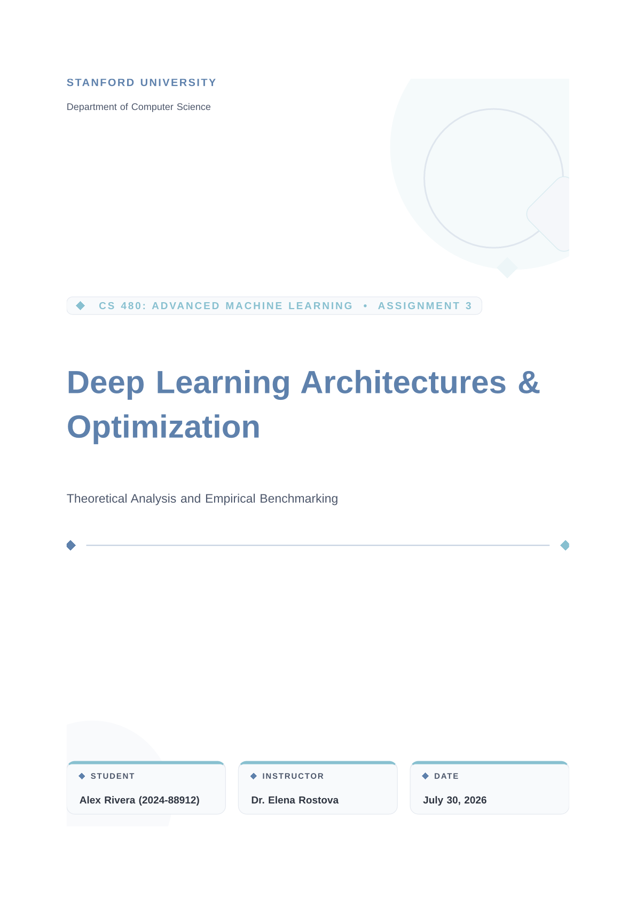 |

| Architecture | Minimal | Classic |
| :---: | :---: | :---: |
| 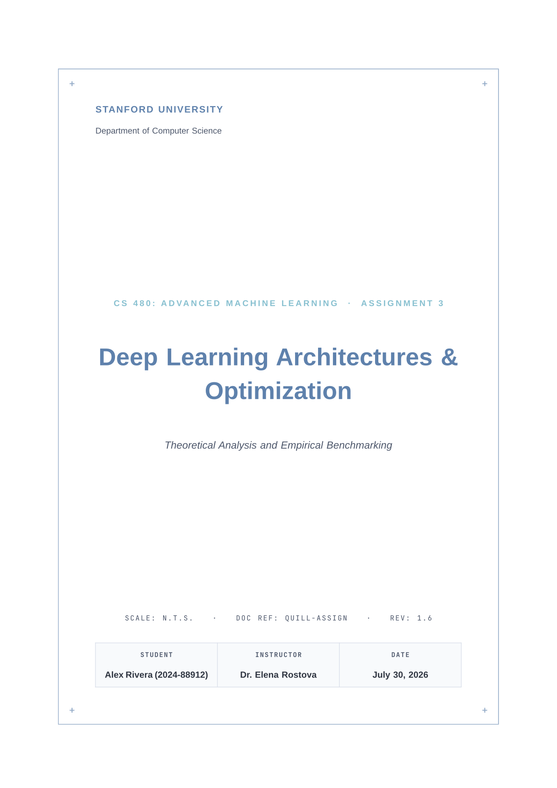 | 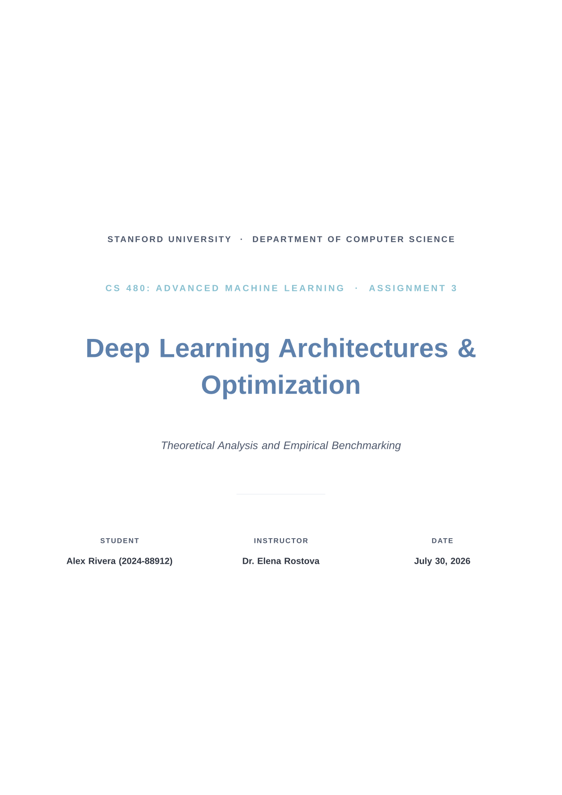 | 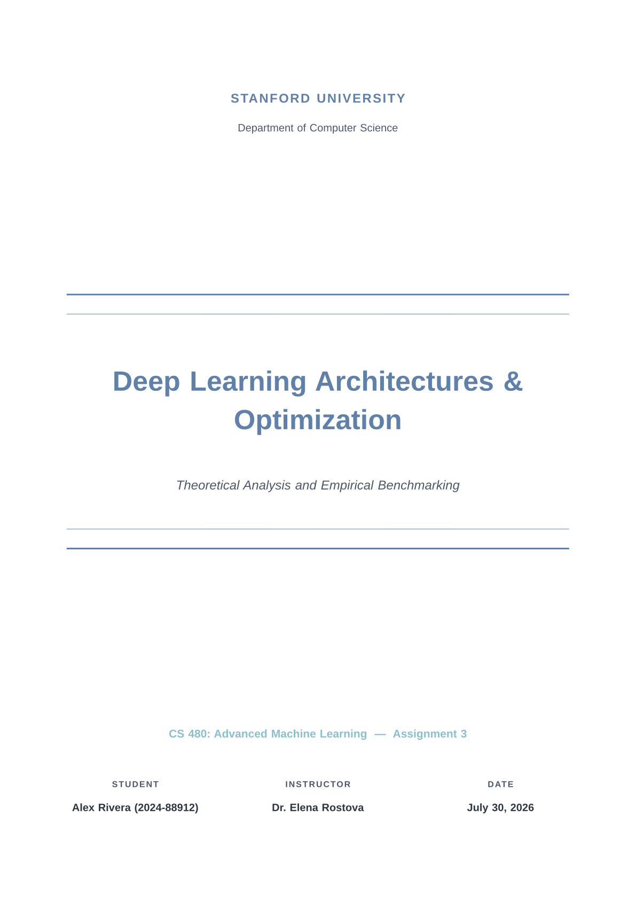 |

| Editorial |
| :---: |
| 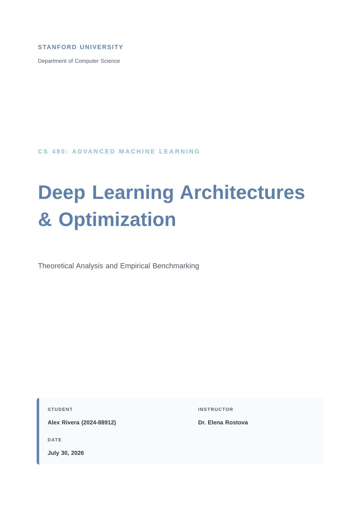 |

## Installation

Create a new project using the Typst CLI:

```bash
typst init @preview/quill-assignment:0.1.0
```

Or import it into an existing document:

```typ
#import "@preview/quill-assignment:0.1.0": *
```

## Quick Start

```typ
#import "@preview/quill-assignment:0.1.0": *

#show: assignment.with(
  title: "Deep Learning Architectures & Optimization",
  subtitle: "Theoretical Analysis and Empirical Benchmarking",
  course: "CS 480: Advanced Machine Learning",
  assignment: "Assignment 3",
  student: "Alex Rivera",
  student-id: "2024-88912",
  instructor: "Dr. Elena Rostova",
  department: "Department of Computer Science",
  university: "Stanford University",
  date: datetime.today(),
  theme: "nord-light",
  cover-page: true,
  cover-style: "architecture",
  doc-ref: "QUILL-ASSIGN",
  rev: "1.6",
  scale: "N.T.S.",
)

= Problem 1

#question(title: "Multi-Layer Perceptron")[
  Derive the parameter update rule for the weight matrix using the chain rule.
]

#answer[
  The gradient with respect to the weight matrix is

  $
  (partial L)/(partial W^((l)))
  =
  delta^((l))
  (a^((l-1)))^T
  $

  #note(type: "tip")[
    Use log-sum-exp stabilization to avoid numerical overflow.
  ]
]
```

## Themes

Quill includes four built-in color themes:

| Theme | Description |
| :--- | :--- |
| `"nord-light"` | Soft cool white background with arctic blue accents (default). |
| `"catppuccin-latte"` | Warm cream background with lavender accents. |
| `"paper"` | Pure white background with charcoal typography. |
| `"github-light"` | GitHub light background with primer blue accents. |

Select a theme when initializing the document:

```typ
#show: assignment.with(
  theme: "catppuccin-latte",
)
```

## Components

Quill provides dedicated functions for structuring coursework content:

| Component | Description |
| :--- | :--- |
| `#question(title: "...", body)` | Automatically numbered question block (`que`). |
| `#answer(body)` | Styled answer container (`ans`). |
| `#note(type: "...", title: "...", body)` | Callout box (`type`: `"info"`, `"tip"`, `"warning"`, `"note"`). |
| `#kv-table("Key", "Value", ...)` | Structured key-value grid (`kvtable`). |
| `#watermark("Text or Image")` | Background watermark overlay. |

For complete function signatures and parameter references, see [docs/configuration.md](https://github.com/h-jangra/quill-assignment/blob/0.1.0/docs/configuration.md).

## Customization

Override default colors, fonts, and page settings directly:

```typ
#show: assignment.with(
  title: "Quantum Computing Homework",
  course: "PHYS 301",
  student: "Jordan Lee",
  theme: "paper",
  primary: rgb("#2b5c8f"),
  accent: rgb("#4682b4"),
  font: "Libertinus Serif",
  code-font: "JetBrains Mono",
  radius: 6pt,
)
```

## Example

A complete working document demonstrating all features is available in [example.typ](https://github.com/h-jangra/quill-assignment/blob/0.1.0/example.typ).

## License

This package is licensed under the [MIT License](LICENSE).
