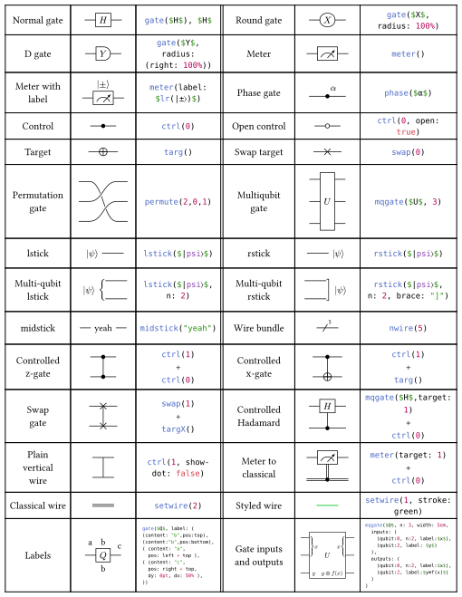
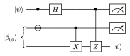
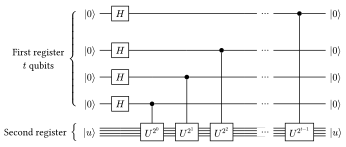
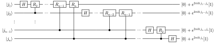

<h1 align="center">
  
</h1>


**Quill** is a package for creating quantum circuit diagrams in [Typst](https://typst.app/). 

Repository: https://github.com/Mc-Zen/quill


_Note, that this package is in beta and may still be undergoing breaking changes. As new features like types and scoped functions will be added to Typst, this package will be adapted to profit from the new paradigms._

_Meanwhile, we suggest importing everything from the package in a local scope to avoid polluting the global namespace (see example below)._


## Usage

Create circuit diagrams by calling the function `quantum-circuit()` with any number of positional arguments — just like the built-in Typst functions `table()` or `grid()`. A variety of different gate and instruction commands are available and plain numbers can be used to produce any number of empty cells just filled with the current wire style. A new wire is started by adding a `[\ ]` item. 

```typ
#{
  import "@preview/quill:0.2.0": *
  quantum-circuit(
    lstick($|0〉$), gate($H$), ctrl(1), rstick($(|00〉+|11〉)/√2$, n: 2), [\ ],
    lstick($|0〉$), 1, targ(), 1
  )
}
```
<h3 align="center">
  
</h3>

As a shorthand for simple gates you can also just write `$H$` instead of the more lengthy `gate($H$)`. 

Refer to the [user guide](docs/guide/quill-guide.pdf) for a full documentation of this package.

## Gallery

<h3 align="center">
  
</h3>

## Examples

Some show-off examples, loosely replicating figures from [Quantum Computation and Quantum Information by M. Nielsen and I. Chuang](https://www.cambridge.org/highereducation/books/quantum-computation-and-quantum-information/01E10196D0A682A6AEFFEA52D53BE9AE#overview).

<h3 align="center">
  
</h3>
<h3 align="center">
  
</h3>
<h3 align="center">
  
</h3>


## Changelog


### v0.2.0
- New features:
  - Arbitrary labels to any `gate` (also derived gates such as `meter`, `ctrl`, ...), `gategroup` or `slice` that can be anchored to any of the nine 2d alignments. 
  - Add optional gate inputs and outputs for multi-qubit gates (see gallery).
  - Implicit gates (breaking change ⚠️): a content item automatically becomes a gate, so you can just type `$H$` instead of `gate($H$)` (of course, the `gate()` function is still important in order to use the many available options). 
- Other breaking changes ⚠️: 
  - `slice()` has no `dx` and `dy` parameters anymore. Instead, labels are handled through `label` exactly as in `gate()`. Also the `wires` parameter is replaced with `n` for consistency with other multi-qubit gates. 
  - Swap order of row and column parameters in `annotate()` to make it consistent with built-in Typst functions. 
- Improvements: 
  - Improve layout (allow row/column spacing and min lengths to be specified in em-lenghts).
  - Automatic bounds computation, even for labels. 
  - Improve meter (allow multi-qubit gate meters and respect global (per-circuit) gate padding).d
- Fixes:
  - `lstick`/`rstick` braces broke with Typst 0.7.0.
  - `lstick`/`rstick` bounds.
- Documentation
  - Add section on creating custom gates. 
  - Add section on using labels. 
  - Explain usage of `slice()` and `gategroup()`.
  <!-- - Add Tips and tricks section -->

### v0.1.0

Initial Release