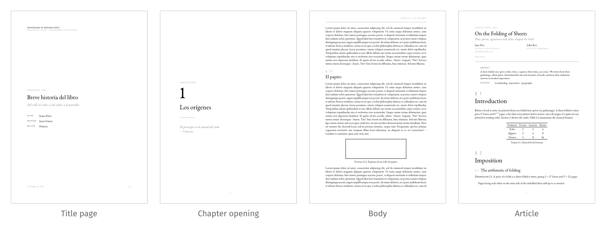

# quire

A classical Typst template for books, reports and articles: EB Garamond text with small caps, quiet sans-serif
labels, thin golden rules and generous margins, ready for print and for screens.



A _quire_ is a gathering of folded sheets, the unit books are sewn from.

## Features

- **Three structures**, chosen with `top-level`: documents divided in parts (`"part"`), chapters (`"chapter"`) or
  only sections (`"section"`, for articles).
- **Print and digital output**: recto openings with clean blank pages, a wider inner margin and link footnotes for
  print; symmetric margins and colored links for screens.
- **Front matter**: title page, dedication and colophon, acknowledgments, abstracts in several languages and table of
  contents, or a title block for articles.
- **Localized** in English, Spanish and Catalan.
- **Customizable** fonts and colors.
- Bibliographies with a localized title and Typst's default style, which you can change with
  `#set bibliography(style: ...)`.
- Theorem-like environments (with [theorion](https://typst.app/universe/package/theorion)), code listings (with
  [codly](https://typst.app/universe/package/codly)), appendices, and figures and equations numbered within
  sections.

## Usage

```sh
typst init @preview/quire
```

or, in an existing document:

```typ
#import "@preview/quire:0.1.0": *

#show: quire.with(
  title: [On Bookbinding],
  authors: "Jane Doe",
  lang: "en",
  top-level: "chapter",
  output: "print",
)

= Introduction
```

See the [**manual**][manual] for every option. The examples show the template at work:

- [An article][article] in English, divided in sections, for screens ([source][article-source]).
- [A book][book] in Spanish, divided in parts, for print ([source][book-source]).

[manual]: docs/manual.pdf
[article]: examples/article.pdf
[article-source]: examples/article.typ
[book]: examples/book.pdf
[book-source]: examples/book.typ

### Fonts

The default style requires these fonts, which are not bundled with the package:
[EB Garamond](https://github.com/octaviopardo/EBGaramond12) (the `EB Garamond 12` and `EB Garamond 08` families),
[Fira Sans](https://github.com/mozilla/Fira), [Garamond-Math](https://github.com/YuanshengZhao/Garamond-Math) and
[JuliaMono](https://github.com/cormullion/juliamono). Any of them can be replaced:

```typ
#show: quire.with(
  fonts: (serif: "Libertinus Serif", math: "Libertinus Math"),
  colors: (link: rgb("#7a1f3d")),
  strong: "bold",
)
```

### Dates

Dates given as `datetime` are shown with English month names, since Typst does not localize dates yet
([typst/typst#2840](https://github.com/typst/typst/issues/2840)). Pass the date as content to localize it, e.g.
`date: [junio de 2026]`.

## Development

The development environment is managed with [devenv](https://devenv.sh). Enter it with `devenv shell`, which also
installs the git hooks (Conventional Commits, typstyle, markdownlint, alejandra), and run `just` to list the recipes:

- `just pdfs` compiles the examples and the manual, which are committed to the repository.
- `just build` also compiles the template and renders the thumbnail.
- `just watch <file>` recompiles a file on changes.
- `just format` formats the Typst sources; `just check` runs every hook on every file.

The template and the examples import `@preview/quire`; the recipes expose the working tree under that name through
`build/packages`.

The committed PDFs are kept in sync with their sources by a `pdfs` git hook: when a commit touches the sources, it
rebuilds the PDFs and, if any of them changed, aborts the commit so that they can be staged too. The build is
deterministic (documents have fixed dates or none), so unchanged sources give byte-identical PDFs. The hook needs the
fonts of the default style.

## License

The package is distributed under the [MIT license](LICENSE), except for the files of the template directory
(`template/`), which are copied into new projects by `typst init` and are distributed under the
[MIT No Attribution license](https://spdx.org/licenses/MIT-0.html), so that documents created from them can be used
and shared without restriction.
