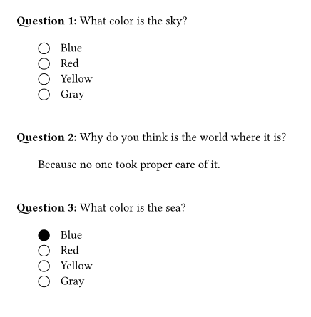

# Quiztime

Typst package to create quizzes.

```typst
#import "@preview/quiztime:0.1.0": question, quiz

#let q1 = question(
  text: "What color is the sky?",
  kind: "multiple-choice",
  answers: ("Blue", "Red", "Yellow", "Gray"),
)

#let q2 = question(
  text: "Why do you think is the world where it is?",
  kind: "text",
  answers: ("Because no one took proper care of it.",),
  show-solutions: true,
  answer-space: 50pt,
)

#let q3 = question(
  text: "What color is the sea?",
  kind: "multiple-choice",
  answers: ("Blue", "Red", "Yellow", "Gray"),
  true-answers: (1,),
  show-solutions: true
)

#quiz(questions: (q1,q2,q3), pre-numbering: "Question ")
```

Gives a list of quiz questions that are multiple-choice or text-based (i.e., space for writing freely). Solutions may be enabled per question.


