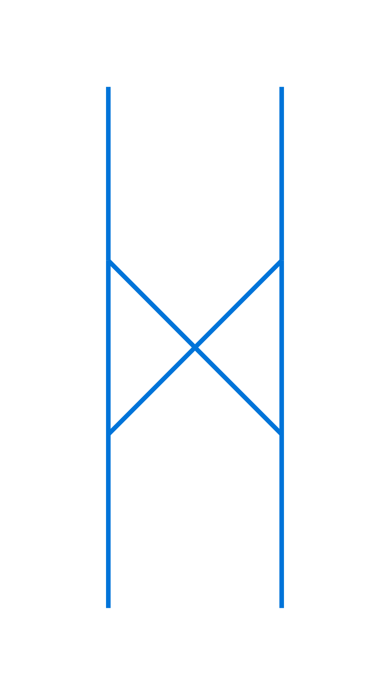
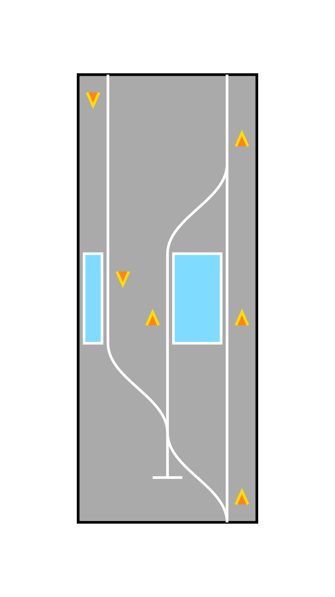

**Railynx** (pronounced _rail-lynx_, /ˈreɪl ˌlɪŋks/) is a Typst package for **drawing rail track diagrams** using a concise and expressive syntax. It allows you to **render tracks, switches, buffer stops, platforms and arrows** in a structured and configurable way, all with readable symbolic input.

> 📦 Designed for transportation enthusiasts who need schematic track diagrams in their Typst documents.

<table>
<tr>
  <td>
    <a href="https://github.com/yusancky/railynx/blob/0.1.0/gallery/example-1.typ">
      
    </a>
  </td>
  <td>
    <a href="https://github.com/yusancky/railynx/blob/0.1.0/gallery/example-2.typ">
      
    </a>
  </td>
</tr>
</table>

## 🚃 Usage

### Quick Start

To use this package, simply add the following code to your document:

```typst
#import "@preview/railynx:0.1.0": railynx

#railynx(
  2,
  ("1e 2e", "1sr 2sl", ""),
)
```

### Parameters

| Name             | Default        | Description                                       |
| ---------------- | -------------- | ------------------------------------------------- |
| `rail`           | **(Required)** | Number of vertical rail tracks.                   |
| `nodes`          | **(Required)** | Operation expressions of horizontal nodes.        |
| `base-index`     | `1`            | Base number for track indexing.                   |
| `rail-space`     | `1cm`          | Horizontal spacing between tracks.                |
| `node-space`     | `1cm`          | Vertical spacing between node rows.               |
| `breakable`      | `true`         | Whether the diagram block can break across pages. |
| `fill`           | `none`         | Background fill color of the diagram block.       |
| `stroke`         | `none`         | Border stroke color of the diagram block.         |
| `rail-stroke`    | `1.5pt + blue` | Stroke style for tracks and switches.             |
| `switch-tension` | `0`            | Controls the curve tension for switches.          |
| `platform-fill`  | `blue`         | Fill color for platforms.                         |
| `arrow-dx`       | `0.2`          | Horizontal offset for arrows.                     |
| `arrow-fill`     | `none`         | Fill color for arrowheads.                        |
| `arrow-stroke`   | `blue`         | Stroke color for arrows.                          |

## 🧮 Node Syntax

The type of each node element in the `nodes` array can be `str` or an `array[str]`, representing a horizontal _row_ in the diagram.

### Operation Reference

| Syntax                            | Description                                                                    |
| --------------------------------- | ------------------------------------------------------------------------------ |
| `Ne`                              | Toggle a vertical **rail segment** at index `N`.                               |
| `NE`                              | Render a **buffer stop** at index `N`.                                         |
| `Nsr` / `Nsl`                     | Draw a **right/left switch** starting at index `N`.                            |
| `NSr` / `NSl`                     | Draw a **complete right/left switch** from index `N`.                          |
| `Npr` / `Npl`                     | Draw a **platform** on right/left side of index `N`.                           |
| `NPr` / `NPl`                     | Draw a **wide platform** on right/left side of index `N` for two tracks.       |
| `Nadr` / `Nadl` / `Naur` / `Naul` | Draw a **down/up arrow** (directional marker) on right/left side of index `N`. |

Each node element contains one or more operation expressions, like `"0e 2e 0adl 2aur"` or `("0e", "2e", "0adl", "2aur")`. Notably, if a node is an empty string (`""`), it will simply extend all existing rails by one node space.

## 🛠 Error Handling

Railynx clearly flags invalid input with error blocks, including invalid argument types, out-of-bounds references and malformed operations. If you encounter other errors during compilation, please [create an issue](https://github.com/yusancky/railynx/issues).
