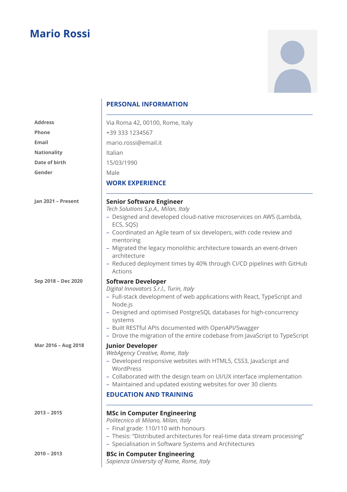

# rasko-europass

Published on Typst Universe as `rasko-europass`; the template function you
call is `europass-cv`.  The development repository keeps the descriptive name
`europass-cv`.

[](https://github.com/Raskolny/europass-cv/actions/workflows/ci.yml)



A faithful, **accessible** reproduction of the official European Union
**Europass CV** format, built for [Typst](https://typst.app) ≥ 0.15.

- Asymmetric two-column grid (~25 % dates / ~75 % content) with the iconic
  thin vertical blue rule running unbroken top-to-bottom.
- Official EU palette: blue `#164194`, body grey `#575756`, highlight `#F2F2F2`.
- **CEFR language self-assessment table** (A1–C2) with contrast-safe shading.
- **GDPR / DPR 445 self-declaration** clause, localised.
- **Full i18n for all 24 official EU languages.**
- **PDF/UA-1 (ISO 14289-1) accessible output**, verified by `verify.sh`.
- **Self-contained fonts**: the whole Open Sans family is vendored in
  `fonts/`, so builds are reproducible and the PDF never substitutes a
  locally installed font.

---

## Quick start

### From Typst Universe

```typst
#import "@preview/rasko-europass:1.0.0": europass-cv, cv-entry

#show: europass-cv.with(lang: "en", name: "Your Name")
```

### From this repository

```bash
./build.sh                 # hermetic, PDF/UA-1 build -> output.pdf
./build.sh my-cv.pdf       # custom output name
```

`build.sh` is the canonical entry point.  It compiles with:

```bash
typst compile --pdf-standard 1.7,ua-1 --ignore-system-fonts --font-path fonts main.typ output.pdf
```

and then runs `verify.sh`, which asserts accessibility and font embedding
(see *Verification* below).  Plain `typst compile main.typ` also works —
Typst auto-discovers `./fonts` — but only `build.sh` guarantees the hermetic,
UA-1-validated result.

---

## Writing your CV

Everything an end user touches lives in **`main.typ`**.  You never edit the
layout.  Fill in fields and go:

```typst
#import "lib.typ": cv-entry, europass-cv

#show: europass-cv.with(
  lang: "it",
  name: "Mario Rossi",
  email: "mario.rossi@email.it",

  work-experience: (
    cv-entry(
      date-start: "Gen 2021", date-end: "Presente",
      title: "Senior Software Engineer",
      organization: "Tech Solutions S.p.A.",
      location: "Milano, Italia",
      description: [
        - Led a team of six engineers
        - Migrated a monolith to event-driven microservices
      ],
    ),
  ),

  other-languages: (
    (lang: "English", listening: "C1", reading: "C1",
     interaction: "B2", production: "B2", writing: "C1"),
  ),
)
```

Anything you write *below* the `#show:` line is appended as an extra section.

### `europass-cv(..)` parameters

| Group | Parameters |
| --- | --- |
| Language / metadata | `lang`, `title`, `author` |
| Personal info | `name`, `photo`, `photo-alt`, `address`, `postal-code`, `city`, `country`, `phone`, `email`, `website`, `nationality`, `date-of-birth`, `gender` |
| Sections | `work-experience`, `education` (arrays of `cv-entry`) |
| Skills | `mother-tongue`, `other-languages`, `digital-skills`, `comm-skills`, `org-skills`, `job-skills`, `other-skills`, `driving-licence` |
| Declaration | `declaration`, `signature-place`, `signature-date` |

Every parameter has a default; supply only what you need.

### `cv-entry(..)`

One row of Work Experience / Education.  Fields: `date-start`, `date-end`,
`title`, `organization`, `location`, `description`.  `title` is emitted as a
real **H3 heading**, so assistive technology can jump straight to a job.

### `language-grid(mother-tongue:, others:, lang:)`

Renders the CEFR table.  `others` is an array of dictionaries with keys
`lang`, `listening`, `reading`, `interaction`, `production`, `writing`, each a
CEFR code (`A1`–`C2`, case-insensitive).  Levels are emitted as **text** with
a contrast-safe background shade — never colour-only, so the PDF stays
accessible.

---

## Internationalisation

Set `lang:` to any ISO 639-1 code; unknown codes fall back to English.
All 24 official EU languages are bundled:

`bg cs da de el en es et fi fr ga hr hu it lt lv mt nl pl pt ro sk sl sv`

Each provides the section headers, the personal-info labels, the CEFR grid
labels, the A1–C2 proficiency descriptors, the gender values, the image
alt-text, and the localised GDPR declaration.

### Localisation data lives in `lang.toml`, not in code

Following the prevailing Typst Universe convention for multilingual packages
(cf. `modern-cv`), all translations are kept in a single external data file,
**`lang.toml`**, loaded by `lib.typ` with the built-in `toml()` function:

```typst
#let i18n = toml("lang.toml")
```

Why this rather than one file per language (or an inline dictionary)?

- **Translator-friendly.**  Contributors edit plain TOML key/value pairs with
  zero risk of breaking Typst syntax.
- **One reviewable diff.**  A new language or a wording fix touches one file.
- **Keeps `lib.typ` pure logic.**  The entrypoint stays small and readable.
- **No import overhead.**  Per-language modules would each need an `#import`
  and would all be compiled anyway; a single data file is simpler and is the
  established community pattern.

## Gender (inclusive, localisable, omittable)

The `gender` parameter is deliberately flexible and GDPR-conscious:

| Value | Effect |
| --- | --- |
| `none` / `""` | the row is omitted entirely (recommended default) |
| `"male"`, `"female"` | localised label for the active language |
| `"other"` / `"non-binary"` | the EU third option (the "X" / German *divers*) |
| `"undeclared"` / `"prefer-not-to-say"` | an explicit "I prefer not to declare" |
| any other string | passed through verbatim, in the person's own words |

All four semantic values are translated in `lang.toml` for every language.

## Examples

`examples/<code>.typ` contains one complete CV per EU language, each with a
persona of the matching nationality (e.g. `examples/bg.typ` → Георги Иванов,
Българин).  They double as the i18n regression suite:

```bash
./build-examples.sh          # compiles all 24 to examples/pdf/ (PDF/UA-1)
```

Every example uses the same anonymous, gender-neutral placeholder portrait
(`assets/photo-placeholder.svg`) so no real person is depicted.

The flagship `main.typ` is written in **English** (the lingua franca of EU
mobility) but keeps an **Italian** persona: Europass uptake is highest in
Southern/Eastern Europe and Italy is its largest single market, whereas
Germany and France favour their national CV formats — so an Italian submitting
in English is the archetypal Europass user.

---

## Accessibility (PDF/UA-1)

The template is engineered for accessibility, not bolted on:

- **Real semantic headings.**  The name is `H1`, sections are `H2`, job/degree
  titles are `H3`.  This produces a genuine PDF outline (bookmarks) —
  PDF/UA-1 rejects documents without one.
- **Layout vs. data.**  The presentational date/content grid uses Typst
  `grid`, which is tagged as layout `Div`s — screen readers never announce a
  bogus data table.  Only the genuinely tabular CEFR grid uses `table` with
  `table.header()`, yielding proper `Table/THead/TH/TD` tags.
- **Text, not colour.**  CEFR levels are always real text.
- **Links.**  Email/website become real `Link` annotations.
- **Lists.**  Bullet skills are tagged `L/LI/Lbl/LBody`.
- **Document metadata.**  `title`, `author`, and the document `lang` are set,
  and `/DisplayDocTitle` is enabled.
- **Alt text.**  `photo-alt` is mandatory for the portrait image.

Typst enforces PDF/UA-1 at compile time via `--pdf-standard 1.7,ua-1`: the
build *fails* if the document would not be accessible.

## Fonts & reproducibility

`fonts/` vendors the complete Open Sans family (Apache-2.0).  The build uses
`--ignore-system-fonts --font-path fonts`, so no glyph is ever resolved from
the host machine, and the PDF embeds **subsetted** Open Sans with a Unicode
CMap (`emb=yes sub=yes uni=yes`) — there is no fallback to local/Base-14 PDF
fonts.  See `fonts/README.md`.

## Verification

`verify.sh` asserts, on the rendered PDF:

1. every font embedded **and** subsetted;
2. no Base-14 / non-embedded font referenced;
3. `/MarkInfo Marked true`, `/StructTreeRoot`, document `/Lang`, XMP metadata;
4. a non-empty PDF outline (H1 root + H2 sections);
5. `H1/H2/Table/THead/TH/TD/L/LI` tags present;
6. the layout grid tagged `Div` (not a data table).

---

## Repository layout

```text
lib.typ               template library (layout + public API; loads lang.toml)
lang.toml             localisation data — all 24 official EU languages
main.typ              end-user entry point — fill this in
assets/               anonymous gender-neutral placeholder portrait (SVG)
examples/             one CV per language/nationality (+ pdf/ build output)
fonts/                vendored Open Sans family + Apache-2.0 license
build.sh              canonical hermetic PDF/UA-1 build (main.typ)
build-examples.sh     compiles all 24 examples (PDF/UA-1)
verify.sh             accessibility + font-embedding assertions
typst.toml            Typst Universe package manifest
```

## License

- Template code, examples, docs and scripts: **MIT** (see `LICENSE`).
- Bundled Open Sans fonts: **Apache-2.0** (see `fonts/LICENSE-OpenSans-Apache2.txt`).
- Combined licensing statement: see `NOTICE.md`.

## Author

Massimiliano Milani (**rasko--**)

- GitHub: [@Raskolny](https://github.com/Raskolny)
- LinkedIn: [maxmilani](https://www.linkedin.com/in/maxmilani/)
- Email: <raskolny@gmail.com>
