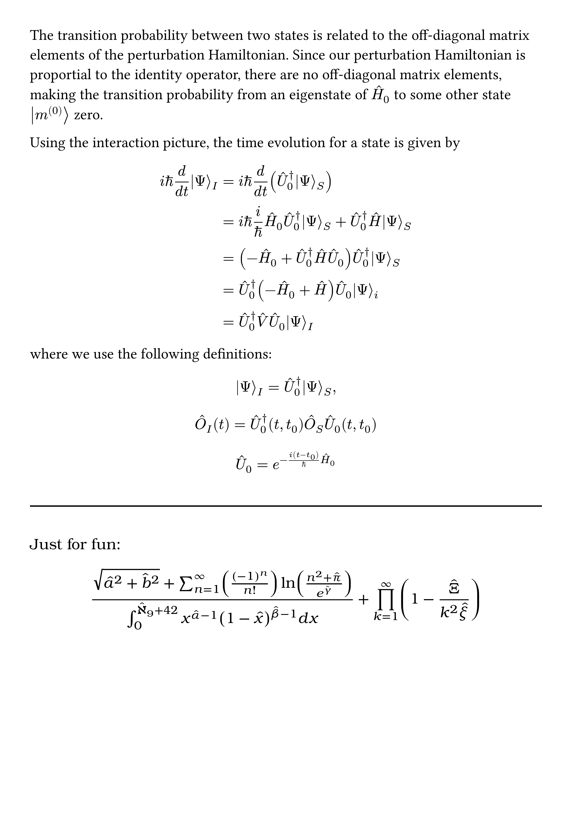
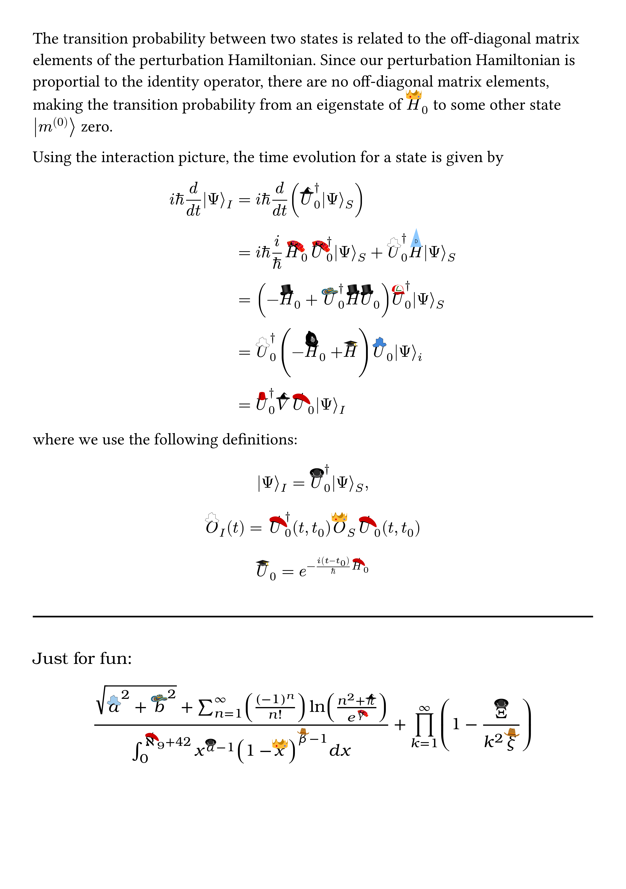

**realhats** puts real hats on symbols in math mode. Why settle for the lifeless, old-fashioned circumflex when your variables could sport berets, sombreros, top hats, and more? Inspiration and most hats from the original [**realhats** for LaTeX](https://github.com/mscroggs/realhats).

Before and after **realhats**:

<div style="display: flex; gap: 10px;">
  
  
</div>

## Using realhats

To replace the default math mode `hat` function, import `hat` from realhats:

```typst
#import "@preview/realhats:0.1.0": hat
```

Use it as you would the default `hat` function. If you would like to specify which hat a variable wears, use the `hat` named argument in the `hat` function:

```typst
$ 2 hat(x, hat: "vueltiao") + 3 $
```

For a list of available hats, import `realhats-list`:
```typst
#import "@preview/realhats:0.1.0": realhats-list

#realhats-list
```