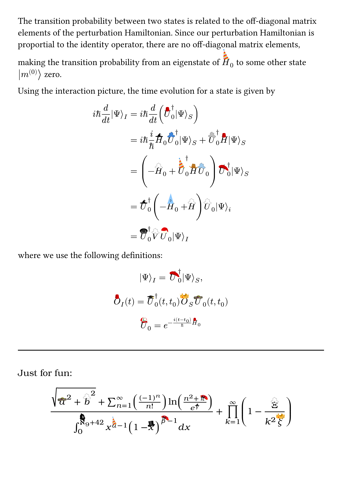

**realhats** puts real hats on symbols in math mode. Why settle for the lifeless, old-fashioned circumflex when your variables could sport berets, sombreros, top hats, and more? Inspiration and most hats from the original [realhats for LaTeX](https://github.com/mscroggs/realhats).

Before and after realhats:

<div style="display: flex; gap: 10px;">
  
  
</div>

## Using realhats

Import `hat` from realhats:

```typst
#import "@preview/realhats:0.1.0": hat
```

Use it as you would [`math.hat`](https://typst.app/docs/reference/math/accent/#parameters-accent). If you would like to specify which hat a variable wears, use the `hat` named argument in the `hat` function:

```typst
$ 2 hat(x, hat: "vueltiao") + 3 $
```

For a list of available hats, import `realhats-list`:
```typst
#import "@preview/realhats:0.1.0": realhats-list
#realhats-list
```

***
Image Licenses

- [ash](./realhats/hats/realhats-ash.svg): [MIT](./LICENSE)
- [beret](./realhats/hats/realhats-beret.svg): [MIT](./LICENSE)
- [birthday](./realhats/hats/realhats-birthday.svg): [MIT](./LICENSE)
- [cowboy](./realhats/hats/realhats-cowboy.svg): [MIT](./LICENSE)
- [crown](./realhats/hats/realhats-crown.svg): [MIT](./LICENSE)
- [dunce](./realhats/hats/realhats-dunce.svg): [MIT](./LICENSE)
- [fez](./realhats/hats/realhats-fez.svg): [MIT](./LICENSE)
- [mortarboard](./realhats/hats/realhats-mortarboard.svg): [MIT](./LICENSE)
- [policeman](./realhats/hats/realhats-policeman.svg): [MIT](./LICENSE)
- [santa](./realhats/hats/realhats-santa.svg): [MIT](./LICENSE)
- [scottish](./realhats/hats/realhats-scottish.svg): [MIT](./LICENSE)
- [sombrero](./realhats/hats/realhats-sombrero.svg): [MIT](./LICENSE)
- [tophat](./realhats/hats/realhats-tophat.svg): [MIT](./LICENSE)
- [witch](./realhats/hats/realhats-witch.svg): [MIT](./LICENSE)
- [tile-blue](./realhats/hats/realhats-tile-blue.svg): [MIT](./LICENSE)
- [tile-gray](./realhats/hats/realhats-tile-gray.svg): [MIT](./LICENSE)
- [tile-light-blue](./realhats/hats/realhats-tile-light-blue.svg): [MIT](./LICENSE)
- [tile-white](./realhats/hats/realhats-tile-white.svg): [MIT](./LICENSE)
- [vueltiao](./realhats/hats/typst-realhats-vueltiao.svg): Creative Commons [Attribution 3.0 Unported](https://creativecommons.org/licenses/by/3.0/deed.en). [Original](https://commons.wikimedia.org/wiki/File:Sombrero_vueltiao_stylized.svg) by [Camilo Sanchez](https://commons.wikimedia.org/wiki/User:Camilo_Sanchez), color added by [Matthew Ward](https://github.com/mward19/). Attribution is provided within this package; users are not required to include separate attribution in their documents when using this asset, as long as this notice remains intact.
