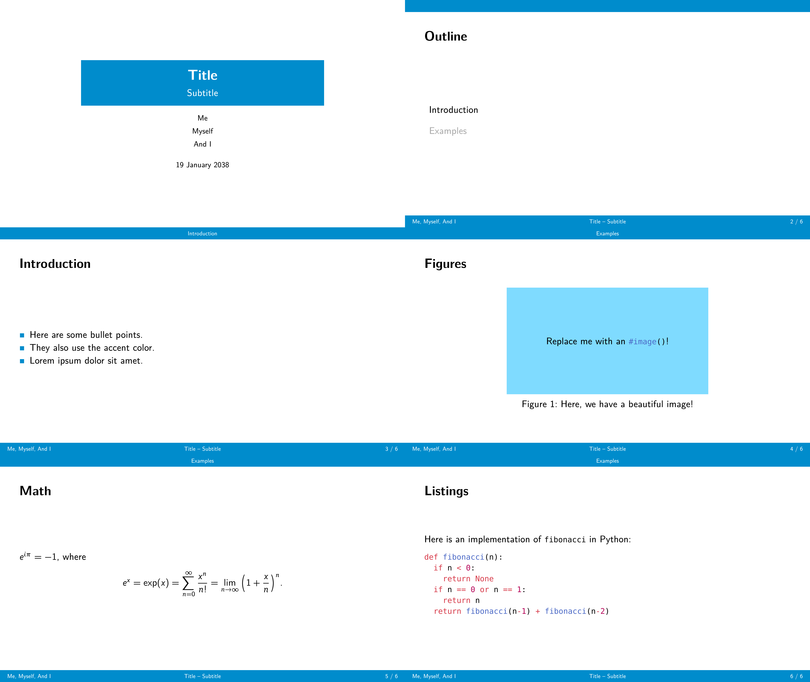

# Rectangles



A template for creating presentation slides with Typst and [Polylux](https://github.com/polylux-typ/polylux/) that is inspired by the popular LaTeX beamer outer theme "miniframes" and inner theme "rectangles".

## Getting Started

Simply use the provided template:

```sh
typst init @preview/rectangles-polylux:0.1.0 foo
```

All setup is performed via the `rectangles-theme` function:

```typ
#import "@preview/rectangles-polylux:0.1.0": *

#show: rectangles-theme.with(
  aspect-ratio: "16-9", // "4-3" and "16-9" are supported.
  title: [Title],
  subtitle: none,
  authors: none, // You can also pass an array if you have multiple authors.
  date: datetime.today().display(),
  short-title: none, // The title that is displayed in the footer. Defaults to `[#title – #subtitle]`.
  short-authors: none, // The authors that are displayed in the footer. Defaults to authors, possibly connected with commas.
  accent-fill-color: rgb("#008ccc"), // The color of the slide decoration.
  accent-text-color: none, // The color of the text on the decoration. Defaults to black or white, depending on `accent-fill-color`.
  text-size: 20pt,
)
```

## Slides

Regular slides can be created with the `slide` function:

```typ
#slide(title: "Introduction", new-section: "Introduction")[
  - #lorem(5)
]
```

The title slide can be displayed with the `title-slide` function.

The outline slide can be displayed with the `outline-slide` function:

```typ
#outline-slide(
  title: "Outline",
  highlight-section: none,
  new-section: none
)
```

When the `highlight-section` argument is passed, you can use the `outline-slide` function to announce the next section. To do so, you have to pass the name of the section that you want to highlight.

## Fonts

By default, the template uses New Computer Modern Sans for regular text and math, and DejaVu Sans Mono for raw.

If you want that really authentic popular LaTeX look and feel, you should use Latin Modern Sans for text and Latin Modern Mono for raw.

You can download the Latin Modern font here: https://www.ctan.org/tex-archive/fonts/lm/

After extracting the zip file, you can find the font files in `fonts/opentype/public/lm`. Install the contained `otf` files (or simply upload the entire `fonts/opentype/public/lm` directory to the Typst web editor).
