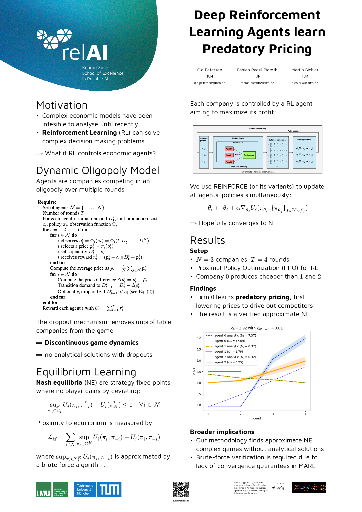

# relAI poster template

This is a template for posters for the [Konrad Zuse School of Excellence in Reliable AI](https://zuseschoolrelai.de) in [Typst](https://typst.app).

For a real example, see the `examples` folder.

## Usage

1. Clone this repository
2. Install typst: <https://typst.app>
3. Optionally install the typst vscode extension
4. Edit the `poster.typst` file with your poster content
5. Compile the poster with `typst compile poster.typ`. The VSCode extension can do this automatically. A pdf file will be output

## Features

- Follows the relAI poster template, including all logos
- Automatically generates QR codes to sources given in the `references` parameter
- Landscape and portrait mode supported through the `flipped` parameter
