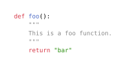

# Relescope

Relescope 是一个用于从源代码中提取特定函数、结构体、枚举等（的源代码）的工具，当前支持 Rust 和 Python 语言。

Relescope is a tool for extracting specific functions, structs, enums, etc. from source code. Currently Rust and Python are supported.

## 使用 Usage

在 Typst 文件中导入并使用 `pick` 函数：

Import and use the `pick` function in Typst file:

````typ
#import "@preview/relescope:0.0.1": pick

#let src = ```py
bar = "foo"

def foo():
    """
    This is a foo function.
    """
    return "bar"
```
#let result = pick(src.text, "foo", lang: src.lang)
#raw(result.src, lang: src.lang)
````



## 许可证 License

MIT License
