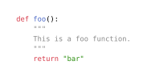

# Relescope

Relescope 是一个用于从源代码中提取特定函数、结构体、枚举等（的源代码）的工具，当前支持 Rust 和 Python 语言。

Relescope is a tool for extracting specific functions, structs, enums, etc. from source code. Currently Rust and Python are supported.

## 使用 | Usage

### `pick` 函数 | `pick` Function

在 Typst 文件中导入并使用 `pick` 函数：

Import and use the `pick` function in Typst file:

````typ
#import "@preview/relescope:0.0.2": pick

#let src = ```py
bar = "foo"

def foo():
    """
    This is a foo function.
    """
    return "bar"
```
#let result = pick(src.text, "foo", lang: src.lang)
#raw(result.src, lang: src.lang)
````



### `scope` 函数 | `scope` Function

在 Typst 文件中导入并使用 `scope` 函数：

Import and use the `scope` function in Typst file:

````typ
#import "@preview/relescope:0.0.2": scope

#let src = ```py
bar = "foo"

class Test:
    ...

def foo():
    """
    This is a foo function.
    """
    return "bar"
```

The source code is written in Python. Items in the source code are:

#let result = scope(src.text, lang: src.lang)
#result.keys().map(raw.with(block: false)).join(", ")
````


## 许可证 | License

MIT License
