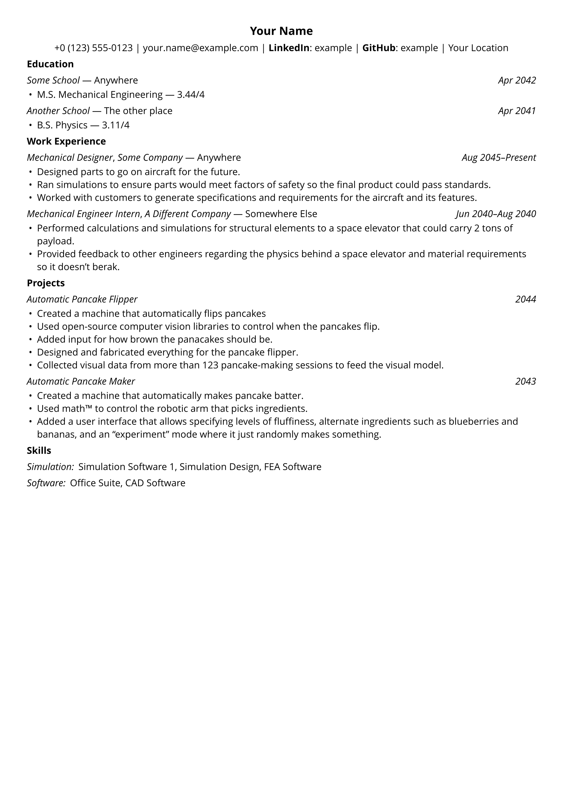

# Resumania

Resumania is a resume-building tool.
It's aimed at making it easy to compose multiple resumes without having to
  rewrite a lot of duplicate information.

## Template

This is what the template looks like without modification:



## Quick Start

If you just want a quick copy-paste-modify start:

```typst
#import "@preview/resumania:1.0.0": *

// Define parts of the resume using Resumania's "types" (see below)
#let author = "Your Name"

#let contacts = contact-section(
  phone("+0 (123) 555-0100"),
  email("you@example.com"),
  linkedin: url-link(name: "LinkedIn", "example", "https://linkedin.com"),
  github: url-link(name: "GitHub", "example", "https://github.com"),
  portfolio: url-link(name: "Portfolio", "you.com", "https://example.com/you"),
  location: location[Your location],
)

#let educations = education-section(
  education(
    institution: "Name of School",
    location: "Location of school",
    kind: "Degree",
    study: "Area of study",
    timeframe: datetime.today(),
    score: "x",
    scale: "y",
  ),
)

#let works = work-section(
  work(
    company: "Company name",
    location: "Location of work",
    position: "Position at company",
    timeframe: (
      start: datetime.today(),
      end: "Present",
    )
  )[Description of work done.],
)

#let projects = project-section(
  project(title: "Project title", timeframe: "Project date")[
    Project ddescription.
  ],
)

#let skills = skills-section(
  skillset("Skill 1", "Skill 2"),
  skillset("Skill 3", "Skill 4"),
)

#show: resume.with(
  author,
  sections: (contacts, educations, works, projects, skills),
)
```

## Concepts

Since Typst doesn't yet have custom [types][typst-custom-type-issue], Resumania
  uses dictionaries as a substitute, with convenience "constructors" provided
  for each one.
Similarly, since types aren't built-in, there are no `show`/`set` rules that can
  be used with Resumania's types.

To get around this, Resumania exposes functions that create Typst dictionaries
  to later be turned into content using Resumania `show-*` functions, of which
  the most-used is `show-section`.

### Resume sections and elements

Resumania categorizes its types into two kinds: (1) sections and (2) section
  elements.

There are 5 Resumania sections: work, education, projects, skills, and contact
  information.
Every one of these can be turned into content using `show-section`.

For each of the sections, there is a corresponding element (or multiple in the
  case of contacts).
Each element has a function to create it except for skills, which can be
  anything that can be trivially turned into `content`.
The functions are `work`, `education`, `project`, and `contact`.

Contacts are a special case for elements that have "sub-types", namely `phone`,
  `email`, `url-link`, and `location`, which are conveniences since `contact`
  requires a function that converts it into `content`.

This general structure should allow plenty of flexibility for defining custom
  resume sections if desired.

## Styling

Resumania doesn't provide a significant amount of specific styling optionality,
  but it does have a styling system that's flexible enough to do just about
  anything you desire, provided you have the will to put in the effort.

Basically, you can write the styling for any component in the resume, and even
  custom "show" rules (see below).

### "Show" Rules

Since Typst doesn't yet have custom types, there isn't actually a way to write
  real `show` rules.
The workaround is basically to define a `state` that tracks the "current"
  function that acts as a `show` rule of sorts ("current" is in quotes because
  the definition really depends on layout order, which acts a bit differently
  than traditional programming language execution order).

For Resumania, these are all located in the `style` module through the
  `current-style` state.
The styling takes effect whenever `show-section` or a specific section element's
  show function gets called.
If you wish to edit the style, look in the `style` module for `default-style` as
  an example.
Here are all of the styleable keys:

- `name`: the name appearing at the top of the resume
- `section`: section titles
- `element`: element titles within sections
- `timeframe`: timeframes (part of section headers)
- `location`: locations (part of section headers)
- `header`: the entire header of an element, applied on top of the `element`,
  `location`, and `timeframe` styles
- `body`: the entire body of an element

Each key in the style maps to a function which takes one argument of `content`
  and returns content.
This means that, for example, if you just want to erase the styling you can set
  the style key which you want to reset to `text`.

### Miscellaneous Styling

There are a few small styling options not included in the `style` module that
  are specific to certain sections.
These are `contact-separator` in the `contact` module, `skill-separator` in the
  `skill` module, and `default-datetime-format` in the `timeframe` module.
Each of these is its own `state` and may be freely changed as you like.

For example, to change the contact separator to a space instead of the pipe
  character:

```typst
#contact-separator.update(h(1em))
```

or to set the skills separator to a pipe character instead of a comma:

```typst
#skill-separator.update([ | ])
```

### Resume rules

Since Resumania resumes are composed typically by defining sections and then
  finally ending the Typst document with a `show: resume.with(...)` call, there
  may be some things you can't easily style (or might get overridden by
  Resumania defaults).
If you would like to change the main document's `show`/`set` rules you can make
  changes to the `resume-rules` state in the `resume` module.
This state is just a function that takes the author and resume body (which will
  already be `content`).
It should mostly be used just for document setup such as page margins and text
  font/size, but of course you're free to do whatever you want.

There is no specific styling available past this because Resumania isn't really
  meant to make super fancy-looking resumes (which are overrated/unnecessary in
  this author's opinion).

It is highly recommended to use the `default-rules` as a basis for your own
  rules.
As an example, if you wanted to change the font from Resumania's default to a
  monospace font:

```typst
#resume-rules.update(_ => { (author, body) => {
  default-rules(author, text(font: "Liberation Mono", body))
}})
```

## Local Installation

Resumania can be installed locally to be used offline. First, clone Resumania's
  [source][resumania-github].

Then, assuming you have [`fish`][fish-shell] and [`just`][just-book] installed,
  you can run `just install` (probably only works for MacOS, Linux, and Windows,
  but the `.justfile` should be fairly easy to edit for other platforms if
  needed).

If you're not on a supported platform, or you don't have `fish`/`just`, you'll
  have to look at the recipe for building and installing in `.justfile` and
  simply perform equivalent steps for your platform.

<!------------------------------------------------------------------------------
Links
------------------------------------------------------------------------------->
[fish-shell]:
  https://fishshell.com/
  "Fish"

[just-book]:
  https://just.systems/man/en/
  "just book"

[resumania-github]:
  https://github.com/kcmw3e/resumania
  "Resumania GitHub"

[typst-custom-type-issue]:
  https://github.com/typst/typst/issues/147
  "Custom Typst types issue"

[typst-local-packages]:
  https://github.com/typst/packages/tree/main?tab=readme-ov-file#local-packages
  "Local Typst Packages"

[typst-type-hint-issue]:
  https://github.com/typst/typst/issues/317
  "Typing issue"
