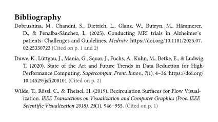

# `retrofit`

This package adds backreferences to each of your bibliography entries. More precisely, `retrofit` queries for all instances of a citation in your document, collects the page(s) it is on and formats them to your liking, while keeping them in the `link` element to the location.

In order to correctly associate each formatted backreference to the bibliography entry, `retrofit` uses Typst's own internal bibliography handling through [hayagriva](https://github.com/typst/hayagriva) to ensure correct citation ordering (Typst still renders its own bibliography, we just append to its entries!).

> [!WARNING]
> Performance may be impacted somewhat due to the creation of an internal bibliography through WebAssembly! Use with caution and check for correctness!

## Getting Started

To add this package to your project, use this:

```typ
#import "@preview/retrofit:0.1.1": backrefs

/*
  Default formatting wraps pages in parentheses and makes them bold.
  Change the formatting with `backrefs.with(format: l => ...)` to your liking.

  When reading in a relative path to a bibliography file, a special
  `read` function has to be provided, see the manual for details.
*/
#show: backrefs.with(
  format: links => text(gray)[(Cited on p. #links.join(", ", last: " and "))],
  read: path => read(path),
)

...

#bibliography("refs.bib")
```

<p align="center">
  <picture>
    <source media="(prefers-color-scheme: dark)" srcset="./images/ieee-dark.svg">
    
  </picture>
  <picture>
    <source media="(prefers-color-scheme: dark)" srcset="./images/apa-dark.svg">
    
  </picture>
</p>

## Usage

See the [manual](docs/docs.pdf) for details.

