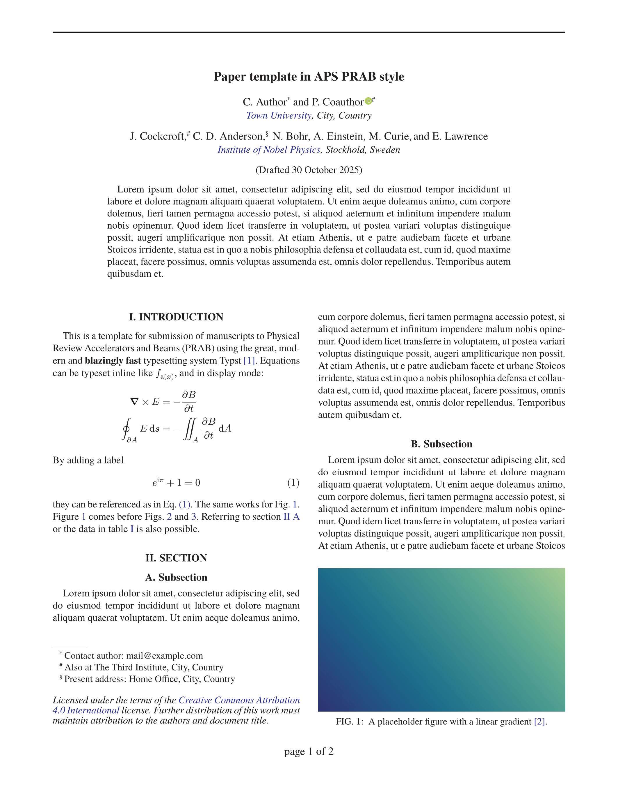

# RevTyp

[](https://github.com/eltos/revtyp)
[](https://typst.app/universe/package/revtyp)

Typst template for papers in the style of the journal [Physical Review Accelerators and Beams (PRAB)](https://journals.aps.org/prab/).


## Usage

### Typst web app
In the [typst web app](https://typst.app/app?template=revtyp) select "start from template" and search for the revtyp template.
Alternatively, use the "create project" button at the top of the package's [typst universe page](https://typst.app/universe/package/revtyp).

### Local
Run these commands inside your terminal:
```sh
typst init @preview/revtyp
cd revtyp
typst watch paper.typ
```

If you don't yet have the *TeX Gyre Termes* font family, you can install it with `sudo apt install tex-gyre`.




## Licence

Files inside the template folder are licensed under MIT-0. You can use them without restrictions.  
The citation style (CSL) file is based on the IEEE style and licensed under the [CC BY SA 4.0](https://creativecommons.org/licenses/by-sa/4.0/) compatible [GPLv3](https://www.gnu.org/licenses/gpl-3.0.html) license.  
All other files are licensed under [GPLv3](https://www.gnu.org/licenses/gpl-3.0.html).  
