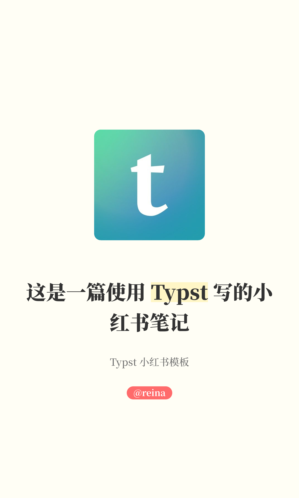
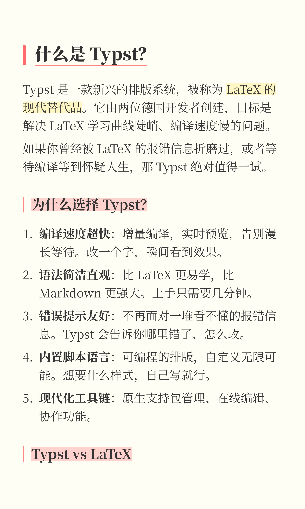

# Typst Rewind Note Template

这是一个用于创建小红书（RedNote）风格笔记的 Typst 模板。

<p align="center">
  
  
</p>

[English](https://github.com/Ri-Nai/typst-rewind-note/blob/main/README.md) | [中文](https://github.com/Ri-Nai/typst-rewind-note/blob/main/README_CN.md)

## 简介

Typst Rewind Note 旨在帮助用户使用 Typst 快速生成美观、符合小红书风格的图片或 PDF 文档。它提供了预设的主题、封面生成器以及针对移动端阅读优化的排版样式。

## 使用方法

### 1. 导入模板

#### 方式一：从 Typst Universe 导入（发布后）

```typst
#import "@preview/rewind-note:0.1.0": *
```

#### 方式二：本地导入

克隆仓库并导入：

```bash
git clone https://github.com/Ri-Nai/typst-rednote.git
```

然后在你的 Typst 文件中：

```typst
#import "path/to/typst-rednote/lib.typ": *
```

### 2. 应用主题

使用 `rewind-theme` 函数应用主题：

```typst
#show: rewind-theme.with(
  font-family: ("Source Han Serif SC", "Times New Roman"), // 自定义字体
  // bg-color: rgb("#fff0f0"),  // 自定义背景色
)
```

### 3. 创建封面

使用 `cover` 函数创建吸引人的封面：

```typst
#cover(
  image-content: image("assets/brand.png"),
  title: [你的标题],
  subtitle: [副标题],
  author: "@你的名字",
)
```

### 4. 编写内容

像平时一样编写内容。

```typst
= 什么是 Typst？

Typst 是一款新兴的排版系统...
```

## 示例

查看 `template/main.typ` 获取完整的示例代码。

## 许可证

MIT
