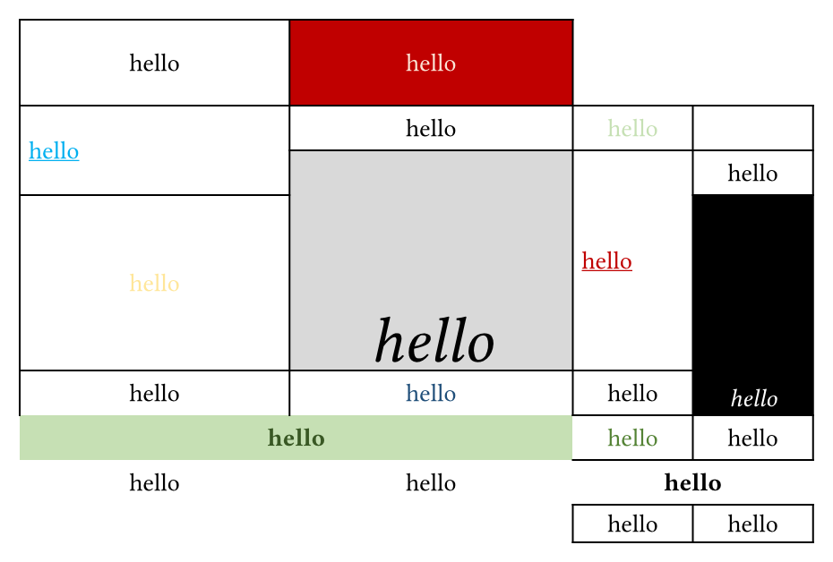
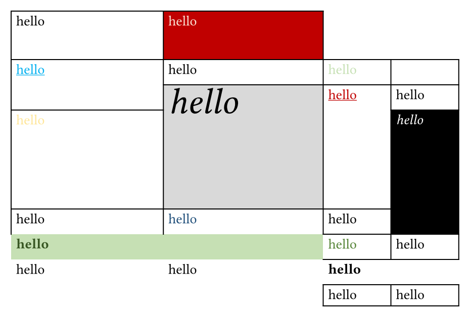
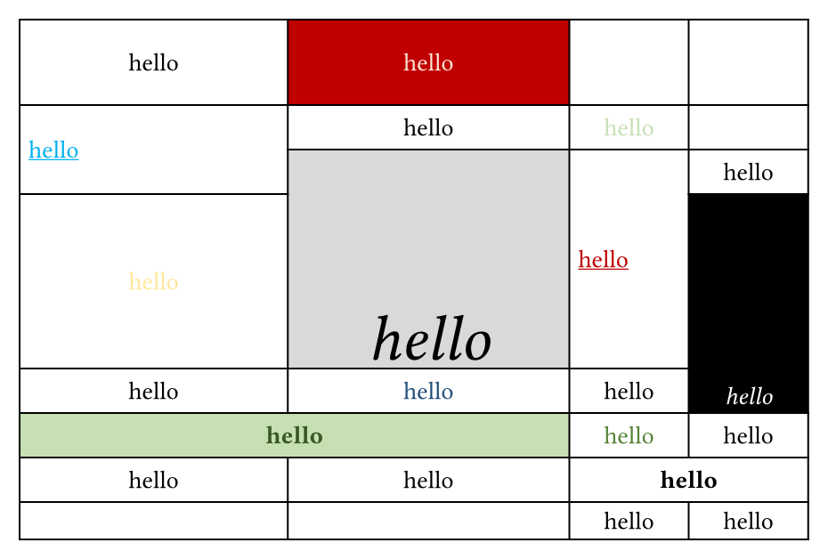
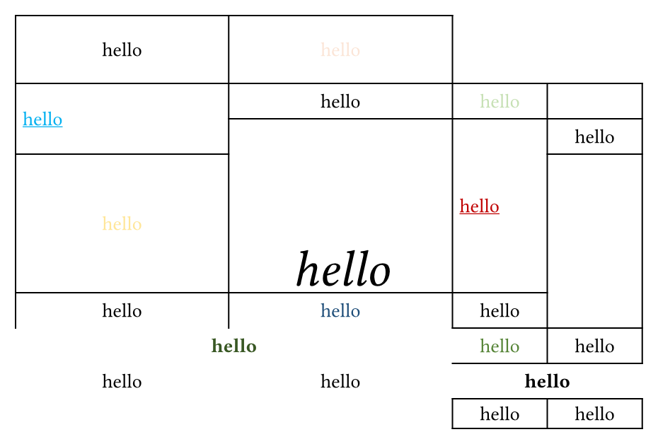
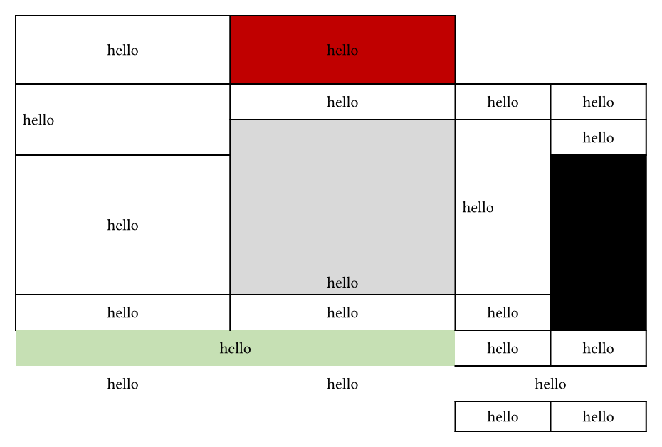

# ReXLlenT

ReXLlenT is a typst package that helps you convert Excel **xlsx** tables to typst tables, powered by wasm. (Formerly eXMLlent.)

## Quick Start

Start by importing the package:

```typ
#import "@preview/rexllent:0.2.0": xlsx-parser
```

Then you can use `xlsx-parser` function to convert your xlsx Excel table to typst table. Here is an example:

```typ
#xlsx-parser(read("test.xlsx", encoding: none))
```

By passing `sheet-index` parameter, you can specify the sheet index to parse. The default value is 0.

```typ
#xlsx-parser(read("test.xlsx", encoding: none), sheet-index: 1)
```

By toggling parameters below, you can customize the output table:

- `parse-table-style`: Parse table style(columns width, rows height), default is `true`.
- `parse-alignment`: Parse cell content alignment, default is `true`.
- `parse-stroke`: Parse cell stroke, default is `true`.
- `parse-fill`: Parse cell fill, default is `true`.
- `parse-font`: Parse font style, default is `true`.

Extra arguments passed to `xlsx-parser` function will be passed to `table`. Feel free to customize the output table.

Have fun!

## Example

- Excel Table

  

- Typst Table (with default parameters)

  

- Typst Table (with `parse-table-style: false`)

  

- Typst Table (with `parse-alignment: false`)

  

- Typst Table (with `parse-stroke: false`)

  

- Typst Table (with `parse-fill: false`)

  

- Typst Table (with `parse-font: false`)

  

## Credits

- [lublak/typst-spreet-package](https://github.com/lublak/typst-spreet-package)
- [MathNya/umya-spreadsheet](https://github.com/MathNya/umya-spreadsheet)

## License

This package is licensed under the MIT License.
