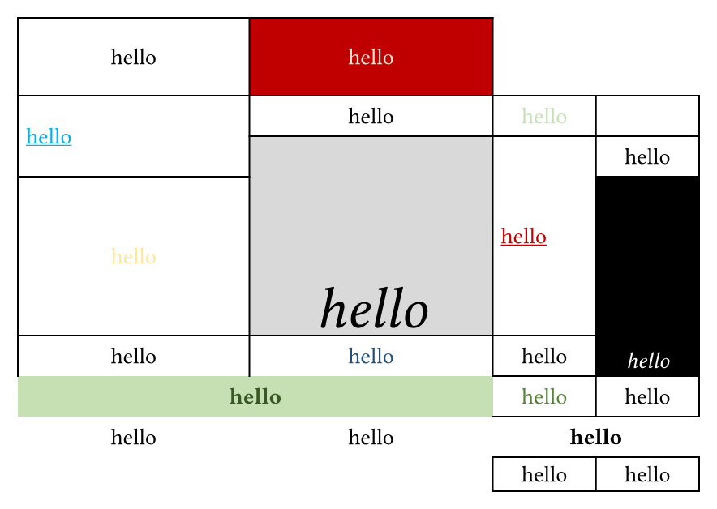
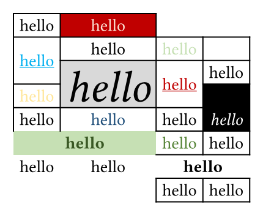
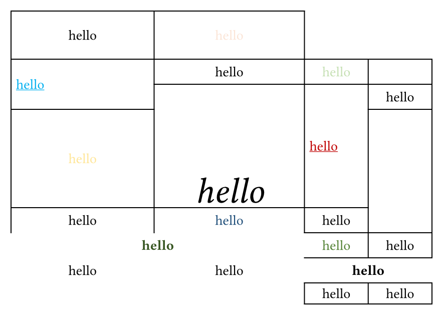

# 🦖 ReXLlenT

<a href="https://typst.app/universe/package/rexllent">

</a>

ReXLlenT is a typst package that helps you:

- Convert Excel **xlsx** tables to typst tables, powered by wasm.
- Convert [Spreet](https://github.com/lublak/typst-spreet-package) parsed tables to typst tables. (Supports excel/opendocument spreadsheets but doesn't support parsing styles or merge cells.)

## Quick Start

Start by importing the package:

```typ
#import "@preview/rexllent:0.3.0": xlsx-parser
```

Then you can use `xlsx-parser` function to convert your xlsx Excel table to typst table. Here is an example:

```typ
#xlsx-parser(read("test.xlsx", encoding: none))
```

By passing `sheet-index` parameter, you can specify the sheet index to parse. The default value is 0.

```typ
#xlsx-parser(read("test.xlsx", encoding: none), sheet-index: 1)
```

By toggling parameters below, you can customize the output table:

- `parse-table-style`: Parse table style(columns width, rows height), default is `true`.
- `parse-alignment`: Parse cell content alignment, default is `true`.
- `parse-stroke`: Parse cell stroke, default is `true`.
- `parse-fill`: Parse cell fill, default is `true`.
- `parse-font`: Parse font style, default is `true`.
- `parse-header`: Parse header row, default is `false`.

> [!NOTE]
> Notice that 0pt height or 0pt width will be parsed as `auto`. Disable `parse-table-style` to prevent this behavior and set the width and height manually.

Extra arguments passed to `xlsx-parser` function will be passed to `table`. Feel free to customize the output table. For the prepend argument, you should pass them as array to `prepend-elems` parameter.

```typ
#xlsx-parser(
  read("test.xlsx", encoding: none),
  parse-header: true,
  parse-stroke: false,
  prepend-elems: (table.hline()),
  stroke: (_, y) => {
    if y == 0 {
      return (bottom: black)
    }
  },
  table.hline(),
)
```


## Work with Spreet

You can also convert Spreet parsed tables to typst tables. Here is an example:

```typ
#import "@preview/spreet:0.1.0"
#import "@preview/rexllent:0.3.0": spreet-parser

#spreet-parser(spreet.decode(read("/tests/data/default.ods", encoding: none)))
```

By passing `sheet-index` parameter, you can specify the sheet index to parse. The default value is 0. The extra arguments passed to `spreet-parser` function will be passed to `table`.

Through this way, you can convert excel/opendocument spreadsheets to typst tables. However, the styles and merge cells will not be parsed due to the limitation of calamine.

## Example

- Excel Table

  

- Typst Table (with default parameters)

  

- Typst Table (with `parse-table-style: false`)

  

- Typst Table (with `parse-alignment: false`)

  

- Typst Table (with `parse-stroke: false`)

  

- Typst Table (with `parse-fill: false`)

  

- Typst Table (with `parse-font: false`)

  

- With Custom Style

  

## Pixel Art

You can also convert pixel art to typst table using ReXLlenT. Here are some examples:

- Typst Logo

  

- Typst Guy

  

- _Impression, soleil levant_

  

## TODOs

ReXLlenT is still in development and PRs are welcome. Here are some TODOs (also limitations):

- [ ] Implement in-cell image parsing.
- [ ] Prevent parsing errors caused by special characters.
- [ ] Parse auto width and height instead of treating 0pt as auto.
- [ ] Handle hidden rows and columns.
- ...

## Credits

- [lublak/typst-spreet-package](https://github.com/lublak/typst-spreet-package)
- [MathNya/umya-spreadsheet](https://github.com/MathNya/umya-spreadsheet)

## License

This package is licensed under the MIT License.

## Star History

<a href="https://star-history.com/#hongjr03/typst-rexllent&Date">
 <picture>
   <source media="(prefers-color-scheme: dark)" srcset="https://api.star-history.com/svg?repos=hongjr03/typst-rexllent&type=Date&theme=dark" />
   <source media="(prefers-color-scheme: light)" srcset="https://api.star-history.com/svg?repos=hongjr03/typst-rexllent&type=Date" />
   
 </picture>
</a>
